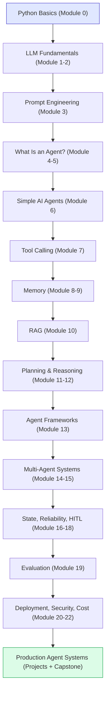
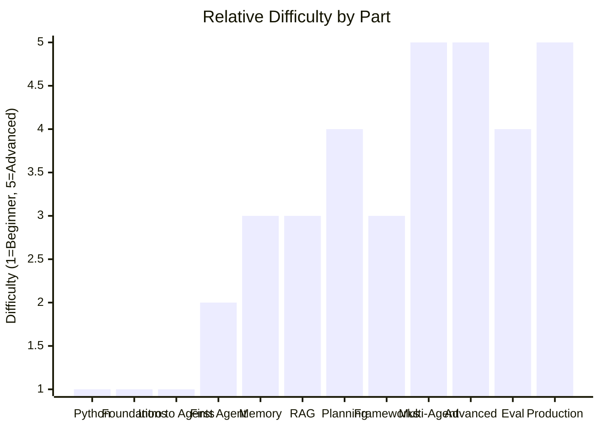

# Course Overview — Agentic AI: Zero to Production

## Course Description

This course teaches you how to design, build, debug, and deploy **AI agents** — software systems powered by Large Language Models (LLMs) that can understand a goal, decide what to do, use tools, remember context, and keep working until the goal is done, largely without a human directing every step.

You will go from "what is AI?" to shipping a production-style multi-agent system with memory, planning, evaluation, and monitoring.

## Who This Course Is For

- Complete beginners to AI who can read simple code (or are willing to learn alongside it).
- Software engineers who know how to code but have never built anything with LLMs.
- Data scientists/ML engineers who understand models but not agentic systems.
- Product-minded builders who want to understand agents deeply enough to design real systems, not just prompt a chatbot.

No prior knowledge of LLMs, APIs, RAG, or agent frameworks is assumed. Basic Python helps for the code examples but is not required to understand the concepts.

## What You Will Learn

By the end of this course you will be able to:

- Explain clearly what an AI agent is and how it differs from a chatbot, a workflow, and a fully autonomous system.
- Write effective prompts and system instructions for LLMs.
- Build agents that call external tools (APIs, calculators, search, databases, files).
- Give agents short-term and long-term memory using vector databases and embeddings.
- Build Retrieval-Augmented Generation (RAG) systems that ground answers in real documents.
- Implement planning and reasoning loops (ReAct, plan-and-execute, reflection).
- Evaluate agent frameworks (LangChain, LangGraph, CrewAI, AutoGen, Semantic Kernel, modern Agent SDKs) and decide when to use one vs. build from scratch.
- Design multi-agent systems with supervisors, specialists, and communication patterns.
- Handle reliability problems: hallucination, infinite loops, tool failures, bad plans.
- Add human-in-the-loop approval gates for risky actions.
- Evaluate agents with metrics beyond "it looks right."
- Deploy, secure, and control the cost of agent systems in production.
- Build 5 hands-on projects and one capstone production-style platform.

## How Agentic AI Differs From Other Things You've Heard Of

| System Type | What It Does | Key Limitation |
|---|---|---|
| **Traditional software** | Follows exact, pre-written rules for every input (`if x then y`) | Cannot handle situations the programmer didn't anticipate |
| **Chatbot** | Answers questions or holds a conversation using an LLM | Cannot take actions in the world; only produces text |
| **LLM application** | Uses an LLM inside a fixed feature (e.g., "summarize this document" button) | Does one predetermined thing; no autonomy or multi-step decision-making |
| **AI workflow** | A fixed sequence of steps where an LLM may power one or more steps (e.g., "extract → classify → route") | The *sequence* is hardcoded by a human; the system can't decide to skip, reorder, or add steps |
| **Autonomous system (non-AI)** | Follows control loops to operate without humans (e.g., a thermostat, a self-driving car's low-level controller) | No language understanding or open-ended reasoning; narrow, engineered behavior |
| **AI Agent** | Given a *goal*, decides *what steps to take*, *which tools to use*, checks its own results, and adapts until the goal is met | Needs careful design for reliability, cost, and safety — it is not magic and can still fail |

The short version:

> **Traditional software** is told exactly what to do.
> **A chatbot** talks.
> **A workflow** follows a fixed recipe, possibly with an LLM cooking one step.
> **An agent** is handed a goal and figures out the recipe itself — deciding, acting, observing, and adjusting in a loop.

## What You'll Be Able to Build

- A personal task assistant that stores and prioritizes your to-dos.
- A research agent that searches, gathers, and summarizes information into a report.
- A RAG-powered knowledge assistant that answers questions from your own documents.
- An autonomous research system with planning, memory, and reflection.
- A multi-agent "content company" with research, writing, SEO, and editing agents collaborating.
- A capstone: an AI business automation platform that takes a goal, plans tasks, executes them with tools, asks for human approval when needed, and reports progress.

## Recommended Prerequisites

- **Required:** Basic comfort reading code (any language). Willingness to learn Python basics as you go — **[Module 0](00b-Module0-Python-Primer.md)** covers exactly the slice of Python this course needs, from scratch.
- **Helpful, not required:** Familiarity with JSON, REST APIs, and using a command line (also covered in Module 0).
- **Not required:** Machine learning math, statistics, or prior AI experience — all explained here.

## Recommended Tools & Technologies

| Tool | Purpose | When You'll Use It |
|---|---|---|
| Python 3.10+ | Primary language for examples | Throughout |
| An LLM API (Anthropic Claude, OpenAI, or similar) | The "brain" of your agents | From Module 2 onward |
| `pip` / virtual environments | Dependency management | Setting up any project |
| A vector database (e.g., Chroma, FAISS, Pinecone, Qdrant) | Long-term/semantic memory, RAG | Modules 8–10 |
| An agent framework (LangGraph, CrewAI, or the raw SDK) | Structuring multi-step agents | Module 13+ |
| Git | Version control for your projects | Throughout |
| A simple web framework (FastAPI) | Serving agents as APIs | Module 20+ |
| Docker (optional) | Packaging for deployment | Module 20 |

## Estimated Difficulty by Section

| Part | Difficulty |
|---|---|
| Part 1 — Python Primer (Module 0) | Beginner |
| Part 2 — Foundations | Beginner |
| Part 3 — Intro to Agentic AI | Beginner |
| Part 4 — Building Your First Agent | Beginner → Intermediate |
| Part 5 — Agent Memory | Intermediate |
| Part 6 — RAG | Intermediate |
| Part 7 — Reasoning & Planning | Intermediate → Advanced |
| Part 8 — Agent Frameworks | Intermediate |
| Part 9 — Multi-Agent Systems | Advanced |
| Part 10 — Advanced Agent Systems | Advanced |
| Part 11 — Evaluation | Advanced |
| Part 12 — Production | Advanced |
| Part 13–14 — Projects & Capstone | Intermediate → Advanced |

## Complete Learning Roadmap (Visual)

**How to read this graph:** each box is a stage of the course, and the arrows show the order you should learn them in — you can't skip ahead safely because later stages assume you understand the ones above (e.g., you can't understand RAG in Module 10 without first understanding embeddings in Module 9, which itself depends on knowing what memory even is from Module 8). The blue box is where everyone starts — if Python is new to you, that box is **[Module 0, the Python Primer](00b-Module0-Python-Primer.md)**, not something you're expected to already know; if you already write Python comfortably, skim Module 0 for its JSON/API sections and move straight to Module 1. The green box is the production-ready skill level you're building toward. Think of it as a single hiking trail up a mountain, not a menu you can pick items from — the whole point of the ordering is that each stage's difficulty is manageable *because* the previous stage already prepared you for it.

## Difficulty Curve Across the Course

**How to read this graph:** the bars are not a smooth, ever-steepening climb — notice they dip back down at "Frameworks" (Module 13) even though it comes after "Planning" (Module 11-12). That's intentional: frameworks package up patterns you already learned by hand in earlier modules, so that module is more about *tooling* than new *concepts*, which is genuinely easier once the underlying ideas are already in your head. The two tallest bars — Multi-Agent Systems and Advanced Agent Systems (reliability, state, human-in-the-loop) — are where most of the real engineering difficulty in production agentic AI actually lives, so budget extra time there rather than assuming difficulty rises in lockstep with module number.

Continue to **[01-Module1-Intro-to-AI.md](01-Module1-Intro-to-AI.md)**.
