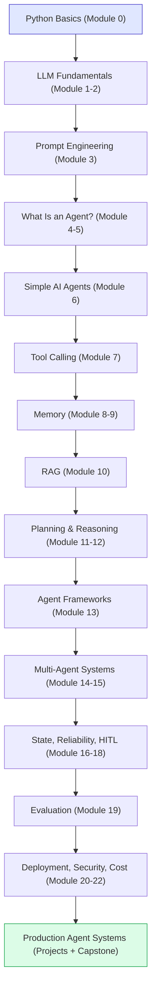
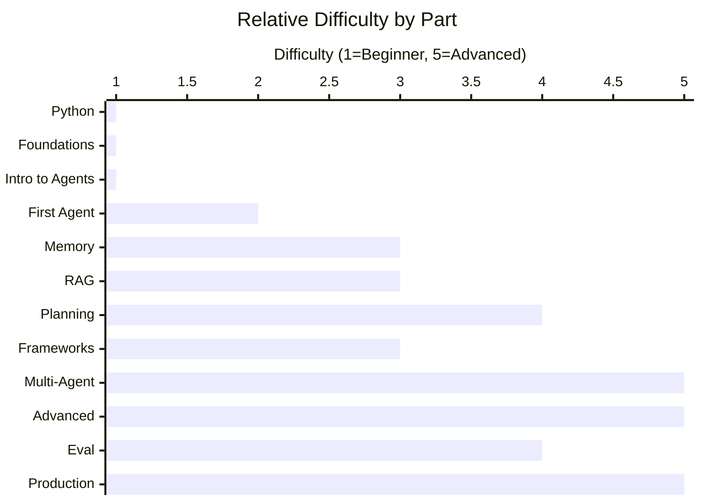

# Course Overview — Agentic AI: Zero to Production

## Course Description

This course teaches you how to design, build, debug, and deploy **AI agents** — software systems powered by Large Language Models (LLMs) that can understand a goal, decide what to do, use tools, remember context, and keep working until the goal is done, largely without a human directing every step.

It's worth being precise about what that sentence actually promises, because "AI agent" gets used loosely everywhere online, often to describe things that are really just a chatbot with a new coat of paint. This course is specifically about systems where the *loop* is the point: something decides what to do next, does it, checks whether it worked, and decides again — repeatedly, autonomously, until a goal is satisfied or the system knows to stop and ask for help. That loop, and everything needed to make it reliable, observable, and safe, is the actual subject matter here. Module 4 defines this loop rigorously; every module after it either builds a piece the loop needs (a brain, tools, memory, a plan) or hardens the loop against something that goes wrong in the real world (failures, cost, security, human oversight).

You will go from "what is AI?" to shipping a production-style multi-agent system with memory, planning, evaluation, and monitoring — and the course is structured so that every one of those later, more sophisticated capabilities is explicitly built on a concept from an earlier module, rather than introduced as an isolated new fact. By the time you reach the multi-agent and production modules near the end, you'll recognize most of the individual pieces already; what's new there is mainly how they combine.

## Who This Course Is For

- **Complete beginners to AI** who can read simple code (or are willing to learn alongside it). If that's you, **[Module 0](00b-Module0-Python-Primer.md)** is written specifically so you have zero gaps before Module 1 starts assuming you can read a Python dictionary and a `while` loop.
- **Software engineers who know how to code but have never built anything with LLMs.** You'll move quickly through the early modules' code but shouldn't skip the conceptual material — LLM behavior (non-determinism, hallucination, prompt sensitivity) breaks a lot of intuitions carried over from deterministic software, and those intuitions need to be explicitly replaced, not just supplemented.
- **Data scientists/ML engineers who understand models but not agentic systems.** You likely already understand *how* an LLM produces text; this course's value for you is almost entirely in Module 4 onward — the engineering of loops, tools, memory, and multi-agent coordination *around* a model you already trust.
- **Product-minded builders** who want to understand agents deeply enough to design real systems, not just prompt a chatbot. The comparison table in the next section, and Module 5, are written specifically to give you the vocabulary to correctly scope a feature request as "this needs a real agent" versus "this is actually just a workflow," which is one of the most consequential decisions a product person can get wrong.

No prior knowledge of LLMs, APIs, RAG, or agent frameworks is assumed — each of these is explained from scratch, in the module where it first becomes necessary, before it's ever used in a later example. Basic Python helps for the code examples but is not strictly required to understand the concepts; if you have none, start at Module 0 rather than skipping the code blocks and hoping the prose alone gets you there — the code is where the abstract description of a loop or a tool call becomes something you can actually run and modify.

## What You Will Learn

The list below is organized in the same order the course teaches it, deliberately — each item depends on the ones above it. "Write effective prompts" (item 2) has to come before "build agents that call tools" (item 3), because a tool call is, underneath, just a specially formatted prompt response (Module 7); "give agents memory" (item 4) has to come before RAG (item 5), because RAG is really just one specific, powerful application of the same embedding-and-retrieval idea memory uses (Module 9-10). By the end of this course you will be able to:

- Explain clearly what an AI agent is and how it differs from a chatbot, a workflow, and a fully autonomous system.
- Write effective prompts and system instructions for LLMs.
- Build agents that call external tools (APIs, calculators, search, databases, files).
- Give agents short-term and long-term memory using vector databases and embeddings.
- Build Retrieval-Augmented Generation (RAG) systems that ground answers in real documents.
- Implement planning and reasoning loops (ReAct, plan-and-execute, reflection).
- Evaluate agent frameworks (LangChain, LangGraph, CrewAI, AutoGen, Semantic Kernel, modern Agent SDKs) and decide when to use one vs. build from scratch.
- Design multi-agent systems with supervisors, specialists, and communication patterns.
- Handle reliability problems: hallucination, infinite loops, tool failures, bad plans.
- Add human-in-the-loop approval gates for risky actions.
- Evaluate agents with metrics beyond "it looks right."
- Deploy, secure, and control the cost of agent systems in production.
- Build 5 hands-on projects and one capstone production-style platform.

## How Agentic AI Differs From Other Things You've Heard Of

Before the table, it's worth understanding *why* this comparison is even necessary. In casual usage, "AI," "chatbot," "automation," and "agent" get thrown around almost interchangeably — a marketing page might call a simple `if/else` script "AI-powered," and a support widget that just answers FAQs might get called an "agent." That looseness is harmless in casual conversation, but it's actively dangerous once you're the one deciding what to *build*. If a stakeholder asks for "an AI agent to handle customer refunds" and you build a full autonomous, tool-using, self-directed loop when a simple three-step workflow would have done the job more reliably and far more cheaply, you've over-engineered a solved problem — and, worse, introduced a whole category of new failure modes (Module 17) that a rigid workflow simply doesn't have. The reverse mistake is just as costly: building a rigid workflow for a task that genuinely needs judgment and adaptation means you'll be back adding special case after special case forever, chasing a moving target a real agent would have handled by reasoning about the specific situation. The table below exists to make these distinctions precise enough that you can make that call correctly, and Module 5 returns to this exact decision with a dedicated framework.

| System Type | What It Does | Key Limitation |
|---|---|---|
| **Traditional software** | Follows exact, pre-written rules for every input (`if x then y`) | Cannot handle situations the programmer didn't anticipate |
| **Chatbot** | Answers questions or holds a conversation using an LLM | Cannot take actions in the world; only produces text |
| **LLM application** | Uses an LLM inside a fixed feature (e.g., "summarize this document" button) | Does one predetermined thing; no autonomy or multi-step decision-making |
| **AI workflow** | A fixed sequence of steps where an LLM may power one or more steps (e.g., "extract → classify → route") | The *sequence* is hardcoded by a human; the system can't decide to skip, reorder, or add steps |
| **Autonomous system (non-AI)** | Follows control loops to operate without humans (e.g., a thermostat, a self-driving car's low-level controller) | No language understanding or open-ended reasoning; narrow, engineered behavior |
| **AI Agent** | Given a *goal*, decides *what steps to take*, *which tools to use*, checks its own results, and adapts until the goal is met | Needs careful design for reliability, cost, and safety — it is not magic and can still fail |

Walking through each row with a concrete situation makes the distinction stick better than the definitions alone:

- **Traditional software**, in a payroll system, calculates tax withholding using a fixed formula written into the code. Give it the same salary twice, and it produces the identical result every single time — which is exactly the behavior you want from payroll, and exactly why you would never want this row's "AI Agent" to be anywhere near a tax calculation (its adaptability is a liability here, not a feature).
- **A chatbot**, on a bank's website, can explain what a "fixed deposit" is and answer follow-up questions about interest rates — but if you ask it to actually open one for you, it can only tell you *how* to do it (e.g., "visit this page" or "call this number"), because it has no mechanism to take that action itself; it only ever produces text in response to text.
- **An LLM application** might be the "auto-summarize" button in your email client — it always does exactly one thing (summarize the currently open email) whenever you press it, and nothing else; it never decides on its own that a different action would be more useful right now, because it wasn't built to decide anything at all, only to execute one fixed transformation on demand.
- **An AI workflow** might power a resume-screening pipeline: extract candidate details (an LLM step), classify seniority level (another LLM step), and route the resume to the matching recruiter's queue (plain code, no LLM needed) — always in that exact order, for every resume, regardless of what the first step actually found. If a resume is genuinely unusual — say, it's in a language the extraction step doesn't handle well — the workflow doesn't notice and adapt; it just runs the same three fixed steps on degraded input and produces a low-quality result at the end, because "notice something is wrong and change course" was never built into the pipeline.
- **An autonomous system (non-AI)** like a thermostat repeatedly checks the room temperature and turns the heater on or off — technically a loop, technically running without a human — but it has no language understanding, cannot be given an arbitrary new goal in English, and cannot reason about anything outside the one narrow variable (temperature) it was engineered to watch. This row is included specifically so you don't confuse "operates without a human in a loop" with "is an AI agent" — autonomy alone isn't the defining trait; the combination of autonomy *and* general language-driven reasoning *and* the ability to use arbitrary tools is.
- **An AI agent**, given the goal "resolve this customer's complaint," might read the complaint, decide it needs the customer's order history, call a tool to fetch it, notice the order was delayed due to a shipping issue, decide a partial refund is the appropriate resolution, check that this action is within its allowed risk tier (Module 18), and either issue it directly or flag it for human approval — none of which was pre-scripted step by step; the agent worked out that specific sequence *for this specific complaint*, and would take a completely different sequence of actions for a different complaint about a wrong item being shipped.

The short version:

> **Traditional software** is told exactly what to do.
> **A chatbot** talks.
> **A workflow** follows a fixed recipe, possibly with an LLM cooking one step.
> **An agent** is handed a goal and figures out the recipe itself — deciding, acting, observing, and adjusting in a loop.

## What You'll Be Able to Build

These six projects (detailed fully in Module 23-24) are not six unrelated demos — they're staged so each one adds exactly one or two new capabilities on top of everything the previous project already established, the same "reuse what you already built" principle the roadmap enforces at the module level:

- **A personal task assistant** that stores and prioritizes your to-dos — no tool calling or multi-step loop yet, just structured-output parsing and simple persistence, so you can get comfortable with "LLM as a function" in isolation before anything else is layered on.
- **A research agent** that searches, gathers, and summarizes information into a report — adds the agent loop and tool calling on top of the first project's foundation.
- **A RAG-powered knowledge assistant** that answers questions from your own documents — swaps tool calling out for retrieval, letting you focus entirely on embeddings and vector search without also juggling a reasoning loop at the same time.
- **An autonomous research system** with planning, memory, and reflection — recombines the loop, tools, and retrieval from the first three projects into one system, which only becomes tractable because you've already debugged each piece separately.
- **A multi-agent "content company"** with research, writing, SEO, and editing agents collaborating — the first time you split one agent's responsibilities across several communicating agents instead of one agent doing everything.
- **A capstone:** an AI business automation platform that takes a goal, plans tasks, executes them with tools, asks for human approval when needed, and reports progress — synthesizes every module into one production-style system, including the reliability, security, and cost-control concerns that the smaller projects deliberately set aside to keep things learnable.

## Recommended Prerequisites

- **Required:** Basic comfort reading code (any language). Willingness to learn Python basics as you go — **[Module 0](00b-Module0-Python-Primer.md)** covers exactly the slice of Python this course needs, from scratch.
- **Helpful, not required:** Familiarity with JSON, REST APIs, and using a command line (also covered in Module 0).
- **Not required:** Machine learning math, statistics, or prior AI experience — all explained here.

## Recommended Tools & Technologies

Each row below is something you'll actually install and use, not just read about — here's what each one does mechanically and, importantly, *why* the course reaches for it at that specific point rather than earlier or later:

| Tool | Purpose | When You'll Use It |
|---|---|---|
| Python 3.10+ | Primary language for examples — chosen because its dictionary/JSON syntax (Module 0.1, 0.6) maps almost one-to-one onto the data every LLM API speaks, and because every major LLM provider and agent framework ships an official Python SDK first. | Throughout |
| An LLM API (Anthropic Claude, OpenAI, or similar) | The "brain" of your agents (Module 2) — a hosted service you send prompts to over HTTP (Module 0.7) and get generated text back from; you do not run the model itself on your machine. | From Module 2 onward |
| `pip` / virtual environments | Dependency management (Module 0.8) — `pip` installs the libraries above (an LLM SDK, a vector database client, a web framework); a virtual environment keeps one project's installed library versions from silently conflicting with another project's. | Setting up any project |
| A vector database (e.g., Chroma, FAISS, Pinecone, Qdrant) | Long-term/semantic memory, RAG (Module 9-10) — stores the numeric "embedding" representation of your documents or memories and can quickly find the ones most similar in meaning to a new query, which is the entire mechanism RAG depends on. | Modules 8–10 |
| An agent framework (LangGraph, CrewAI, or the raw SDK) | Structuring multi-step agents (Module 13) — packages up the loop, tool-calling, and multi-agent coordination patterns you'll first build by hand in Modules 6-15, so larger systems don't require re-implementing that scaffolding from scratch every time. | Module 13+ |
| Git | Version control for your projects — lets you save checkpoints of your code as you build each project, and is what this course's own repository uses to track the course content itself. | Throughout |
| A simple web framework (FastAPI) | Serving agents as APIs (Module 20) — turns your agent's Python function into something a frontend, a mobile app, or another service can call over HTTP, the same request/response mechanism from Module 0.7 but now with your code on the receiving end instead of an LLM provider's. | Module 20+ |
| Docker (optional) | Packaging for deployment (Module 20) — bundles your code together with the exact Python version and libraries it needs into one portable unit, so it runs identically on your machine, a teammate's machine, and a production server. | Module 20 |

## Estimated Difficulty by Section

| Part | Difficulty |
|---|---|
| Part 1 — Python Primer (Module 0) | Beginner |
| Part 2 — Foundations | Beginner |
| Part 3 — Intro to Agentic AI | Beginner |
| Part 4 — Building Your First Agent | Beginner → Intermediate |
| Part 5 — Agent Memory | Intermediate |
| Part 6 — RAG | Intermediate |
| Part 7 — Reasoning & Planning | Intermediate → Advanced |
| Part 8 — Agent Frameworks | Intermediate |
| Part 9 — Multi-Agent Systems | Advanced |
| Part 10 — Advanced Agent Systems | Advanced |
| Part 11 — Evaluation | Advanced |
| Part 12 — Production | Advanced |
| Part 13–14 — Projects & Capstone | Intermediate → Advanced |

## Complete Learning Roadmap (Visual)

**How to read this graph:** each box is a stage of the course, and the arrows show the order you should learn them in — you can't skip ahead safely because later stages assume you understand the ones above (e.g., you can't understand RAG in Module 10 without first understanding embeddings in Module 9, which itself depends on knowing what memory even is from Module 8). The blue box is where everyone starts — if Python is new to you, that box is **[Module 0, the Python Primer](00b-Module0-Python-Primer.md)**, not something you're expected to already know; if you already write Python comfortably, skim Module 0 for its JSON/API sections and move straight to Module 1. The green box is the production-ready skill level you're building toward. Think of it as a single hiking trail up a mountain, not a menu you can pick items from — the whole point of the ordering is that each stage's difficulty is manageable *because* the previous stage already prepared you for it.

## Difficulty Curve Across the Course

**How to read this graph:** the bars are not a smooth, ever-steepening climb — notice they dip back down at "Frameworks" (Module 13) even though it comes after "Planning" (Module 11-12). That's intentional: frameworks package up patterns you already learned by hand in earlier modules, so that module is more about *tooling* than new *concepts*, which is genuinely easier once the underlying ideas are already in your head. The two tallest bars — Multi-Agent Systems and Advanced Agent Systems (reliability, state, human-in-the-loop) — are where most of the real engineering difficulty in production agentic AI actually lives, so budget extra time there rather than assuming difficulty rises in lockstep with module number.

Continue to **[01-Module1-Intro-to-AI.md](01-Module1-Intro-to-AI.md)**.
