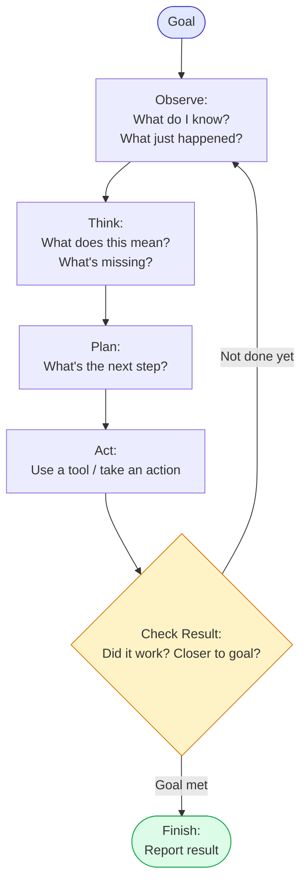

# Module 4 — What Is an AI Agent?

### Difficulty
Beginner

### Learning Objectives
- Define what makes a system "agentic."
- Understand the agent loop: Goal → Observe → Think → Plan → Act → Check → Continue/Finish.
- Understand goals, decisions, actions, tools, environment, and feedback loops.

### Prerequisites
Modules 1–3.

---

## Lesson 4.1 — Defining an Agent

### Concept Explanation

An **AI agent** is a system built around an LLM that:
1. Is given a **goal** (not a single fixed instruction for one output).
2. **Decides** what steps are needed to reach that goal.
3. Can use **tools** to take actions in the world (search, calculate, read/write files, call APIs).
4. **Observes** the results of its actions.
5. **Continues or adjusts** its approach until the goal is achieved (or it gives up / asks for help).

The defining trait is the **loop**: think → act → observe → think again, repeated until done — not a single input/output pass.

### Simple Analogy

> A chatbot is like someone answering questions while sitting at a desk — one question in, one answer out, then they wait for the next question.
>
> An AI agent is like an employee who receives a goal ("organize the Q3 marketing campaign"), figures out what tasks that involves, uses the tools available to them (email, spreadsheets, the internet), checks their own work, and keeps going — reporting back only once the goal is actually accomplished (or they hit a blocker worth escalating).

### The Agent Loop



**How to read this graph:** this is a loop, not a straight line — notice the arrow from the "Check Result" diamond back up to "Observe." That loop-back is the single most important feature of this diagram: it's what lets an agent try again, gather more information, or take a different action when its first attempt doesn't fully solve the goal. A regular program (or a chatbot) would just stop after one pass through the top-to-bottom boxes; an agent keeps circling through Observe → Think → Plan → Act → Check until the diamond finally routes it out to "Finish." The yellow diamond is the agent's one and only exit decision point — everything before it can repeat indefinitely (up to a safety limit, covered in Module 6 and Module 17), but this is the only place the agent decides "am I done or not."

### Explaining Each Stage

- **Goal**: the outcome the agent is working toward, defined by the user (e.g., "find the best laptop under ₹80,000"), not a single Q&A turn.
- **Observe**: gather current state — what has been done so far, what information is available, what the last tool result was.
- **Think**: the LLM reasons about what the observation means relative to the goal (internally — not necessarily shown to the user in raw form).
- **Plan**: decide the next concrete step (which tool to use, what sub-task to tackle).
- **Act**: execute that step — usually a tool call.
- **Check Result**: evaluate whether the action succeeded and moved the agent closer to the goal.
- **Continue/Finish**: loop back if the goal isn't met yet, or produce the final answer/deliverable if it is.

### Real-World Example

**Goal:** "Find the best laptop under ₹80,000."

```text
Plan: Search for laptops under ₹80,000.
Action: search_tool("best laptops under 80000 INR 2026")
Observation: Found 12 candidate laptops with specs and prices.

Plan: Narrow down by comparing specs (RAM, processor, reviews).
Action: compare_tool(candidates)
Observation: 3 laptops stand out on specs and reviews.

Plan: Check current price and availability.
Action: price_check_tool(these 3 laptops)
Observation: One is out of stock; two remain in budget.

Decision: Recommend the two remaining, explain trade-offs.
Finish: Present recommendation with reasoning.
```

Note: this shows **concise decision summaries and observations**, not hidden internal chain-of-thought — this is the standard, safe way to demonstrate agent reasoning.

### Visual Diagram — What Makes It "Agentic"

```text
                     Is there a GOAL (not just one fixed instruction)?
                                    │
                     ┌──────────────┴──────────────┐
                    No                             Yes
                     │                              │
              Not agentic                  Does it DECIDE its own steps?
      (e.g., a fixed "summarize"                    │
             button)                  ┌──────────────┴──────────────┐
                                      No                             Yes
                                       │                              │
                                Still just a               Does it use TOOLS and
                                workflow/LLM call            OBSERVE results in a loop?
                                                                       │
                                                        ┌──────────────┴──────────────┐
                                                       No                             Yes
                                                        │                              │
                                                 A single-shot                    ✅ This is
                                                 LLM response                     an AI Agent
```

### Key Takeaways
- An agent has a goal, not just an instruction.
- An agent decides its own steps rather than following a hardcoded sequence.
- Tools + observation + iteration is what separates an agent from a single LLM call.
- The loop continues until the goal is met or the agent determines it needs to stop/escalate.

### Common Mistakes
- Calling anything that uses an LLM "an agent" — a single Q&A call is not agentic; the defining feature is the goal-driven loop.
- Believing agents must run forever without stopping conditions — a well-designed agent has clear termination conditions (goal met, max steps reached, or needs human input).

### Exercise
Take a task you do at work or home (e.g., "plan weekly groceries"). Write it as a goal, then sketch 4–5 steps an agent might take to accomplish it, in the Plan → Act → Observe format.

### Challenge
Describe a task that *looks* like it needs an agent but could actually be solved with a simple fixed workflow (no autonomous decision-making needed). Explain why the simpler approach is sufficient — this judgment call is a skill you'll need throughout the course.

### Knowledge Check
1. What is the single defining difference between a chatbot and an agent?
2. Name the six stages of the agent loop in order.
3. Why is "checking the result" a critical step, not an optional one?
