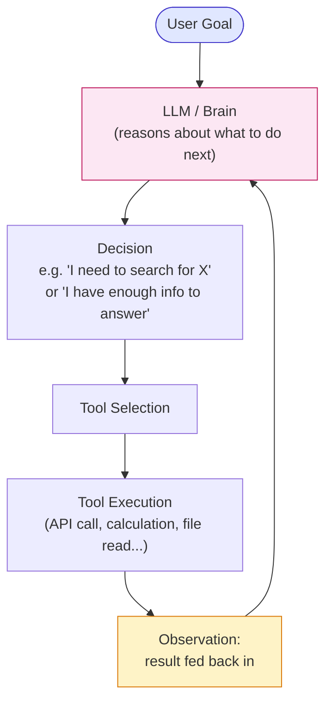

# Module 6 — Basic Agent Architecture

### Difficulty
Beginner → Intermediate

### Learning Objectives
- Understand the components of an agent: brain, instructions, tools, state, memory, environment, execution loop.
- Walk through a conceptual agent solving a real goal.

### Prerequisites
Modules 1–5.

---

## Lesson 6.1 — The Components of an Agent

### Concept Explanation

Module 4 established *what* an agent is (a goal-driven, tool-using, self-observing loop) at a conceptual level, and Module 5 established *when* you should actually build one instead of a simpler alternative. This lesson is where those ideas stop being abstract and become something you could actually write code for: the specific, named pieces that every real agent implementation is built from, no matter which programming language, framework (Module 13), or LLM provider you eventually use.

It's worth being upfront about a fact that tends to surprise beginners the first time they see real agent code: an "agent" is not some exotic new kind of program. Structurally, it is an ordinary loop — the same `while` construct you'd use to repeat any task in Python (Module 0.3) — wrapped around one special kind of function call (a call to an LLM) plus some bookkeeping code around it. Everything that *feels* intelligent or magical about an agent's behavior lives entirely inside that one LLM call; everything else in this list — the loop itself, the tool-execution code, the state-tracking — is completely ordinary, deterministic, unremarkable software engineering. Recognizing this split early will make the rest of this course, and any agent code you read from here on, dramatically less intimidating: you're never debugging "the AI," you're either debugging plain code (which behaves exactly as written, every time) or you're debugging a prompt (which is where genuine LLM-specific reasoning issues live).



**How to read this graph:** the pink "Brain" box is the only box that actually reasons — every other box is plain, predictable code around it. Follow the arrows clockwise: a goal comes in once, but from there the diagram is a cycle, not a line — the "Observation" box always feeds back into the "Brain" box, which is what lets the agent make its *next* decision using what it just learned, rather than blindly running a fixed script. If you're building this in code, everything except the pink box can be ordinary functions; the pink box is the only part that needs an LLM call.

Now let's go through each named component individually, because each one maps onto a very concrete, specific responsibility, and confusing two of them (especially "State" and "Memory," which trips up almost everyone the first time) will make Modules 7 through 16 harder to follow than they need to be:

- **Agent brain**: the LLM itself — reasons over the current state and decides the next action. This is the *only* component in the entire list that involves any actual language understanding or judgment. It's stateless on its own (Module 8.1) — everything it "knows" about the current situation has to be handed to it fresh, as text, in every single call. It never remembers anything between calls unless the surrounding code explicitly re-feeds it that information.
- **Instructions**: the system prompt defining the agent's role, rules, and boundaries (Module 3). This is fixed text, written once by the developer, that shapes how the brain behaves across every single call in the agent's run — it's the "job description" handed to the brain before it starts working, in the language of Module 6's own kitchen analogy below.
- **Tools**: functions/APIs the agent can call to affect or query the outside world (Module 7). Tools are what give the brain's decisions any actual consequence beyond generating more text — without tools, an agent could only ever talk *about* doing something, never actually do it.
- **State**: the current snapshot of what's happened so far in this run (steps taken, results so far). Think of state as this one specific errand's clipboard: it exists only for the duration of this particular goal being worked on, and it's what lets the loop's next iteration know what already happened in previous iterations of *this same run*.
- **Memory**: information retained across turns or sessions — short-term (this conversation) or long-term (across sessions) (Module 8). This is the point that most confuses newcomers, so it's worth stating the distinction as plainly as possible right now, ahead of Module 8's full treatment: **state is about one run** (it typically gets thrown away once the goal is achieved or the process ends), while **memory is about surviving *across* runs** (a fact learned in one conversation being available in a completely different, later conversation). A simple gut-check: if you restarted your whole program right now, would this information still need to exist afterward? If yes, it belongs in memory, not merely in state.
- **Environment**: the world the agent operates in — a filesystem, an API, a database, a web browser. The environment is not code you write directly — it's the external reality your tools reach into and that can change independently of your agent (a webpage's content changes, a file gets deleted by someone else, an API's data updates) — which is exactly why "Observe" is a distinct step in the agent loop: the agent can never simply assume the environment is still in whatever state it last saw.
- **Execution loop**: the code that repeatedly calls the brain, executes the chosen tool, and feeds results back, until a stopping condition is met. This is the ordinary `while` loop mentioned above — the piece of code responsible for actually running the cycle shown in the diagram, over and over, and for enforcing the one rule that keeps an agent from running forever: a maximum number of iterations (see the code example and Common Mistakes below).

### A Common Question

**"If the brain is stateless and forgets everything between calls, how does the agent seem to 'remember' what it did three steps ago?"** It doesn't remember in any biological sense — the illusion of memory comes entirely from the surrounding code re-sending the relevant history *back into* the brain's next prompt, every single time. Look again at the diagram: the "Observation" box feeds into "Brain" on every loop iteration, and in a real implementation, that observation is typically appended to a running list (the `state["history"]` list you'll see in the code example below) that gets included, in full or in summarized form, in every subsequent call to the LLM. The brain isn't recalling anything on its own — the execution loop is doing the remembering, by re-presenting the past as part of each new prompt. This is a subtle but important idea: from the brain's point of view, every single call looks like the *first* call it's ever made, just with an unusually long and detailed prompt describing everything "it" (really: the surrounding code, on its behalf) has supposedly done so far.

**"Why does 'Environment' get its own box if it's not really code I write?"** Because it's the single most important thing to keep separate in your mental model from "Tools." A tool is the *interface* your code uses to reach into the environment (e.g., a `get_weather(city)` function); the environment is the *actual external thing* being reached into (the real weather, which changes on its own schedule regardless of when your agent happens to check it). This distinction matters because it's the reason the "Check Result" step from Module 4's loop is necessary at all: a tool call can succeed perfectly (return valid data, no errors) while still reporting on an environment that has *changed* since the agent's plan was made — for example, the price-check step in the laptop-shopping example below exists specifically because prices found in an earlier search step can no longer be accurate by the time the agent is ready to act on them.

### Simple Analogy

> Think of a restaurant kitchen: the **head chef** (LLM/brain) decides what to cook next based on orders (goal) and what's already been prepared (state/memory); the **kitchen tools** (knives, oven, tools) let them actually act on ingredients (environment); and the **line** of kitchen staff repeating "check order → cook → plate → check next order" is the execution loop.
>
> Push this analogy one step further, because it maps onto the state-vs-memory distinction surprisingly well: the chef's mental note of "I've already plated the appetizer for table 5, now I need to start their main course" is **state** — it matters only for tonight's service and gets wiped clean when the restaurant closes. The chef's recollection that "table 5 always orders the same dish and has a shellfish allergy," recalled from a regular customer's *previous* visits weeks ago, is **memory** — it survives across separate, independent visits precisely because someone deliberately wrote it down (in a reservation system, or in the chef's own long-term recollection) rather than letting it evaporate at the end of each individual dinner service.

---

## Lesson 6.2 — Walking Through a Conceptual Agent

### Concept Explanation

**Goal:** "Find the best laptop under ₹80,000."

The agent should:
1. Understand the request (budget constraint, category = laptop, criteria = "best").
2. Search available information.
3. Compare options.
4. Evaluate specifications against likely priorities (performance, battery, reviews).
5. Select suitable choices.
6. Explain the recommendation.

Before walking through the trace, notice something about this six-step description: it's *not* a fixed workflow (Module 5) even though it's numbered and looks sequential. The actual number of search attempts, what gets compared against what, and whether the agent needs to circle back and search again if the first results are poor — none of that is fixed in advance. This numbered list is really describing the *shape* of a reasonable approach, not a hardcoded script; the trace below shows the agent actually working through it, making real decisions at each point based on what it observes, exactly the way Module 4 described the loop operating on a real goal.

### Visual Walkthrough (Decision Summaries, Not Hidden Reasoning)

```text
GOAL: Find the best laptop under ₹80,000.

Step 1
  Plan: Understand what "best" likely means without more input — assume general
        use: good performance, reliable brand, strong reviews, since no specific
        use case was given.
  Action: search_tool("best laptops under 80000 rupees 2026 reviews")
  Observation: 12 candidate laptops retrieved with prices and rough specs.

Step 2
  Plan: Filter to laptops actually under budget with recent, credible reviews.
  Action: filter_tool(candidates, max_price=80000, min_review_score=4.0)
  Observation: 5 candidates remain.

Step 3
  Plan: Compare the 5 remaining on CPU, RAM, battery life, and build quality.
  Action: compare_tool(remaining_5)
  Observation: 2 laptops clearly outperform the others on this use case.

Step 4
  Plan: Verify current stock/price hasn't changed since search.
  Action: price_check_tool(top_2)
  Observation: Both still in stock and within budget.

Step 5 — Finish
  Decision: Recommend both, with a clear primary pick and reasoning.
  Final Answer: "Laptop A is the best overall pick for battery life and build
  quality; Laptop B is a strong budget-performance alternative if raw speed
  matters more to you."
```

Notice how directly this trace maps onto the component list from Lesson 6.1: each "Plan" line is the brain's decision output; each "Action" line is a tool call reaching into the environment (a live product-search service, in this case); each "Observation" line is what gets appended into state, becoming part of what the brain sees on the *next* iteration. Step 4 deserves special attention, because it's easy to skim past as "just another step" when it's actually demonstrating something important about the environment being separate from the agent's own state: by Step 4, the agent already believes (from Step 1's search) that it knows the prices of the top candidates — but it deliberately re-checks rather than trusting that stale information, because the real environment (actual stock and pricing) could have changed in the time between the initial search and the final recommendation. This is precisely the "Check Result" discipline from Module 4's loop, applied concretely: a good agent treats its own earlier observations as provisional, not as permanent truth, whenever there's a realistic chance the environment moved on since it last looked.

This is how agent reasoning should be *shown* to users and in documentation: concise plans, explicit tool actions, observations, and a final decision — never raw private chain-of-thought.

### Practical Example (Simplified Python Skeleton)

```python
def run_agent(goal, tools, llm, max_steps=10):
    state = {"goal": goal, "history": []}

    for step in range(max_steps):
        # 1. Brain decides next action based on goal + history so far
        decision = llm.decide_next_step(state)

        if decision["action"] == "finish":
            return decision["final_answer"]

        # 2. Execute chosen tool
        tool = tools[decision["tool_name"]]
        result = tool.run(decision["tool_input"])

        # 3. Record the observation and loop
        state["history"].append({
            "plan": decision["plan_summary"],
            "tool": decision["tool_name"],
            "result": result,
        })

    return "Stopped: reached max steps without finishing."
```

*Explanation, walking through why each piece is written the way it is:*

`state = {"goal": goal, "history": []}` sets up the run's **state** (Lesson 6.1) as a plain Python dictionary — this single object is what will accumulate everything the agent has done so far in this run, and it's the concrete thing being passed into `llm.decide_next_step(state)` on every iteration, which is how the "stateless brain, stateful loop" idea from the Common Question above is actually implemented: the loop, not the model, is carrying the history forward.

`for step in range(max_steps):` is the execution loop itself, and `max_steps` is not a minor detail — it's the single line of code standing between this agent and the "infinite loop" failure mode Module 4 warned about. Without this cap, if `llm.decide_next_step` never happened to return `{"action": "finish", ...}` (because the model got confused, because a tool kept returning unhelpful results, because the goal was subtly unachievable), this function would call the LLM, execute a tool, and loop, forever, silently consuming API cost with no output ever returned to the caller. `range(max_steps)` guarantees the loop body can run at most `max_steps` times no matter what the model decides, which is why the very last line of the function — `return "Stopped: reached max steps without finishing."` — exists: it's the fallback the loop falls through to *only* if every iteration was used up without the model ever choosing to finish.

`decision = llm.decide_next_step(state)` is the one and only line in this entire function that involves the LLM — everything else is plain, deterministic Python. In a real implementation, this function call would package up `state` into a prompt (using the templating and structured-output techniques from Module 2.5 and Module 3.4), send it to the LLM API, and parse the model's structured JSON response (Module 0.6) back into the `decision` dictionary this code expects.

`if decision["action"] == "finish": return decision["final_answer"]` is the loop's one designed exit point when the model itself believes the goal is met — this corresponds exactly to the "Check Result → Finish" branch of Module 4's loop diagram.

`tool = tools[decision["tool_name"]]` then `result = tool.run(decision["tool_input"])` is the "Tool Selection" and "Tool Execution" boxes from the Lesson 6.1 diagram, written as actual code: `tools` is a dictionary mapping tool names (strings) to actual callable tool objects — this is the same pattern Module 7.3's `TOOLS` dictionary uses, and it's what lets the model's plain-text decision of "use the tool named `search_tool`" get translated into an actual function call in Python.

`state["history"].append({...})` is the "Observation" box from the diagram, made concrete: this is the exact moment a tool's result gets folded into state, ready to be included in the *next* call to `llm.decide_next_step`. If you deleted this one line, the agent would still technically loop and call tools, but it would never actually learn anything from what it did — every iteration's `llm.decide_next_step(state)` call would see the same empty history, and the agent would likely repeat the same first action forever, since nothing in its input ever changes.

### What This Skeleton Deliberately Leaves Out

This code is intentionally simplified, and it's worth being explicit about what's missing, because you'll fill each of these gaps in later modules rather than all at once: there is no handling here for a tool call raising an exception (Module 7's `TOOLS`/error-handling example and Module 17 both address this — as written, an unexpected tool failure would crash this entire function rather than feeding a graceful error observation back to the model); there is no persistence of `state` to a database (Module 16 — if this process crashes at step 7, everything in `state["history"]` is lost, and a restart would begin the whole goal over from scratch); and there is no loop-detection logic beyond the blunt `max_steps` cap (Module 17.3's `detect_stuck_loop` example shows a more targeted way to notice an agent is repeating the same failing action well before it burns through all ten allowed steps).

### Key Takeaways
- An agent = Brain (LLM) + Instructions + Tools + State/Memory + Environment + Execution Loop.
- The execution loop is ordinary code — the "intelligence" lives in the brain's decisions, not magic in the loop itself. Everything except the single LLM-call line in the skeleton above is deterministic, unremarkable Python.
- Always show reasoning as concise plans/observations, never exposed raw internal chain-of-thought.
- State is scoped to one run and typically thrown away afterward; memory is deliberately preserved across runs — confusing the two is the single most common conceptual mix-up at this stage of the course (Module 8 develops this distinction fully).

### Common Mistakes
- Forgetting a maximum step limit — an agent without a stopping condition can loop indefinitely, burning cost (Module 17). Mechanically, this happens because `llm.decide_next_step` is a probabilistic function (Module 2.4) with no built-in guarantee it will ever return `{"action": "finish"}` — treating that guarantee as automatic, rather than enforcing a hard external cap, is the root cause of this failure mode.
- Not logging each step's plan/action/observation — without this, debugging why an agent failed becomes nearly impossible, because by the time you notice something went wrong (a bad final answer, a crash), the intermediate reasoning that led there is gone unless it was captured as it happened; `state["history"]` in the skeleton above is exactly this log, and discarding it (or never persisting it anywhere durable) removes your only window into what the agent actually did.
- Conflating "state" and "memory" — treating the run-scoped `state` dictionary as if it were durable, cross-session memory (assuming information from one call to `run_agent` will still be there the next time the function is called with a fresh `state = {...}`), or conversely, building a persistent memory system before you've even gotten a single run's state management working reliably. Get the single-run loop correct and observable first; only then layer in the cross-run memory concerns from Module 8 onward.

### Exercise
Design (on paper) the step-by-step plan/action/observation trace for an agent with the goal: "Book the cheapest available flight from Delhi to Mumbai next Friday." Include at least 4 steps.

### Challenge
Identify one point in your Exercise trace where the agent's plan should change based on what it observes (e.g., "no flights found for Friday, check Saturday instead"). Explain how the execution loop needs to support that kind of replanning.

### Knowledge Check
1. Name the six components of a basic agent architecture.
2. Why does the execution loop need a maximum step count?
3. What's the difference between "state" and "memory" in an agent (hint: think about a single run vs. across runs — this will be sharpened in Module 8)?
4. In the Python skeleton above, which single line is the only one that involves the LLM, and why does that matter for how you'd debug this code?
