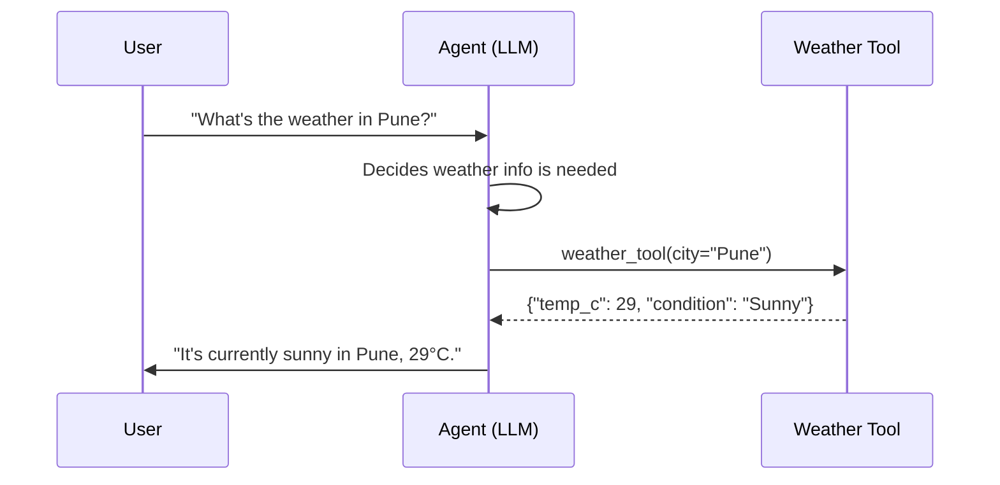

# Module 7 — Tool Calling

### Difficulty
Beginner → Intermediate

### Learning Objectives
- Understand why agents need tools and what APIs/functions are.
- Understand tool schemas, inputs/outputs, and error handling.
- Implement a simple tool-calling loop in Python.

### Prerequisites
Modules 1–6.

---

## Lesson 7.1 — Why Agents Need Tools

### Concept Explanation

To understand why tools exist, it helps to first be precise about what an LLM actually *is* at the mechanical level, because the limitation isn't a missing feature someone forgot to add — it's a direct consequence of how these models work. An LLM is a function: you give it a sequence of tokens (text), and it computes a probability distribution over what the next token is likely to be, then repeats that process to generate a response (Module 2.1–2.2). That's the entire operation. It runs on a server, has no arms, no network socket it can open on its own initiative, no filesystem it can browse, and no clock it can check. When you ask an LLM "what time is it right now?", there is no mechanism inside the model that reaches out to a clock — it can only generate text that *sounds like* a plausible answer, drawing on patterns from its training data (which, remember, has a knowledge cutoff — Module 2.3). This is precisely why LLMs can hallucinate a confident-sounding but wrong time, or a plausible-but-wrong weather report: generating fluent text and being factually current are two completely different capabilities, and the model only has the first one built in.

**Tools** close this gap. A tool is simply a piece of code — running in *your* application, not inside the model — that can do the things the model can't: query a live weather API, execute exact arithmetic, read a file from disk, write a row into a database, or send an email through a real mail server. The model's job changes from "answer directly" to "recognize when an external capability is needed, and describe precisely what to invoke and with what input." Your surrounding application code is the one that actually receives that description, executes the real action, and hands the result back to the model as new text it can then reason over. This is the single most important mental model to hold onto for this entire module: **the LLM never directly executes anything in the outside world.** It only ever produces text describing an intended action; a completely separate piece of ordinary code is what turns that description into a real HTTP request, a real SQL query, or a real file write. This separation is not an implementation detail — it's a deliberate safety boundary, and it's exactly what makes the guardrails and approval gates in Module 17 and Module 18 possible at all: because the model can only *propose* an action, your code always gets a chance to inspect, validate, or block it before anything real happens.

### A Common Question

**"If the model can't actually run code, how does 'tool calling' work at all — is the model literally calling a Python function?"** No. What actually happens is: you send the model a list of tool *descriptions* (covered in Lesson 7.2) alongside the conversation. When the model decides a tool would help, it doesn't call anything — it outputs a specially formatted piece of text (usually JSON) saying, in effect, "I would like to call `get_weather` with `city="Pune"`." Your application code reads that structured output, recognizes it as a tool-call request, looks up the real `get_weather` Python function, actually runs it, and then sends the *result* back to the model as another message in the conversation. The model then continues generating text, now with that result available as additional context. So "tool calling" is really a *protocol* — a structured way for the model to ask your code to do something, and for your code to report back what happened — not the model reaching out and executing anything itself.

**"Couldn't I just skip all this and let the LLM generate the final answer directly, since it's usually pretty good at guessing?"** For some things, sure — if you ask "what's a synonym for happy," the model doesn't need a tool, because generating a plausible answer *is* the correct behavior; there's no external fact to get right or wrong. But the moment correctness depends on something outside the model's training data or exact computation (today's weather, this user's account balance, precise arithmetic on large numbers, whether a flight is actually available right now), guessing is actively dangerous, because the output will *look* just as confident and fluent whether it's right or wrong. Tools exist specifically to replace "the model's best guess" with "a verified, real answer" wherever that distinction actually matters.

### Simple Analogy

Imagine an intelligent employee sitting in an office. The employee can think, reason, and answer questions from what they've already learned. But if they need the current weather, they need access to a phone or a computer — their own knowledge, no matter how extensive, cannot substitute for that live external fact. Crucially, the employee doesn't magically develop the ability to check the weather just by being smart; they need someone to have already installed a phone line and taught them how to use it. That installation and training is exactly what defining a tool schema (Lesson 7.2) does for an LLM.

> Tools give AI agents the ability to interact with the outside world.
>
> **LLM = Brain**
> **Tool = Ability to perform an external action**
> **Agent = Brain + Tools + Decision-making loop**

### Example

User asks: "Calculate 25% of ₹40,000."

```text
User Request
     ↓
Agent understands calculation is needed
     ↓
Agent selects Calculator Tool
     ↓
Calculator returns ₹10,000
     ↓
Agent responds to user
```

Walking through this more slowly: the phrase "Agent understands calculation is needed" is doing a lot of hidden work, so let's unpack it. When the model receives the user's message alongside the list of available tool descriptions (Lesson 7.2), it isn't running some separate "intent classifier" — it's using the exact same next-token-prediction mechanism from Module 2, just now with the tool descriptions sitting in its context as extra information to draw on. Because one of those descriptions says something like "evaluates a mathematical expression," and the user's message contains an arithmetic request, the most statistically likely continuation the model generates is a structured tool-call request rather than a prose answer. Nothing forces this to happen — a poorly written tool description, or a genuinely ambiguous request, can lead the model to answer directly instead (this is exactly why the wording of a tool's description matters so much, as you'll see in Lesson 7.2).

Why not let the LLM just do the math itself? LLMs generate text by predicting likely tokens, not by running exact arithmetic circuitry. For small, extremely common calculations ("2+2"), the model has seen the correct answer so many times during training that it reliably reproduces it — but that's pattern memorization, not calculation, and it breaks down fast. Ask a raw LLM to multiply two large, less-common numbers (say, 8,472 × 391) and there's a real chance it produces a wrong but perfectly fluent-looking answer, because nothing in its architecture is actually performing long multiplication — it's predicting what digits are likely to come next based on patterns in similar-looking problems it saw during training. A calculator tool, by contrast, is ordinary deterministic code: given the same input, it produces the exact correct output, every single time, with zero risk of "confidently wrong" arithmetic. This is the general principle behind almost every tool in this module: reach for a tool whenever correctness depends on something the model's text-generation mechanism cannot guarantee — exact computation, live external state, or an action that has real-world side effects.

---

## Lesson 7.2 — APIs, Functions, and Tool Schemas

### Concept Explanation

Three terms get used together constantly in this module, and it's worth being precise about each one so they don't blur together:

- **Function**: the most basic building block — a named piece of code that takes some input and returns some output, running entirely inside your own program (e.g., `calculate(expression)` performing arithmetic locally, with no network involved at all).
- **API (Application Programming Interface)**: a defined way for your program to talk to *another* program, usually running on a different machine somewhere on the internet, over the network (e.g., a weather service's API, which you send a request to and get a response back from). An API is really a contract: "send me a request shaped like this, and I promise to send back a response shaped like that."
- **Tool schema**: a structured description — almost always JSON — of a function or API that you show to the LLM so it can decide, on its own, whether and how to invoke that capability. This is the piece that's genuinely new in this module: functions and APIs have existed in software for decades, but a tool schema is specifically the translation layer that makes a function or API *legible to an LLM* as something it can choose to use.

It's worth being explicit that a "tool" in the agentic sense can be either a pure local function (like the calculator above, which does no networking at all) or a wrapper around a remote API call (like the weather tool, which sends an HTTP request somewhere else). From the LLM's point of view, there's no difference whatsoever — it only ever sees the tool's name, description, and input format via the schema, never the implementation. This is a genuinely useful property: you can start a project with a tool that returns fake hardcoded data (exactly as the Python example in Lesson 7.3 does for `get_weather`), get the whole agent loop working and tested, and then later swap in a real API call behind the exact same function signature — the agent's reasoning about *when* to use the tool never has to change, because the schema (its "interface" to the model) stayed identical.

### Visual Diagram



**How to read this graph:** this is a *sequence diagram* — time flows top to bottom, and each arrow is a message passed between one of the three participants (User, Agent, Tool). The key thing to notice is that the Agent never talks to the Tool's underlying weather service directly in a way the user sees — the User only ever sees the first arrow (their question) and the last arrow (the final answer). Everything in between — deciding a tool is needed, calling it, and receiving structured data back — happens inside the agent's own loop from Module 6, invisible to the user unless you explicitly choose to show it (as we do throughout this course, for teaching purposes). It's also worth noticing what this diagram *doesn't* show: the "A->>T" arrow labeled `weather_tool(city="Pune")` is a simplification of two real steps — the model first outputs a JSON tool-call *request* describing that call, and then it is your surrounding application code (not the model itself, per Lesson 7.1) that actually performs the call to `T` and captures the result. The diagram compresses those two steps into one arrow purely to keep the picture readable.

### Tool Schema Example

```json
{
  "name": "get_weather",
  "description": "Get the current weather for a given city.",
  "input_schema": {
    "type": "object",
    "properties": {
      "city": {"type": "string", "description": "City name, e.g. 'Pune'"}
    },
    "required": ["city"]
  }
}
```

*Explanation:* the `description` field is critical — it's the primary signal the LLM uses to decide *when* this tool is relevant. Vague descriptions lead to the model either never using the tool or misusing it. Let's look at every field and think about exactly what job it's doing, because each one answers a different question the model implicitly needs answered before it can use the tool correctly:

- `name` answers "what do I call this thing when I want to use it?" — this is the literal string the model will echo back in its tool-call request, so it needs to be short, unambiguous, and ideally verb-like (`get_weather`, not `weather` or `weather_data_retriever_v2`).
- `description` answers "*when* should I reach for this, and what does it actually do?" This is genuinely the most important field in the whole schema, because it's the only piece of information the model has to decide relevance — remember from Lesson 7.1 that the model is choosing to call a tool based on the same next-token-prediction mechanism as everything else it does, so if the description is vague or misleading, the model's decision about when to use the tool will be correspondingly vague or misleading. A description like "handles weather stuff" gives the model much weaker signal than "Get the current weather for a given city" — the second version tells the model both the domain (weather) and the scope (current, per-city), which helps it correctly *avoid* calling this tool for a question like "what's the average weather in Pune during monsoon season historically" (a different kind of request this specific tool wasn't built to answer).
- `input_schema` answers "if I do want to use this, exactly what information do I need to provide, and in what shape?" The `type: "object"` and `properties` fields describe the expected shape (here, an object with one field called `city`, expected to be a string), and the nested `description` under `city` gives the model an example format to follow — notice the schema uses a description *inside* a description, at two different levels of specificity: the outer one describes the whole tool, the inner one describes just this one parameter.
- `required` answers "which of these fields are mandatory, versus optional?" — listing `"city"` here tells the model it cannot call this tool without providing a city; if the schema had additional optional fields (say, a `units` field for Celsius vs. Fahrenheit), those would simply be left out of the `required` array, and the model would understand it's free to omit them.

### A Common Question

**"What happens if the model provides input that doesn't actually match the schema — say, it passes a number where the schema expects a string, or forgets a required field?"** This does happen in practice, especially with smaller or less capable models, or with poorly worded schemas. There are two layers of defense: first, many LLM providers perform some validation on their end before even returning the tool-call request to you, rejecting or auto-correcting obviously malformed calls. Second — and this is the layer *you* control and should never skip — your own application code should validate the input against the schema before actually executing the underlying function, exactly as described in the "Error Handling in Tool Calling" section below and expanded further in Module 17. Never assume a tool-call request is well-formed just because it came from the model; treat it with the same skepticism you'd apply to input from an untrusted user, because in a meaningful sense, it is exactly that (this connects directly to the security discussion in Module 21).

**"Is a 'tool schema' the same thing as 'function calling'?"** Yes, in practice — different LLM providers and frameworks use slightly different names for essentially the same idea (function calling, tool use, tool calling), and the underlying mechanism — describe a capability in structured form, let the model request it, execute it yourself, feed the result back — is consistent across all of them, even though the exact JSON field names can differ slightly from provider to provider. Learning the concept here transfers directly regardless of which specific SDK or framework you end up using in Module 13.

---

## Lesson 7.3 — A Simple Tool-Calling Loop in Python

### Practical Example

```python
import json

# --- Define tools the agent can use ---
def get_weather(city: str) -> dict:
    # In reality this would call a real weather API
    fake_data = {"Pune": {"temp_c": 29, "condition": "Sunny"}}
    return fake_data.get(city, {"error": f"No data for {city}"})

def calculate(expression: str) -> dict:
    try:
        return {"result": eval(expression, {"__builtins__": {}})}
    except Exception as e:
        return {"error": str(e)}

TOOLS = {
    "get_weather": get_weather,
    "calculate": calculate,
}

TOOL_SCHEMAS = [
    {"name": "get_weather", "description": "Get current weather for a city.",
     "input_schema": {"type": "object", "properties": {"city": {"type": "string"}}, "required": ["city"]}},
    {"name": "calculate", "description": "Evaluate a math expression.",
     "input_schema": {"type": "object", "properties": {"expression": {"type": "string"}}, "required": ["expression"]}},
]

def run_agent(user_message: str, llm_client, max_steps: int = 5) -> str:
    messages = [{"role": "user", "content": user_message}]

    for _ in range(max_steps):
        response = llm_client.decide(messages=messages, tools=TOOL_SCHEMAS)

        if response["type"] == "final_answer":
            return response["content"]

        if response["type"] == "tool_call":
            tool_name = response["tool_name"]
            tool_input = response["tool_input"]

            if tool_name not in TOOLS:
                observation = {"error": f"Unknown tool: {tool_name}"}
            else:
                try:
                    observation = TOOLS[tool_name](**tool_input)
                except Exception as e:
                    observation = {"error": f"Tool execution failed: {e}"}

            messages.append({"role": "assistant", "content": json.dumps(response)})
            messages.append({"role": "tool_result", "content": json.dumps(observation)})

    return "Stopped: reached max steps without a final answer."
```

*Explanation, walked through block by block:*

- **`get_weather` and `calculate`** are ordinary Python functions with no special "agent" magic in them at all — this is a deliberate and important point. Anything you already know how to write as a normal function can become a tool; the only extra work is describing it in a schema (below) so the model knows it exists. Notice `get_weather` uses `.get(city, {"error": ...})` rather than a plain dictionary lookup (`fake_data[city]`) — this is a small but important defensive habit: a plain lookup would raise a `KeyError` and crash the function the moment someone asks about a city that isn't in `fake_data`, whereas `.get` with a default lets the function return a clean, structured error instead. Similarly, `calculate` wraps `eval` in a `try/except` because `eval` will raise an exception on malformed input (like `"5 + "` with nothing after the plus sign) — without the `try/except`, that exception would propagate upward and crash the whole function, not just fail this one calculation. (Using bare `eval` on model-generated text also has real security implications, which Module 21 addresses directly — restricting `__builtins__` to an empty dict here is a partial mitigation, not a complete one.)
- **`TOOLS`** is a dictionary mapping each tool's string name to the actual Python function object that should run when that name is requested. This dictionary is the bridge between "the model said it wants to call `get_weather`" (just text, per Lesson 7.1) and "actually run the `get_weather` Python function" (a real function call) — `TOOLS[tool_name]` is the lookup that crosses that bridge.
- **`TOOL_SCHEMAS`** is the list of tool descriptions (Lesson 7.2) that actually gets sent to the model alongside the conversation, so it knows these two tools exist and what input each expects. Notice this list is built from the exact same tool names (`"get_weather"`, `"calculate"`) as the `TOOLS` dictionary — keeping these two structures in sync (same names, same expected inputs) is essential; if you added a new tool to `TOOLS` but forgot to add its schema here, the model would have no way of knowing the new tool exists at all.
- **`run_agent`** is the actual agent loop from Module 6, written out as real code for the first time in this course. `messages` starts as a list containing just the user's original message — this list *is* the agent's working memory for this run (foreshadowing Module 8), and it grows by two entries every time a tool gets used.
- The `for _ in range(max_steps):` loop is the code-level implementation of the "Continue" arrow in the agent loop diagram from Module 4 — each iteration is one full pass through Observe → Think → Plan → Act → Check. `llm_client.decide(...)` represents the actual call to the LLM API (Module 0.7 covered the raw HTTP mechanics of a call like this); it's passed both the conversation so far (`messages`) and the available tools (`tools=TOOL_SCHEMAS`), and it returns either a final answer or a request to call a specific tool.
- The `if response["type"] == "final_answer":` branch is the loop's *only* normal exit point — this is the code equivalent of the "Finish" box in Module 4's agent-loop diagram. Everything below this line only runs when the model instead asked for a tool.
- `if tool_name not in TOOLS:` is the defensive check against a real failure mode worth naming explicitly: **the model can hallucinate a tool name that was never given to it** — for instance, requesting a `"get_stock_price"` tool that doesn't exist in `TOOLS` at all, perhaps because the model has seen similar tools in its training data and incorrectly assumed one exists here too. Without this check, the very next line (`TOOLS[tool_name](**tool_input)`) would raise a `KeyError` and crash the entire agent run over what is really a minor, recoverable mistake. Instead, the code catches this case explicitly and produces a structured `{"error": "Unknown tool: get_stock_price"}` observation, which gets fed back into the conversation just like any other tool result — giving the model a chance to notice the mistake and either try a real tool instead or explain to the user that it can't do what was asked. This is a concrete instance of the general reliability principle from Module 17: detect the failure, and recover gracefully, rather than letting the whole system crash over one bad decision.
- The inner `try/except` around `TOOLS[tool_name](**tool_input)` is a second, different safety net — this one guards against the tool *existing* but *failing during execution* (a network timeout inside a real weather API call, for example, or `calculate` receiving an expression that still slips past its own internal `try/except` in some unusual way). `**tool_input` unpacks the dictionary of arguments the model provided into keyword arguments for the function call — so if `tool_input` is `{"city": "Pune"}`, this line becomes equivalent to writing `get_weather(city="Pune")` directly.
- The two `messages.append(...)` lines are what actually gives the agent "memory" of what just happened within this run: the first records the model's own tool-call request (so it remembers *what it asked for*), and the second records the observation that came back (so it remembers *what it learned*). Both get serialized with `json.dumps` because, per Module 0.6, the conversation history is fundamentally a sequence of text messages — even a "tool result" has to be turned into a string before it can be appended to a list of messages that will eventually be sent back to the LLM as more input text.
- **`max_steps`** exists purely to prevent the failure mode named explicitly in Module 17.1 as "infinite loops" — without this cap, a model that keeps deciding a tool is needed, over and over, without ever converging on a final answer, would run forever (or until you ran out of money paying for each LLM call). The final `return "Stopped: ..."` line is what happens if the loop exhausts `max_steps` without ever hitting the `final_answer` exit — this is a deliberate, visible failure state, not a silent one, so that whatever code called `run_agent` knows the task didn't actually complete successfully.

### A Worked Trace — What Happens With a Hallucinated Tool

To make the "unknown tool" defensive check above concrete, here is what an actual run through this code looks like when the model asks for a tool that was never defined:

```text
User: "What's the stock price of Acme Corp, and what's 15% of that?"

Step 1:
  Model requests: {"type": "tool_call", "tool_name": "get_stock_price",
                    "tool_input": {"symbol": "ACME"}}
  Code checks: "get_stock_price" not in TOOLS → True
  Observation returned: {"error": "Unknown tool: get_stock_price"}
  (fed back into messages as a tool_result)

Step 2:
  Model, now aware no stock-price tool exists, requests:
    {"type": "final_answer",
     "content": "I don't have access to live stock prices, so I can't
     look up Acme Corp's current price or calculate 15% of it. If you
     can tell me the price, I can calculate the 15% for you."}
```

Notice the model recovers gracefully in Step 2 — not because of any special "recovery" code, but simply because the structured error from Step 1 became part of its context, and the most sensible continuation given that new information is to explain the limitation rather than keep guessing. This is exactly the payoff of never letting a failure crash the whole run: a single bad decision becomes recoverable information instead of a dead end.

### Practical Tool Categories

| Tool Type | Example | Typical Use |
|---|---|---|
| Search tool | `web_search(query)` | Getting current/external information |
| Calculator tool | `calculate(expression)` | Reliable math instead of model-generated arithmetic |
| Database tool | `query_db(sql)` | Reading/writing structured business data |
| File tool | `read_file(path)`, `write_file(path, content)` | Working with documents |
| API tool | `send_email(to, subject, body)` | Taking real-world actions |

Notice a pattern across this table: the first three rows are largely about *retrieving* information the model doesn't otherwise have, while the last two increasingly involve *changing* something in the world (writing a file, sending an email). This distinction matters more than it might first appear — a read-only tool that returns wrong information is usually just unhelpful, but a write/action tool that runs on bad input can cause real, sometimes irreversible, damage. This exact distinction is what Module 18's risk-tiered human-in-the-loop system is built around, so it's worth starting to notice it here.

### Error Handling in Tool Calling

```text
Tool Call
   ↓
Did it succeed?
 ├─ Yes → feed result back as observation
 └─ No  → feed structured error back (not a crash)
              ↓
        Agent decides: retry, try a different tool, or ask for help
```

The phrase "Agent decides: retry, try a different tool, or ask for help" deserves unpacking, because it's easy to read past it without noticing that this decision is happening the *exact same way* every other agent decision happens: the model sees the error message as part of its context (via the appended `tool_result` message in the Python example above) and generates whatever continuation seems most appropriate given that new information. There's no separate "error-handling module" bolted onto the model — the error is just more text, and a reasonably capable model, given a clearly worded error like `{"error": "No data for Mumbai"}`, will often naturally choose a sensible next step (say, asking the user to clarify, or trying a nearby city) purely because that's the most plausible continuation of a conversation containing that error. This is powerful, but it's also exactly why the *wording* of your structured errors matters just as much as the wording of your tool descriptions — a vague `{"error": "failed"}` gives the model much less to work with than `{"error": "No weather data available for 'Mumbai' — try a supported city like 'Pune' or 'Delhi'"}`.

### Key Takeaways
- Tools convert an LLM from "text generator" into "system that can act" — but the model still never executes anything itself; your surrounding application code is always the one performing the real action, which is precisely what makes it possible to inspect, validate, or block that action before it happens.
- Tool schemas need clear names, descriptions, and input formats — the description is what teaches the model *when* to use the tool, using the exact same text-prediction mechanism the model uses for everything else, which is why vague descriptions produce vague tool-selection behavior.
- Always handle tool failures gracefully and feed the error back to the agent rather than letting it crash the whole run — this includes both "the tool doesn't exist" (a hallucinated tool name) and "the tool exists but failed" (a runtime error), and each needs its own defensive check.

### Common Mistakes
- **Vague tool descriptions** ("does stuff with data") — because the description is the model's only signal for *when* a tool applies, an ambiguous description doesn't just make the tool less useful, it makes the model's tool-selection behavior itself unpredictable: the same vague wording that confuses a human reader confuses the model for exactly the same reason.
- **Giving the agent too many overlapping tools** — if two tools have similar descriptions (say, `search_web` and `search_internet`), the model has no reliable way to know which one you actually intended to be used for what, and will effectively guess; the fix isn't more tools, it's fewer, clearly differentiated ones.
- **Not validating tool inputs before execution** — a malformed input can crash a tool outright, or, in the worst case, let a model-generated value flow directly into something sensitive like a raw SQL query or a shell command (this is the same class of vulnerability as classic SQL/command injection, just with the LLM's output playing the role of "untrusted input" instead of a web form — Module 21 covers this in depth).
- **Letting a raw exception propagate and kill the whole agent run** instead of returning a structured error observation — this is the single mistake this module's Python example goes out of its way to avoid twice over (the `try/except` inside `calculate`, and the `try/except` around every tool call in the loop), because one failed tool call should never mean the entire multi-step task has to restart from scratch.
- **Treating the model's tool-call request as inherently trustworthy** simply because it came from the model rather than from a human user — as the "unknown tool" trace above shows, the model can request tools that don't exist or pass input that doesn't match the schema; defensive checks at every step aren't paranoia, they're the same discipline you'd apply to any other untrusted input source.

### Exercise
Design a tool schema (name, description, input schema) for a `send_email(to, subject, body)` tool. Write the description carefully enough that an LLM would know exactly when and how to use it.

### Challenge
Extend the Python tool-loop example to add a third tool, `search_products(query, max_price)`, and write a short trace showing the agent using all three tools in sequence to answer: "Find a phone under ₹20,000 and tell me if I can afford it with 15% of my ₹50,000 salary."

### Knowledge Check
1. Why can't an LLM reliably do exact math without a calculator tool?
2. What's the purpose of a tool's `description` field?
3. What should happen when a tool call fails — and why is "crash the whole agent" the wrong answer?
4. Why is it inaccurate to say "the model calls the tool" — what actually happens instead, and why does that distinction matter for safety?
