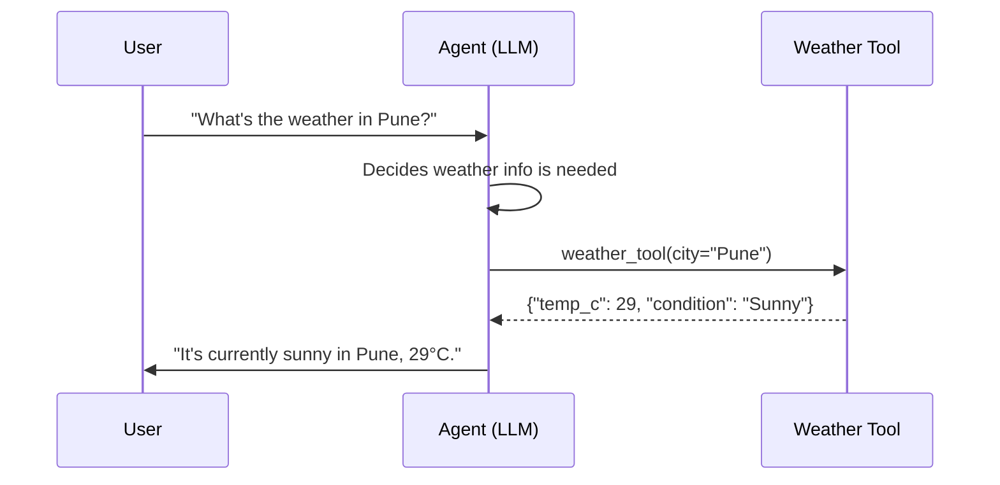

# Module 7 — Tool Calling

### Difficulty
Beginner → Intermediate

### Learning Objectives
- Understand why agents need tools and what APIs/functions are.
- Understand tool schemas, inputs/outputs, and error handling.
- Implement a simple tool-calling loop in Python.

### Prerequisites
Modules 1–6.

---

## Lesson 7.1 — Why Agents Need Tools

### Concept Explanation

An LLM by itself can only generate text — it cannot check today's weather, run a calculation reliably, search the live web, or modify a file. **Tools** give an agent the ability to interact with the outside world: APIs, functions, databases, files.

### Simple Analogy

Imagine an intelligent employee sitting in an office. The employee can think and answer questions. But if they need the current weather, they need access to a phone or computer.

> Tools give AI agents the ability to interact with the outside world.
>
> **LLM = Brain**
> **Tool = Ability to perform an external action**
> **Agent = Brain + Tools + Decision-making loop**

### Example

User asks: "Calculate 25% of ₹40,000."

```text
User Request
     ↓
Agent understands calculation is needed
     ↓
Agent selects Calculator Tool
     ↓
Calculator returns ₹10,000
     ↓
Agent responds to user
```

Why not let the LLM just do the math itself? LLMs generate text by predicting likely tokens, not by running exact arithmetic — for anything beyond very simple sums, an actual calculator tool is more reliable than trusting the model's generated digits.

---

## Lesson 7.2 — APIs, Functions, and Tool Schemas

### Concept Explanation

- **Function**: a piece of code that takes input and returns output (e.g., `calculate(expression)`).
- **API (Application Programming Interface)**: a way for programs to talk to other services over the network (e.g., a weather service API).
- **Tool schema**: a structured description (usually JSON) telling the LLM what a tool is called, what it does, and what input format it expects — so the model can decide when and how to call it correctly.

### Visual Diagram



**How to read this graph:** this is a *sequence diagram* — time flows top to bottom, and each arrow is a message passed between one of the three participants (User, Agent, Tool). The key thing to notice is that the Agent never talks to the Tool's underlying weather service directly in a way the user sees — the User only ever sees the first arrow (their question) and the last arrow (the final answer). Everything in between — deciding a tool is needed, calling it, and receiving structured data back — happens inside the agent's own loop from Module 6, invisible to the user unless you explicitly choose to show it (as we do throughout this course, for teaching purposes).

### Tool Schema Example

```json
{
  "name": "get_weather",
  "description": "Get the current weather for a given city.",
  "input_schema": {
    "type": "object",
    "properties": {
      "city": {"type": "string", "description": "City name, e.g. 'Pune'"}
    },
    "required": ["city"]
  }
}
```

*Explanation:* the `description` field is critical — it's the primary signal the LLM uses to decide *when* this tool is relevant. Vague descriptions lead to the model either never using the tool or misusing it.

---

## Lesson 7.3 — A Simple Tool-Calling Loop in Python

### Practical Example

```python
import json

# --- Define tools the agent can use ---
def get_weather(city: str) -> dict:
    # In reality this would call a real weather API
    fake_data = {"Pune": {"temp_c": 29, "condition": "Sunny"}}
    return fake_data.get(city, {"error": f"No data for {city}"})

def calculate(expression: str) -> dict:
    try:
        return {"result": eval(expression, {"__builtins__": {}})}
    except Exception as e:
        return {"error": str(e)}

TOOLS = {
    "get_weather": get_weather,
    "calculate": calculate,
}

TOOL_SCHEMAS = [
    {"name": "get_weather", "description": "Get current weather for a city.",
     "input_schema": {"type": "object", "properties": {"city": {"type": "string"}}, "required": ["city"]}},
    {"name": "calculate", "description": "Evaluate a math expression.",
     "input_schema": {"type": "object", "properties": {"expression": {"type": "string"}}, "required": ["expression"]}},
]

def run_agent(user_message: str, llm_client, max_steps: int = 5) -> str:
    messages = [{"role": "user", "content": user_message}]

    for _ in range(max_steps):
        response = llm_client.decide(messages=messages, tools=TOOL_SCHEMAS)

        if response["type"] == "final_answer":
            return response["content"]

        if response["type"] == "tool_call":
            tool_name = response["tool_name"]
            tool_input = response["tool_input"]

            if tool_name not in TOOLS:
                observation = {"error": f"Unknown tool: {tool_name}"}
            else:
                try:
                    observation = TOOLS[tool_name](**tool_input)
                except Exception as e:
                    observation = {"error": f"Tool execution failed: {e}"}

            messages.append({"role": "assistant", "content": json.dumps(response)})
            messages.append({"role": "tool_result", "content": json.dumps(observation)})

    return "Stopped: reached max steps without a final answer."
```

*Explanation, line by line intent:*
- `TOOLS` maps a tool name string to the actual Python function — this is what actually executes when the model requests a tool.
- `TOOL_SCHEMAS` is what gets sent to the LLM so it knows what tools exist and their expected input shape.
- The loop calls `llm_client.decide(...)`, which represents the model either returning a final answer or a structured tool-call request.
- Errors from unknown tools or failed execution are captured as `{"error": ...}` observations and fed *back* to the model, rather than crashing the whole agent — this is basic error handling (expanded in Module 17).
- `max_steps` prevents infinite loops if the model keeps calling tools without ever finishing.

### Practical Tool Categories

| Tool Type | Example | Typical Use |
|---|---|---|
| Search tool | `web_search(query)` | Getting current/external information |
| Calculator tool | `calculate(expression)` | Reliable math instead of model-generated arithmetic |
| Database tool | `query_db(sql)` | Reading/writing structured business data |
| File tool | `read_file(path)`, `write_file(path, content)` | Working with documents |
| API tool | `send_email(to, subject, body)` | Taking real-world actions |

### Error Handling in Tool Calling

```text
Tool Call
   ↓
Did it succeed?
 ├─ Yes → feed result back as observation
 └─ No  → feed structured error back (not a crash)
              ↓
        Agent decides: retry, try a different tool, or ask for help
```

### Key Takeaways
- Tools convert an LLM from "text generator" into "system that can act."
- Tool schemas need clear names, descriptions, and input formats — the description is what teaches the model *when* to use the tool.
- Always handle tool failures gracefully and feed the error back to the agent rather than letting it crash the whole run.

### Common Mistakes
- Vague tool descriptions ("does stuff with data") — the model won't reliably know when to use it.
- Giving the agent too many overlapping tools — increases the chance of choosing the wrong one.
- Not validating tool inputs before execution — a malformed input can crash a tool or, worse, execute something unsafe (e.g., unsanitized SQL — see Module 21).
- Letting a raw exception propagate and kill the whole agent run instead of returning a structured error observation.

### Exercise
Design a tool schema (name, description, input schema) for a `send_email(to, subject, body)` tool. Write the description carefully enough that an LLM would know exactly when and how to use it.

### Challenge
Extend the Python tool-loop example to add a third tool, `search_products(query, max_price)`, and write a short trace showing the agent using all three tools in sequence to answer: "Find a phone under ₹20,000 and tell me if I can afford it with 15% of my ₹50,000 salary."

### Knowledge Check
1. Why can't an LLM reliably do exact math without a calculator tool?
2. What's the purpose of a tool's `description` field?
3. What should happen when a tool call fails — and why is "crash the whole agent" the wrong answer?
