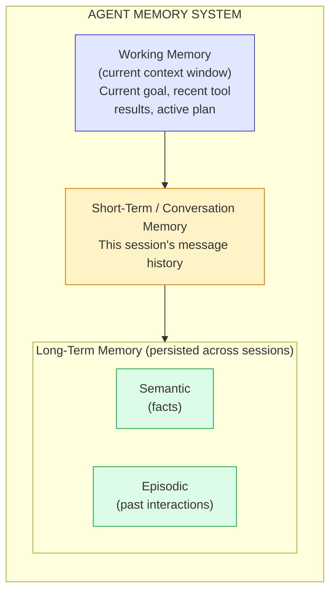

# Module 8 — Understanding Memory

### Difficulty
Intermediate

### Learning Objectives
- Understand why agents need memory beyond a single context window.
- Distinguish short-term, long-term, conversation, semantic, episodic, and working memory.
- Understand how AI agent memory differs from human memory.

### Prerequisites
Modules 1–7.

---

## Lesson 8.1 — Why Memory Is Necessary

### Concept Explanation

By default, an LLM call is stateless — it only knows what's in the current context window (Module 2.2). Without engineered memory, an agent forgets everything the moment a conversation ends, or once history exceeds the context window. Memory systems let agents retain relevant information across turns, sessions, and even indefinitely.

### Simple Analogy — The Human Brain

```text
Working Memory
= What you are currently thinking about right now

Long-Term Memory
= Things you learned in the past and can recall when relevant

Episodic Memory
= Specific experiences you remember ("that meeting last Tuesday")

Semantic Memory
= General facts and knowledge, disconnected from when/how you learned them
  ("Paris is the capital of France")
```

---

## Lesson 8.2 — Types of Memory in Agents

| Memory Type | What It Stores | Human Analogy | Typical Implementation |
|---|---|---|---|
| **Working memory** | What the agent is actively processing right now | What you're thinking about this second | The current context window / prompt |
| **Short-term (conversation) memory** | Recent turns in the current session | Remembering what was said 2 minutes ago | Message history list, possibly summarized when long |
| **Long-term memory** | Information retained across sessions | Things you learned last year | Database or vector store persisted between runs |
| **Semantic memory** | General facts/knowledge, not tied to a specific event | Knowing "water boils at 100°C" | Embeddings/vector database of facts, or a knowledge base |
| **Episodic memory** | Specific past events/interactions | Remembering a particular conversation you had | Logged interaction records, retrievable by similarity or time |

### Visual Diagram



**How to read this graph:** think of this as three concentric rings of "how long information sticks around," ordered top to bottom by lifespan. Working memory (blue) only exists for the current LLM call and vanishes the instant that call ends. Short-term memory (yellow) survives for the length of one conversation session but is gone once the session ends — unless something in it gets explicitly promoted downward. Long-term memory (green) is the only tier that survives across entirely separate sessions, and it's split into two flavors: semantic (general facts, like "the user prefers Python") and episodic (specific remembered events, like "the user asked about bakery chatbots on Monday"). The arrows show the *only* way information moves between tiers: something must be deliberately written down and promoted — nothing crosses a boundary automatically, which is exactly the point made in the next section.

---

## Lesson 8.3 — How AI Agent Memory Differs From Human Memory

### Concept Explanation

- **Explicit vs. implicit**: Human memory forms automatically through experience. Agent memory must be *deliberately engineered* — someone decides what gets stored, when, and how it's retrieved.
- **Perfect recall vs. lossy**: A database entry is retrieved exactly as stored; human memory is reconstructive and can distort over time. Agent memory is only as good as what was captured and how retrieval matches the current need.
- **No automatic forgetting**: Humans naturally forget irrelevant details; agent memory systems must explicitly implement pruning, summarization, or expiration, or they accumulate unbounded, increasingly noisy storage.
- **Retrieval is search, not recollection**: Agents don't "remember" — they run a semantic search (Module 9) over stored memory and re-inject the results into the context window for the next LLM call.

### Practical Example

```text
Session 1 (Monday):
User: "My favorite programming language is Python, and I'm building a
       chatbot for my bakery business."
Agent: [stores to long-term memory]: 
       {"fact": "User's favorite language is Python"}
       {"fact": "User is building a chatbot for a bakery business"}

Session 2 (Thursday, new conversation, no shared context window):
User: "Can you help me debug this function?"
Agent: [retrieves relevant long-term memory before responding]
       → recalls: user prefers Python, is building a bakery chatbot
Agent: "Sure — since this is for your bakery chatbot, want me to keep the
        code idiomatic Python 3 style?"
```

Without engineered long-term memory, the agent in Session 2 would have zero knowledge of Monday's conversation — every session would start from a blank slate.

### Key Takeaways
- Memory is not automatic in LLM systems — it must be designed.
- Working/short-term memory lives in the context window; long-term memory lives in external storage (database, vector store) and must be explicitly retrieved.
- Agent memory is a search-and-inject mechanism, not literal recollection — retrieval quality directly determines how "well" an agent seems to remember.

### Common Mistakes
- Assuming conversation history alone counts as "memory" — it's only short-term and vanishes once the session/context is gone.
- Storing everything indefinitely without any relevance filtering, leading to noisy, expensive, and eventually harmful retrieval (irrelevant memories crowding out useful context).
- Not distinguishing what should be remembered forever (user preferences) vs. what's session-specific (today's specific question).

### Exercise
For a customer support agent, list 3 things it should remember long-term about a customer (semantic/episodic) and 3 things it should only need for the current session (working/short-term).

### Challenge
Design a simple memory-write policy: given a conversation transcript, what rule would you use to decide which facts get saved to long-term memory vs. discarded? (Hint: think about durability, specificity, and future usefulness — similar to how this course's own memory system distinguishes types.)

### Knowledge Check
1. What's the difference between working memory and long-term memory in an agent?
2. Why is agent memory retrieval described as "search," not "recollection"?
3. Give one risk of storing memory with no pruning or filtering strategy.

Continue to **[09-Module9-Vector-DB-Embeddings.md](09-Module9-Vector-DB-Embeddings.md)** to learn *how* long-term/semantic memory is actually implemented.
