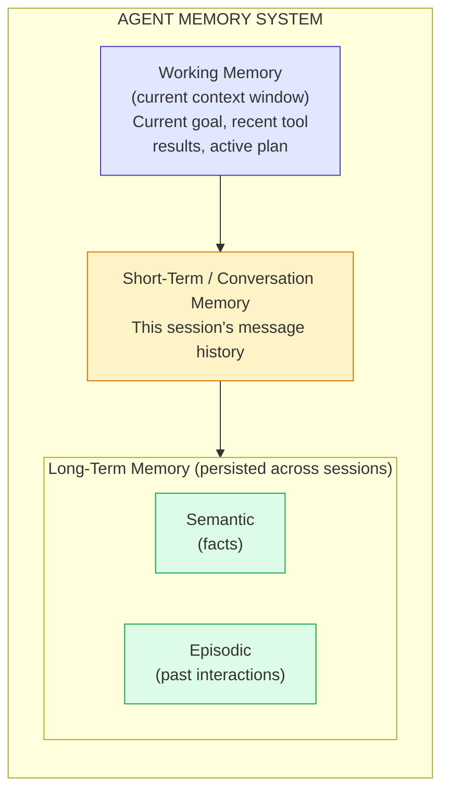

# Module 8 — Understanding Memory

### Difficulty
Intermediate

### Learning Objectives
- Understand why agents need memory beyond a single context window.
- Distinguish short-term, long-term, conversation, semantic, episodic, and working memory.
- Understand how AI agent memory differs from human memory.

### Prerequisites
Modules 1–7.

---

## Lesson 8.1 — Why Memory Is Necessary

### Concept Explanation

To understand why memory needs to be *engineered* at all, it helps to return to a fact established in Module 2 and reinforced in Module 7: an LLM call is fundamentally **stateless**. Every time you send a request to the model, it processes exactly the tokens present in that request's context window — nothing more. It has no persistent internal state that carries over between separate API calls the way a running program keeps variables alive in memory. If you send the model a message, get a response, and then send a completely new request tomorrow with no reference to today's conversation, the model has no way to know today ever happened. It isn't "choosing" to forget, the way a distracted person might — there is nothing inside the model's architecture that could have retained the information in the first place, because each call is, from the model's perspective, its entire universe of information for that moment.

This creates an obvious problem the instant you want to build anything beyond a single-turn question-answering tool. Consider a customer support agent: if a customer says "my order number is 48213" in one message, and then three messages later asks "when will it arrive?", the agent needs to still have access to that order number — but if each message were sent to the model as an isolated, stateless call, the model answering "when will it arrive?" would have absolutely no idea which order the customer meant. The naive fix — just include the entire conversation history in every single request — works for a while, but Module 2.2 already showed you why it eventually breaks: context windows are finite, and even within that limit, cramming in every word ever exchanged degrades the model's ability to find what's actually relevant right now ("context rot"). And even the naive fix only solves memory *within one conversation session* — it does nothing for a customer who closes the chat and comes back next week expecting the agent to remember they're a returning customer with a known preference or an open issue.

**Memory systems** are the engineering layer that solves both problems at once: they decide, deliberately, what information is worth preserving, in what form, for how long, and how to bring the *right* piece of it back into a future context window exactly when it's needed — rather than either forgetting everything or remembering everything indiscriminately. This module is about the taxonomy of *what kinds* of memory an agent needs; Module 9 covers the actual mechanism (embeddings and vector search) that makes long-term memory retrieval practical at scale.

### A Common Question

**"If I just keep appending every message to a list and send the whole list every time, isn't that already 'memory'?"** It's a start, and it's exactly what the code in Module 7.3's `run_agent` function does with its `messages` list — but it's only one *kind* of memory (short-term/conversation memory, defined below), and it has two hard limits. First, it's bounded by the context window (Module 2.2): eventually the conversation gets too long to fit, and something has to be dropped, summarized, or moved elsewhere. Second, and more fundamentally, it doesn't survive past the current session — the moment that Python process ends, or the user starts a new conversation, that list is gone unless you've explicitly saved it somewhere durable (which is exactly what Module 16's "persistent state" covers). So "just append everything to a list" is a correct and necessary building block, but it's not a complete memory system on its own.

**"Why not just make the context window bigger so this problem goes away?"** Providers have in fact made context windows dramatically larger over time, and this does help. But it doesn't eliminate the need for memory design, for two reasons that are worth internalizing rather than hoping technology solves for you. First, cost and latency scale with the number of tokens processed (Module 22) — even if a million-token context window is technically available, sending that much text on every single call is slow and expensive, especially when 99% of it is irrelevant to the current question. Second, and more subtly, model performance does not stay flat as context grows — retrieving the one fact that matters out of an enormous pile of mostly-irrelevant text is a genuinely harder task for the model than finding that same fact in a small, curated context (this is the "context rot" phenomenon named in Module 2.2). A bigger window raises the ceiling on what's *possible*; it doesn't remove the value of being deliberate about what you put in front of the model.

### Simple Analogy — The Human Brain

```text
Working Memory
= What you are currently thinking about right now

Long-Term Memory
= Things you learned in the past and can recall when relevant

Episodic Memory
= Specific experiences you remember ("that meeting last Tuesday")

Semantic Memory
= General facts and knowledge, disconnected from when/how you learned them
  ("Paris is the capital of France")
```

This analogy isn't just a cute comparison — cognitive science has studied human memory in almost exactly this categorized way for decades, and it turns out to be a genuinely useful map for engineering agent memory too, precisely because the *underlying problem* is the same: a system with limited immediate attention (your conscious focus, or an LLM's context window) needs some way to store information beyond that immediate window and selectively bring pieces of it back when relevant. The next lesson maps each of these human categories onto a concrete engineering pattern.

---

## Lesson 8.2 — Types of Memory in Agents

### Concept Explanation

| Memory Type | What It Stores | Human Analogy | Typical Implementation |
|---|---|---|---|
| **Working memory** | What the agent is actively processing right now | What you're thinking about this second | The current context window / prompt |
| **Short-term (conversation) memory** | Recent turns in the current session | Remembering what was said 2 minutes ago | Message history list, possibly summarized when long |
| **Long-term memory** | Information retained across sessions | Things you learned last year | Database or vector store persisted between runs |
| **Semantic memory** | General facts/knowledge, not tied to a specific event | Knowing "water boils at 100°C" | Embeddings/vector database of facts, or a knowledge base |
| **Episodic memory** | Specific past events/interactions | Remembering a particular conversation you had | Logged interaction records, retrievable by similarity or time |

Let's slow down on the distinction between working memory and short-term memory, because they sound similar but play genuinely different roles. **Working memory** is the narrowest and most temporary of all — it's whatever is inside the LLM's context window for *this one call*: the current goal, the most recent tool result, the plan the agent is midway through executing. It exists only for the duration of a single request-response cycle and, in the strictest sense, has to be re-supplied every time, because (per Lesson 8.1) the model retains nothing between calls on its own. **Short-term memory**, by contrast, is the mechanism *you* build to carry information *across* multiple calls within one ongoing session — typically the growing list of messages exchanged so far, which gets re-sent (in whole or in curated part) as part of the working memory for each subsequent call. The relationship is: short-term memory is what supplies most of the content that becomes working memory on the next turn. When that message list eventually gets too long for the context window, something has to give — either older messages get dropped, or (more commonly in production systems) they get summarized into a shorter form that preserves the gist while using far fewer tokens, a technique directly connected to the "context compression" idea you'll see formalized in Module 10.3.

Now consider **long-term memory**, which solves an entirely different problem: surviving past the end of the current session altogether. This is where the semantic/episodic split becomes genuinely useful as a design tool, not just a taxonomy exercise. **Semantic memory** holds durable, generalizable facts about a user or domain that remain true regardless of when or how they were learned — "this user prefers Python," "this customer is on the Enterprise plan," "our return policy is 30 days." These facts are worth carrying forward indefinitely because they'll likely be relevant to many future interactions, not just the one where they were mentioned. **Episodic memory**, by contrast, holds records of specific past *events* — "on March 3rd, this user asked about refund policy and was told 30 days," "this customer previously complained about slow shipping in a support ticket." Episodic memories are more specific and time-bound, but they matter for continuity and context ("didn't we already discuss this?") and for building a longitudinal picture of a relationship over time, rather than just a snapshot of current facts. In practice, both kinds of long-term memory are usually implemented the same way technically (as records in a database, often searchable via the embeddings-based semantic search covered in Module 9) — the semantic/episodic distinction is mainly about *what you choose to write down and how you frame it*, not about using fundamentally different storage technology.

### Visual Diagram



**How to read this graph:** think of this as three concentric rings of "how long information sticks around," ordered top to bottom by lifespan. Working memory (blue) only exists for the current LLM call and vanishes the instant that call ends. Short-term memory (yellow) survives for the length of one conversation session but is gone once the session ends — unless something in it gets explicitly promoted downward. Long-term memory (green) is the only tier that survives across entirely separate sessions, and it's split into two flavors: semantic (general facts, like "the user prefers Python") and episodic (specific remembered events, like "the user asked about bakery chatbots on Monday"). The arrows show the *only* way information moves between tiers: something must be deliberately written down and promoted — nothing crosses a boundary automatically, which is exactly the point made in the next section.

One more detail worth noticing in this diagram: the arrows only point *downward* (Working → Short-Term → Long-Term). There's no arrow flowing back upward automatically, either — long-term memory doesn't spontaneously reappear in working memory just because it exists in storage. Getting a long-term memory back into a future working-memory context requires an active *retrieval* step (query the store, find relevant entries, inject them into the prompt), which is precisely the mechanism Module 9 exists to teach. Without that explicit retrieval step, long-term memory is just inert data sitting in a database, doing nothing to help the agent's next response — a very common and very costly mistake in real systems (storing memories nobody ever queries back out).

---

## Lesson 8.3 — How AI Agent Memory Differs From Human Memory

### Concept Explanation

It's tempting, after Lesson 8.1's brain analogy, to assume agent memory works basically like human memory with a database instead of neurons. The differences are actually significant enough to change how you design these systems, so it's worth walking through each one and *why* it matters practically, not just noting it as trivia.

- **Explicit vs. implicit formation.** Human memory forms automatically and continuously through experience — you don't consciously decide to remember what your kitchen smelled like this morning; it just happens, filtered by attention and emotional salience. Agent memory has no equivalent automatic process: *someone* — you, the system designer — has to write the code that decides what gets saved, when, and in what form. If you never write that code, the agent remembers literally nothing beyond the current context window, no matter how "smart" the underlying model is. This has a direct practical consequence: a genuinely useful memory system requires you to make explicit design decisions (a "memory-write policy," as the Challenge below asks you to design) about what's worth saving — there's no fallback where the system "naturally" figures out what matters, the way a human brain does through years of evolved attention mechanisms.

- **Perfect recall vs. lossy reconstruction.** This cuts in an interesting, slightly counterintuitive direction. Human memory is famously *reconstructive* — every time you recall something, you're partially rebuilding it, which is why memories can shift, blend, or become confidently wrong over time. A database record, by contrast, is retrieved bit-for-bit exactly as it was written; if you stored "the user's favorite language is Python" a year ago, retrieving that record today gives you that exact sentence, unchanged. This sounds like agent memory should be strictly *more* reliable than human memory — and in one sense it is, there's no "misremembering" a stored fact. But the reliability is entirely contingent on what got written down being correct and complete *in the first place*, and on the retrieval step (Module 9) finding the right record among potentially thousands of others. A perfectly preserved but poorly chosen or poorly retrieved memory is still functionally useless — "perfect recall" of the wrong thing, or "perfect recall" of the right thing that never gets found by the search, produces the same practical outcome as a human forgetting.

- **No automatic forgetting.** Humans naturally let irrelevant details fade — you don't remember the exact wording of every email you've ever read, and that's a feature, not a bug, because it keeps your limited attention focused on what still matters. A database has no equivalent instinct: every record you write stays exactly as prominent as every other record until you explicitly decide otherwise. Left unmanaged, a memory store just grows forever, and this isn't merely a storage-cost problem (though it is that too, connecting to Module 22) — it's a *retrieval quality* problem. As Module 9 will show, semantic search returns the records most similar to a query; if your store accumulates thousands of low-value, outdated, or redundant entries, they don't just sit there harmlessly, they actively compete with genuinely useful memories for a spot in the top-k results, diluting retrieval quality over time. This is why production memory systems need deliberate pruning, expiration, or summarization policies (consolidating many old, granular episodic memories into one summarized fact, for instance) — the deliberate "forgetting" a human brain does automatically has to be engineered by hand here.

- **Retrieval is search, not recollection.** This is perhaps the most important mechanical difference to internalize, because it reframes what "remembering" even means for an agent. When a human "remembers" something, there's a subjective experience of recall — the memory surfaces into awareness. An agent has no equivalent internal process. What actually happens, every single time an agent appears to "recall" something from long-term memory, is: your code takes the current query or context, runs a *search* against the memory store (typically the similarity search covered in Module 9), gets back the handful of stored records that scored highest, and pastes them into the prompt as ordinary text before sending it to the model. The model then reads those pasted-in facts exactly the way it reads anything else in its context — it has no way to distinguish "a fact I retrieved from long-term storage" from "a fact the user just told me in this message" unless your prompt explicitly labels the difference. This means the entire quality of an agent's apparent memory is bottlenecked by the quality of that search step — a bad query, a badly indexed store, or badly chosen retrieval parameters (Module 9's `top_k`, for instance) will make an agent seem to "forget" something that is, technically, sitting right there in the database the whole time, simply because the search step failed to surface it.

### Practical Example

```text
Session 1 (Monday):
User: "My favorite programming language is Python, and I'm building a
       chatbot for my bakery business."
Agent: [stores to long-term memory]: 
       {"fact": "User's favorite language is Python"}
       {"fact": "User is building a chatbot for a bakery business"}

Session 2 (Thursday, new conversation, no shared context window):
User: "Can you help me debug this function?"
Agent: [retrieves relevant long-term memory before responding]
       → recalls: user prefers Python, is building a bakery chatbot
Agent: "Sure — since this is for your bakery chatbot, want me to keep the
        code idiomatic Python 3 style?"
```

Without engineered long-term memory, the agent in Session 2 would have zero knowledge of Monday's conversation — every session would start from a blank slate. It's worth being explicit about the two separate engineering steps this trace is glossing over, because each one is a real design decision, not something that happens automatically: **(1) the write step**, at the end of Session 1, where *something* has to decide these two sentences are worth saving at all (as opposed to, say, a passing comment like "ugh, it's hot today," which almost certainly isn't worth persisting) and format them as discrete, retrievable facts; and **(2) the read step**, at the start of Session 2, where *something* has to decide to run a memory search *before* generating a response, using some representation of the current message ("help me debug this function") as the query, and then successfully match it against the stored fact about "building a chatbot for a bakery business" — which, notice, share almost no literal words with the Session 2 message. That successful match despite no shared vocabulary is not a coincidence; it's the semantic search mechanism from Module 9 doing exactly the job it's designed for, and it's why Module 9 is the natural next step after this one — the taxonomy here tells you *what* to store and *why*, but Module 9 is what makes retrieving the *right* stored item, out of potentially thousands, actually work in practice.

### Key Takeaways
- Memory is not automatic in LLM systems — every LLM call is stateless (Lesson 8.1), so anything that appears to persist across calls or sessions had to be explicitly written and retrieved by code you (or a framework) built.
- Working/short-term memory lives in or feeds into the context window for the current session; long-term memory lives in external storage (database, vector store) and must be explicitly retrieved — nothing crosses from long-term storage back into a live conversation without an active search step.
- Agent memory is a search-and-inject mechanism, not literal recollection — retrieval quality directly determines how "well" an agent seems to remember, which is why a badly designed search step can make a technically-stored fact effectively invisible to the agent.

### Common Mistakes
- **Assuming conversation history alone counts as "memory."** It's genuinely useful — it's short-term memory — but it's bounded by the context window and vanishes once the session or process ends; treating it as sufficient is exactly the mistake that leaves an agent unable to recognize a returning user or recall a prior conversation.
- **Storing everything indefinitely without any relevance filtering.** Beyond the storage cost, this actively degrades retrieval (per the "no automatic forgetting" point above) — a memory store cluttered with low-value entries makes it statistically harder for a genuinely important memory to surface in the top-k results of a similarity search, which is a subtler and more damaging failure than simply "using more disk space."
- **Not distinguishing what should be remembered forever (durable preferences, account facts) from what's session-specific (today's particular question).** Promoting session-specific chatter into long-term storage pollutes the store with noise; failing to promote a genuinely durable fact (like a stated preference) means the agent will re-ask or re-discover the same thing every session, which reads as forgetful and untrustworthy to a real user.
- **Writing to long-term memory but never actually querying it back at the right moment.** A memory system that saves facts diligently but never runs a retrieval step before generating a response is functionally equivalent to having no memory at all — the write half of the system is necessary but not sufficient without a corresponding, reliably-triggered read half.

### Exercise
For a customer support agent, list 3 things it should remember long-term about a customer (semantic/episodic) and 3 things it should only need for the current session (working/short-term).

### Challenge
Design a simple memory-write policy: given a conversation transcript, what rule would you use to decide which facts get saved to long-term memory vs. discarded? (Hint: think about durability, specificity, and future usefulness — similar to how this course's own memory system distinguishes types.)

### Knowledge Check
1. What's the difference between working memory and long-term memory in an agent?
2. Why is agent memory retrieval described as "search," not "recollection"?
3. Give one risk of storing memory with no pruning or filtering strategy.
4. Why doesn't a bigger context window make deliberate memory design unnecessary?

Continue to **[09-Module9-Vector-DB-Embeddings.md](09-Module9-Vector-DB-Embeddings.md)** to learn *how* long-term/semantic memory is actually implemented.
