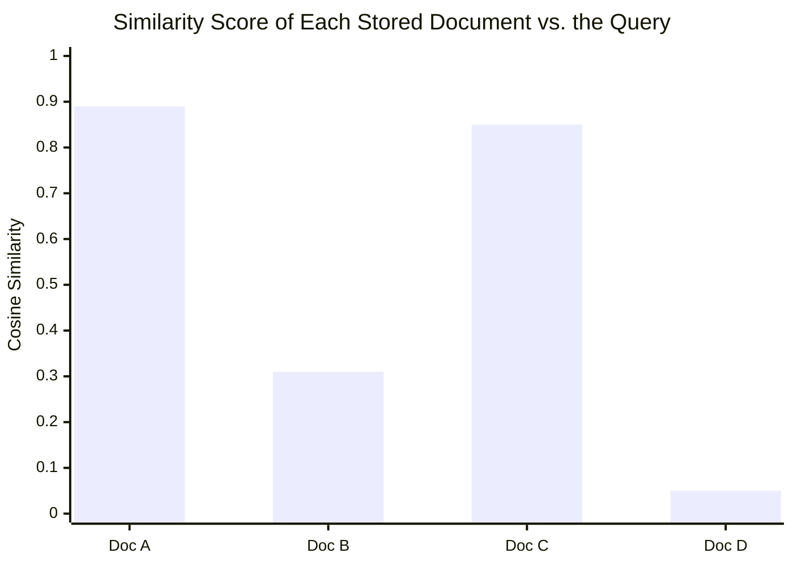

# Module 9 — Vector Databases and Embeddings

### Difficulty
Intermediate

### Learning Objectives
- Understand what embeddings are and why they're useful.
- Understand vector similarity and vector databases.
- Understand chunking and semantic search.

### Prerequisites
Module 8.

---

## Lesson 9.1 — What Are Embeddings?

### Concept Explanation

Module 8 established that retrieving a long-term memory is fundamentally a *search* problem, not a recollection problem — but it left one question unanswered: search based on *what*? If you tried to search stored memories using ordinary keyword matching (the same technique as Ctrl+F, or a basic database `WHERE text LIKE '%password%'` query), you'd immediately hit the exact limitation shown in Module 8's Session 2 example: the user asked "can you help me debug this function?", which shares zero words with the stored fact "user is building a chatbot for a bakery business." A keyword search would find nothing. And yet, conceptually, those two things *are* related — debugging help is relevant to someone's ongoing coding project. Humans effortlessly recognize that relationship; a keyword matcher cannot, because it only knows how to check whether the same literal characters appear in two places.

**Embeddings** are the technique that closes this gap. An embedding is a way of converting a piece of text — a word, a sentence, an entire document — into a list of numbers (formally, a *vector*) that is meant to capture the text's *meaning* rather than its literal wording. The list typically has hundreds or even thousands of numbers in it (each one called a "dimension"), and the entire design goal of an embedding model is this: texts that mean similar things should produce vectors that are mathematically close together, while texts that mean different things should produce vectors that are far apart — regardless of whether the actual words overlap at all.

It's worth being honest about how strange this should sound the first time you hear it, and then walking through why it actually works. An embedding model is itself a neural network (Module 1.2), trained on enormous amounts of text, whose job during training was essentially: given a sentence, predict things about its context — what words tend to appear near it, what other sentences tend to appear in similar situations, and so on. Over the course of that training, the model is forced to develop an internal numerical representation of language where words and sentences that get *used* in similar ways end up positioned similarly in that internal numerical space, purely because that positioning is what makes the model good at its training task. "Password reset" and "I forgot my password" get used in similar conversational contexts across the training data (both appear near account-recovery instructions, support responses, and so on), so the model learns to place their vector representations near each other — not because anyone told it these phrases are synonyms, but because the statistical pattern of how they're used in real text pushed the model toward that arrangement on its own. This is the exact same underlying mechanism (a trained neural network absorbing patterns from data) that produces the generative LLMs from Module 2 — an embedding model is really a close cousin of an LLM, just trained and used for a different purpose: instead of generating the *next* token, it produces one fixed-size numerical summary of the *entire* input's meaning.

### A Common Question

**"What does a 'dimension' in a 768-number vector actually represent — is dimension #42 'formality' or something like that?"** In almost all real embedding models, no individual dimension has a clean, human-interpretable meaning like "formality" or "topic: sports." The model wasn't trained with instructions like "dimension 42 should represent sentiment" — it discovered, on its own, whatever internal numerical arrangement happened to make its training task work well, and that arrangement is typically an entangled mix across many dimensions simultaneously. This can feel unsatisfying (you can't just "read off" what a vector means by inspecting its numbers), but it doesn't matter for how embeddings are actually used: what matters is not what any single dimension means, but whether the *overall pattern* — the vector as a whole, compared to another vector as a whole — reliably places similar meanings close together. You use embeddings by comparing whole vectors (Lesson 9.2), never by inspecting individual dimensions.

**"If embeddings capture meaning, does that mean the embedding model 'understands' language the way I do?"** Resist that framing — it leads to bad intuitions about failure modes (which come up throughout this course, especially Module 17). It's more accurate and more useful to think of an embedding model as an extremely sophisticated statistical summarizer of "how this text tends to be used and what it tends to appear near, based on patterns in a huge training corpus." This explains both its strengths (it genuinely does capture a lot of real semantic structure — synonyms, related concepts, paraphrases) and its very real weaknesses (it can be fooled by text that's used in similar statistical contexts but means something importantly different, or fail to distinguish subtly different meanings that happen to appear in similar contexts across its training data). Treating embeddings as "understanding" rather than "statistical pattern capture" sets you up to trust semantic search more than you should in edge cases.

### Simple Analogy

> Imagine every sentence is represented as a location on a huge map. Similar ideas are located close together — "I love pizza" and "Pizza is my favorite food" would land near each other on this meaning-map, even though they don't share many exact words, while "I love pizza" and "The stock market crashed" would land far apart.

Push the analogy one step further, because it clarifies what "hundreds of dimensions" actually means in a way flat intuition doesn't handle well. A map you're used to has two dimensions — north/south and east/west — and two locations are "close" if both their north/south position and east/west position are similar. An embedding vector with, say, 768 dimensions is the exact same idea, just extended to 768 independent directions instead of 2. Two pieces of text are "close" in this space if they're similar across *all* 768 of those directions simultaneously — which is precisely why embeddings can capture much richer, more nuanced notions of similarity than a 2D map ever could: there's enough room in 768 dimensions to simultaneously encode topic, tone, formality, intent, and dozens of other subtle factors, all at once, none of which you have to name or design by hand.

### Visual Diagram

```mermaid
quadrantChart
    title Meaning Map (simplified to 2D)
    x-axis Low --> High
    y-axis Low --> High
    quadrant-1 AI / ML Topics
    quadrant-2 Sports Topics
    quadrant-3 Cooking Topics
    quadrant-4 (unused)
    "neural networks": [0.75, 0.8]
    "LLMs": [0.7, 0.65]
    "machine learning models": [0.85, 0.7]
    "pizza recipes": [0.25, 0.2]
    "how to bake bread": [0.3, 0.3]
    "football scores": [0.75, 0.25]
    "basketball highlights": [0.8, 0.3]
```

**How to read this graph:** each dot is one piece of text, plotted purely by *meaning* — the x and y axes have no real-world unit (they're two of the hundreds or thousands of dimensions a real embedding model uses, squashed down to 2D so we can draw it). What matters is the clustering: the three AI/ML phrases land close together in the top area, the two cooking phrases cluster together near the bottom-left, and the two sports phrases cluster together on the right — even though, for example, "neural networks" and "machine learning models" share almost no exact words. Distance on this map *is* the similarity score (Lesson 9.2) — a vector database's whole job is finding the dots nearest to your query's dot. In reality, embeddings have hundreds or thousands of dimensions — far more than 2D — but the "closeness = similar meaning" principle is exactly the same.

One more thing worth noticing in this specific chart: the three clusters aren't perfectly separated with huge empty gaps between them — "LLMs" at (0.7, 0.65) is a bit closer to the cooking cluster than "machine learning models" at (0.85, 0.7) is. Real embedding spaces are exactly like this: clustering is a strong statistical tendency, not a guarantee of clean, crisp boundaries. This is precisely why similarity search (Lesson 9.2) returns a *ranked* list of scores rather than a hard yes/no "is this related" answer — the boundary between "related" and "unrelated" is genuinely fuzzy, and your application has to decide (often via a similarity threshold, or simply "top-k regardless of score") how to handle that fuzziness.

---

## Lesson 9.2 — Vector Similarity and Vector Databases

### Concept Explanation

Once text has been converted into vectors, you need a way to actually measure "how close" two vectors are — a single number that quantifies similarity, so you can rank many candidate vectors against one query vector and pick the best matches. The most common measure used for this in embedding systems is **cosine similarity**, and it's worth working through what it's actually computing, because "cosine similarity" as a phrase tells you almost nothing on its own.

Picture each vector as an arrow starting at the origin (the point where every dimension is zero) and pointing out into that hundreds-of-dimensions space toward the coordinates the embedding model produced. Cosine similarity measures the *angle* between two such arrows — not how long either arrow is, only the direction they point. Two arrows pointing in almost exactly the same direction have a cosine similarity near 1.0 (regardless of length); two arrows pointing in completely unrelated directions (at a right angle to each other) have a cosine similarity near 0.0; and two arrows pointing in opposite directions have a cosine similarity near -1.0 (though in practice, embeddings from the same model rarely end up pointing in fully opposite directions for ordinary text). Why angle, and not straight-line distance between the arrow tips? Because what matters for meaning is the *pattern* the vector encodes across its dimensions, not its raw magnitude — a longer or shorter version of essentially the same semantic "direction" should still count as very similar, and cosine similarity is specifically designed to ignore magnitude and focus purely on direction.

To make this completely concrete rather than abstract, here is the actual arithmetic worked out on tiny, simplified 3-dimensional vectors (real embeddings have hundreds of dimensions, but the math is identical, just with more terms to sum):

```text
Vector A = [1.0, 2.0, 0.0]   (imagine this represents "password reset")
Vector B = [1.0, 1.8, 0.2]   (imagine this represents "forgot my password")
Vector C = [0.0, 0.1, 3.0]   (imagine this represents "pizza recipe")

Cosine similarity(A, B):
  1. Dot product: (1.0×1.0) + (2.0×1.8) + (0.0×0.2) = 1.0 + 3.6 + 0.0 = 4.6
  2. Magnitude of A: sqrt(1.0² + 2.0² + 0.0²) = sqrt(1 + 4 + 0) = sqrt(5) ≈ 2.236
  3. Magnitude of B: sqrt(1.0² + 1.8² + 0.2²) = sqrt(1 + 3.24 + 0.04) = sqrt(4.28) ≈ 2.069
  4. Cosine similarity = dot product / (magnitude A × magnitude B)
                        = 4.6 / (2.236 × 2.069) ≈ 4.6 / 4.627 ≈ 0.994

Cosine similarity(A, C):
  1. Dot product: (1.0×0.0) + (2.0×0.1) + (0.0×3.0) = 0 + 0.2 + 0 = 0.2
  2. Magnitude of C: sqrt(0.0² + 0.1² + 3.0²) = sqrt(0 + 0.01 + 9) ≈ 3.002
  3. Cosine similarity = 0.2 / (2.236 × 3.002) ≈ 0.2 / 6.714 ≈ 0.030
```

A and B come out at roughly 0.99 — extremely close, matching the intuition that "password reset" and "forgot my password" should be treated as nearly the same idea. A and C come out at roughly 0.03 — essentially unrelated, matching the intuition that a password question has nothing to do with a pizza recipe. Notice this required no keyword matching whatsoever; the entire judgment came from comparing the *direction* of two lists of numbers. This tiny hand-worked example is doing, with 3 numbers, exactly what a real vector database does with 768 or 1536 numbers per vector, at a scale of millions of stored vectors, thousands of times per second.

- **Vector similarity**: the general term for this kind of mathematical closeness measure (cosine similarity is the most common choice, though a couple of close mathematical cousins like dot-product or Euclidean-distance similarity are also used by some systems — the underlying intuition of "closer = more similar" holds across all of them).
- **Vector database**: a specialized database purpose-built to store millions (or billions) of these embedding vectors, each tagged with metadata (like the original text and its source), and to answer "give me the top-k stored vectors most similar to this new query vector" extremely quickly — well-known examples include Chroma, FAISS, Pinecone, Qdrant, and Weaviate. The "specialized" part matters: naively computing cosine similarity against every single stored vector one at a time (as the tiny hand-worked example above did) becomes far too slow once you have millions of stored vectors; vector databases use clever indexing structures (approximate nearest-neighbor algorithms) specifically to make this search fast at scale, trading a small amount of exactness for a massive speed gain — which is an important practical nuance: most production vector search is technically "approximate," not a guaranteed perfect ranking, though the approximation is generally very good.

### Visual Diagram



```text
User Question: "How do I reset my password?"
        ↓ (embedding model)
   Query Vector: [0.12, -0.44, 0.91, ...]
        ↓ (similarity search against stored vectors)
   Top matches returned: Doc A (0.89), Doc C (0.85)
```

**How to read this graph:** the bar chart shows the exact same numbers as the flow underneath it, just made easier to compare at a glance — a cosine similarity score of 1.0 would mean "identical meaning" and 0.0 would mean "completely unrelated," exactly matching the worked arithmetic above (where A-vs-B landed near 0.99 and A-vs-C landed near 0.03). Doc A and Doc C both clear the 0.85 range, visibly taller than Doc B and Doc D, which is why the system returns those two as the "top matches" even though the user's question ("How do I reset my password?") doesn't share a single exact word with either document's title. This is the mechanical core of every semantic search and RAG system in this course: embed, score every candidate with a bar like this, keep the tallest ones. It's also worth noticing what this bar chart does *not* show: an absolute cutoff for "relevant" vs. "irrelevant." Doc B's 0.31 isn't necessarily "wrong" in some objective sense — it's simply less similar than A and C. Whether 0.31 is "good enough to include" or "too weak to bother with" is a design decision your application has to make (often by picking a `top_k` count, a minimum-score threshold, or both), not something the similarity score decides on its own.

### Practical Example (Conceptual Python)

```python
from embedding_model import embed_text   # produces a vector for a string
from vector_db import VectorDB           # a vector database client

db = VectorDB()

# Store documents
documents = [
    "To reset your password, go to Settings > Security > Reset Password.",
    "Our store hours are 9am to 9pm, Monday through Saturday.",
    "Refunds are processed within 5-7 business days.",
]
for doc in documents:
    db.add(vector=embed_text(doc), metadata={"text": doc})

# Query
query = "I forgot my password, what do I do?"
query_vector = embed_text(query)
results = db.search(query_vector, top_k=2)

for r in results:
    print(r["metadata"]["text"], r["similarity_score"])
```

*Explanation:* `embed_text` converts both stored documents and the incoming query into the same vector space — and this "same vector space" detail matters more than it might look at first glance: you must always use the *same* embedding model for both storing documents and embedding queries, because two different embedding models will typically produce vectors in incompatible numerical spaces, where distances and angles don't mean the same thing across models. Mixing embedding models between ingestion and query time is a subtle, easy-to-make mistake that silently produces meaningless similarity scores rather than an obvious error. `db.add(vector=..., metadata={"text": doc})` stores both the vector (used only for the math of similarity search) and the original text as metadata (used to actually give you back something readable once a match is found — the vector itself, being a list of numbers, is useless to hand back to a human or an LLM on its own). `db.search(query_vector, top_k=2)` runs the similarity computation from this lesson against every stored vector and returns the 2 with the highest scores. This is **semantic search**: it works even though the query ("I forgot my password") shares almost no exact words with the matching document ("reset your password") — this is the exact mechanism that made Module 8's Session 2 memory retrieval example work, now shown as the actual, concrete implementation behind that earlier, more abstract description.

---

## Lesson 9.3 — Chunking

### Concept Explanation

Embeddings answer "how do I represent meaning as numbers," and similarity search answers "how do I find the closest match." **Chunking** answers a third, easy-to-overlook question: "meaning of *what*, exactly?" If you embed an entire 50-page manual as a single vector, that one vector has to somehow represent the average meaning of everything in the whole document — its introduction, its troubleshooting section, its legal disclaimers, all blended together into one 768-number summary. A query about one specific troubleshooting step will match that single, blended, averaged-out vector only weakly, because the vector isn't really "about" any one part of the document — it's a compromise across all of it. **Chunking** solves this by splitting a large document into smaller pieces — typically somewhere in the range of a paragraph to a few paragraphs, often measured as roughly 300–500 tokens (Module 0.6, Module 2.1) — and embedding each piece *separately*, so that a query can match specifically against the one chunk that's actually relevant, rather than against a diluted average of the whole document.

To make the "too small loses context" trade-off concrete rather than abstract, consider this passage from a fictional HR policy document:

```text
Original passage:
"Employees who have completed one year of continuous service are eligible
for the extended leave program. To apply, submit form HR-22 at least 30
days before the requested leave start date. Approval is not guaranteed and
depends on staffing needs at the time of the request."
```

If this got chunked too aggressively — say, split at every single sentence with no regard for meaning — you might end up with a chunk containing only *"To apply, submit form HR-22 at least 30 days before the requested leave start date."* On its own, retrieved in response to a question like "am I eligible for extended leave?", this chunk is actively misleading: it tells the reader how to apply, but strips away the eligibility requirement (one year of continuous service) that the very next question depends on, because that sentence ended up in a *different* chunk. A well-chosen chunk boundary — the whole three-sentence passage together — preserves the logical unit of "eligibility, process, and caveat" that these sentences form together, so that whichever question triggers a match against this chunk, the retrieved text actually contains everything needed to answer it correctly. This is why chunking is not a mechanical "just split every N tokens" operation in well-built systems — good chunking respects natural document boundaries (paragraphs, sections, list items) wherever possible, rather than blindly cutting at a fixed character count that might land mid-sentence or mid-thought.

This also explains a technique worth naming even though it isn't shown in the diagram below: **chunk overlap**. Many production chunking strategies deliberately let consecutive chunks share a small amount of text at their boundary (for example, the last sentence of Chunk 1 also appears as the first sentence of Chunk 2), specifically to reduce the risk that an important connecting idea gets split exactly at a chunk boundary and lost from both sides. It's a small amount of redundancy traded for a meaningful reduction in "the answer was technically in the document, but got cut in half by an unlucky chunk boundary" failures.

### Visual Diagram

```text
Large Document (50 pages)
        ↓ chunking
┌──────────┬──────────┬──────────┬──────────┬──────────┐
│ Chunk 1  │ Chunk 2  │ Chunk 3  │  ...     │ Chunk N  │
└──────────┴──────────┴──────────┴──────────┴──────────┘
        ↓ embed each chunk separately
   [vector 1] [vector 2] [vector 3] ... [vector N]
        ↓ store all in vector database
```

Notice this diagram's second row — "embed each chunk separately" — is the detail that actually solves the problem this lesson opened with. Compare it to the alternative (never shown as a diagram here because it's what we're avoiding): one 50-page document going in, one single blended vector coming out. Instead, this pipeline produces N independent, individually-searchable vectors, one genuinely representing each chunk's own specific meaning — which is exactly why a query about one narrow topic within that 50-page document can find the one relevant chunk directly, instead of weakly matching a single vector that represents "the document as a whole, diluted."

### Key Takeaways
- Embeddings turn meaning into numbers that can be mathematically compared — a trained model's way of placing similar-meaning text close together in a high-dimensional space, learned entirely from patterns in training data, without anyone hand-labeling "these two phrases are synonyms."
- Cosine similarity measures the *angle* between two vectors (not their length), producing a score near 1.0 for very similar meaning and near 0.0 for unrelated meaning — this is the same arithmetic whether you're comparing two 3-dimensional toy vectors by hand or two 768-dimensional real embeddings inside a vector database.
- Vector similarity search finds relevant content by *meaning*, not exact keyword match — this is the core mechanism behind semantic search and RAG (Module 10).
- Chunking balances retrieval precision (smaller chunks = more targeted matches) against context (too small loses the surrounding meaning a chunk needs to stand on its own) — good chunking respects natural document structure rather than cutting at arbitrary fixed lengths.

### Common Mistakes
- **Chunking too large**: retrieval returns bloated, mostly-irrelevant text along with the useful part, wasting context window budget and diluting the embedding itself (recall the 50-page-document problem this lesson opened with — an oversized chunk suffers a milder version of the same "averaged-out meaning" issue).
- **Chunking too small**: loses surrounding context needed to understand the retrieved snippet correctly — as the HR policy example showed, a chunk boundary landing in the wrong place can silently drop a critical qualifying detail (like an eligibility requirement) from the text that actually gets retrieved and shown to the model.
- **Forgetting to store metadata (source, section, date) alongside chunks**: without it, you can't tell the user *where* an answer came from, filter by relevance criteria, or debug a bad retrieval by tracing it back to its source document.
- **Assuming vector search alone is always best**: exact keyword/numeric matches (e.g., product SKUs, order numbers, specific error codes) are sometimes better served by traditional keyword search — an embedding model wasn't trained to treat "SKU-88213" as a meaningfully distinct token from "SKU-88214," so vector similarity can actually blur exactly the kind of precise identifier match a keyword search handles perfectly (this is exactly why "hybrid search," combining both approaches, is introduced in Module 10.3).
- **Mixing embedding models between ingestion and query time**, or re-embedding only part of a corpus after switching embedding models — since different embedding models produce vectors in incompatible numerical spaces, this silently corrupts similarity scores without throwing any visible error, making it a particularly dangerous mistake to overlook.

### Exercise
Given the sentence "The weather is lovely for a picnic today," name two other sentences that should have high embedding similarity to it, and one sentence that should have very low similarity. Explain your reasoning based on meaning, not shared words.

### Challenge
Design a chunking strategy for a 200-page technical manual with numbered sections and code examples. What chunk size would you choose, what metadata would you attach to each chunk to make retrieval more useful, and where would you place chunk boundaries to avoid splitting a code example or a numbered step across two chunks?

### Knowledge Check
1. What does "similarity" mean in the context of embeddings, and what specifically does cosine similarity measure (angle, or distance/length)?
2. Why can semantic search find a relevant document even with zero shared keywords?
3. What problem does chunking solve, and what's the trade-off in choosing chunk size?
4. Why must the same embedding model be used for both ingestion and querying?

Continue to **[10-Module10-RAG.md](10-Module10-RAG.md)** — this module's concepts (embeddings, vector databases, chunking) are the building blocks of Retrieval-Augmented Generation.
