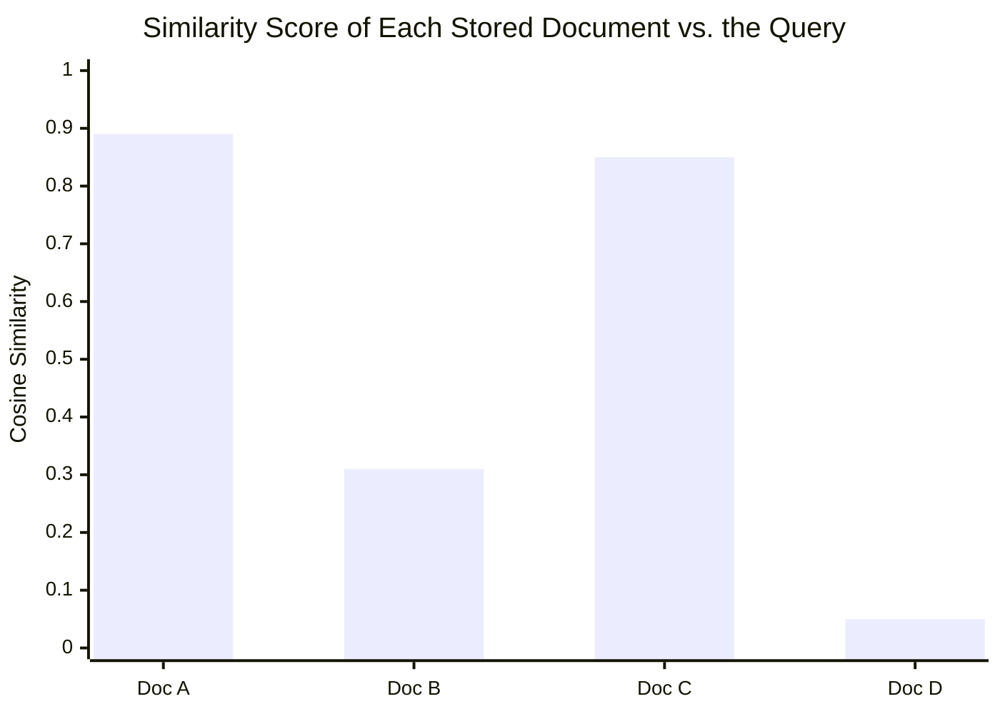

# Module 9 — Vector Databases and Embeddings

### Difficulty
Intermediate

### Learning Objectives
- Understand what embeddings are and why they're useful.
- Understand vector similarity and vector databases.
- Understand chunking and semantic search.

### Prerequisites
Module 8.

---

## Lesson 9.1 — What Are Embeddings?

### Concept Explanation

An **embedding** is a way of converting text (a word, sentence, or document) into a list of numbers (a "vector") that captures its *meaning*. Texts with similar meaning end up with vectors that are mathematically close together, even if they don't share any exact words.

### Simple Analogy

> Imagine every sentence is represented as a location on a huge map. Similar ideas are located close together — "I love pizza" and "Pizza is my favorite food" would land near each other on this meaning-map, even though they don't share many exact words, while "I love pizza" and "The stock market crashed" would land far apart.

### Visual Diagram

```mermaid
quadrantChart
    title Meaning Map (simplified to 2D)
    x-axis Low --> High
    y-axis Low --> High
    quadrant-1 AI / ML Topics
    quadrant-2 Sports Topics
    quadrant-3 Cooking Topics
    quadrant-4 (unused)
    "neural networks": [0.75, 0.8]
    "LLMs": [0.7, 0.65]
    "machine learning models": [0.85, 0.7]
    "pizza recipes": [0.25, 0.2]
    "how to bake bread": [0.3, 0.3]
    "football scores": [0.75, 0.25]
    "basketball highlights": [0.8, 0.3]
```

**How to read this graph:** each dot is one piece of text, plotted purely by *meaning* — the x and y axes have no real-world unit (they're two of the hundreds or thousands of dimensions a real embedding model uses, squashed down to 2D so we can draw it). What matters is the clustering: the three AI/ML phrases land close together in the top area, the two cooking phrases cluster together near the bottom-left, and the two sports phrases cluster together on the right — even though, for example, "neural networks" and "machine learning models" share almost no exact words. Distance on this map *is* the similarity score (Lesson 9.2) — a vector database's whole job is finding the dots nearest to your query's dot. In reality, embeddings have hundreds or thousands of dimensions — far more than 2D — but the "closeness = similar meaning" principle is exactly the same.

---

## Lesson 9.2 — Vector Similarity and Vector Databases

### Concept Explanation

- **Vector similarity**: a mathematical measure (commonly *cosine similarity*) of how close two embedding vectors are — higher similarity means more similar meaning.
- **Vector database**: a specialized database built to store millions of embeddings and quickly find the ones most similar to a given query vector (e.g., Chroma, FAISS, Pinecone, Qdrant, Weaviate).

### Visual Diagram



```text
User Question: "How do I reset my password?"
        ↓ (embedding model)
   Query Vector: [0.12, -0.44, 0.91, ...]
        ↓ (similarity search against stored vectors)
   Top matches returned: Doc A (0.89), Doc C (0.85)
```

**How to read this graph:** the bar chart shows the exact same numbers as the flow underneath it, just made easier to compare at a glance — a cosine similarity score of 1.0 would mean "identical meaning" and 0.0 would mean "completely unrelated." Doc A and Doc C both clear the 0.85 range, visibly taller than Doc B and Doc D, which is why the system returns those two as the "top matches" even though the user's question ("How do I reset my password?") doesn't share a single exact word with either document's title. This is the mechanical core of every semantic search and RAG system in this course: embed, score every candidate with a bar like this, keep the tallest ones.

### Practical Example (Conceptual Python)

```python
from embedding_model import embed_text   # produces a vector for a string
from vector_db import VectorDB           # a vector database client

db = VectorDB()

# Store documents
documents = [
    "To reset your password, go to Settings > Security > Reset Password.",
    "Our store hours are 9am to 9pm, Monday through Saturday.",
    "Refunds are processed within 5-7 business days.",
]
for doc in documents:
    db.add(vector=embed_text(doc), metadata={"text": doc})

# Query
query = "I forgot my password, what do I do?"
query_vector = embed_text(query)
results = db.search(query_vector, top_k=2)

for r in results:
    print(r["metadata"]["text"], r["similarity_score"])
```

*Explanation:* `embed_text` converts both stored documents and the incoming query into the same vector space. `db.search` finds the stored vectors closest to the query vector — this is **semantic search**: it works even though the query ("I forgot my password") shares almost no exact words with the matching document ("reset your password").

---

## Lesson 9.3 — Chunking

### Concept Explanation

**Chunking** is splitting a large document into smaller pieces before embedding it. Embedding an entire 50-page document as one vector loses fine-grained detail; embedding it in smaller chunks (e.g., paragraphs or ~300–500 tokens) allows retrieval of just the relevant portion.

### Visual Diagram

```text
Large Document (50 pages)
        ↓ chunking
┌──────────┬──────────┬──────────┬──────────┬──────────┐
│ Chunk 1  │ Chunk 2  │ Chunk 3  │  ...     │ Chunk N  │
└──────────┴──────────┴──────────┴──────────┴──────────┘
        ↓ embed each chunk separately
   [vector 1] [vector 2] [vector 3] ... [vector N]
        ↓ store all in vector database
```

### Key Takeaways
- Embeddings turn meaning into numbers that can be mathematically compared.
- Vector similarity search finds relevant content by *meaning*, not exact keyword match — this is the core mechanism behind semantic search and RAG (Module 10).
- Chunking balances retrieval precision (smaller chunks = more targeted matches) against context (too small loses surrounding meaning).

### Common Mistakes
- Chunking too large: retrieval returns bloated, mostly-irrelevant text along with the useful part, wasting context window budget.
- Chunking too small: loses surrounding context needed to understand the retrieved snippet correctly.
- Forgetting to store metadata (source, section, date) alongside chunks — without it, you can't tell the user *where* an answer came from or filter by relevance criteria.
- Assuming vector search alone is always best — exact keyword/numeric matches (e.g., product SKUs) are sometimes better served by traditional search (see "hybrid search" in Module 10).

### Exercise
Given the sentence "The weather is lovely for a picnic today," name two other sentences that should have high embedding similarity to it, and one sentence that should have very low similarity. Explain your reasoning based on meaning, not shared words.

### Challenge
Design a chunking strategy for a 200-page technical manual with numbered sections and code examples. What chunk size would you choose, and what metadata would you attach to each chunk to make retrieval more useful?

### Knowledge Check
1. What does "similarity" mean in the context of embeddings?
2. Why can semantic search find a relevant document even with zero shared keywords?
3. What problem does chunking solve, and what's the trade-off in choosing chunk size?

Continue to **[10-Module10-RAG.md](10-Module10-RAG.md)** — this module's concepts (embeddings, vector databases, chunking) are the building blocks of Retrieval-Augmented Generation.
