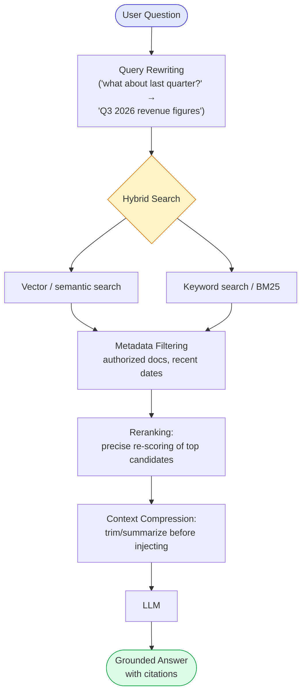

# Module 10 — Retrieval-Augmented Generation (RAG)

### Difficulty
Intermediate

### Learning Objectives
- Understand why LLMs need external knowledge grounding.
- Build the RAG pipeline: ingestion, chunking, embedding, retrieval, context injection.
- Progress from a beginner RAG setup to production-grade techniques.

### Prerequisites
Modules 8–9.

---

## Lesson 10.1 — Why LLMs Need External Knowledge

### Concept Explanation

Three separate facts you've already learned in earlier modules combine to create the exact problem this module solves, and it's worth lining them up explicitly before introducing the fix. First, from Module 2.3: an LLM's knowledge comes entirely from its training data, which was frozen at some fixed cutoff date — anything that happened after that date, or anything that was never part of the public training corpus in the first place, simply isn't in the model's learned patterns. Second, from Module 1.3 and Module 2: when asked something it doesn't actually know, an LLM does not reliably say "I don't know" — its underlying mechanism is to generate the most statistically plausible continuation of the prompt, and a plausible-sounding but factually invented answer is, from the model's point of view, a perfectly valid continuation, indistinguishable in *style* from a correct one. Third, and this is the piece specific to real-world deployment: almost every useful business application of an LLM needs the model to reason about information that is inherently private, current, or specific — your company's internal HR policy, this customer's actual order history, today's actual inventory levels, none of which could possibly have been in any public training dataset, no matter how recent or how large.

Put these three together and you get an uncomfortable situation: the exact information your application most needs the model to be accurate about is precisely the information the model is *least* equipped to know, and its failure mode when it doesn't know something is to confidently make something up rather than admit the gap. **RAG (Retrieval-Augmented Generation)** is the architectural answer to this: instead of relying on the model's frozen training-time knowledge, you retrieve the actually-relevant, actually-current, actually-private information at the moment of the query — using the embedding and vector-search machinery from Module 9 — and paste it directly into the prompt as context, so the model's job changes from "recall this from training" (unreliable, potentially fabricated) to "read this text I just handed you and answer based on it" (a task LLMs are demonstrably very good at — reading comprehension over provided text is a much easier and more reliable capability than long-term factual recall). This is the single most important reframing in this whole lesson: **RAG doesn't make the model smarter or more knowledgeable — it changes the task from recall to reading comprehension**, and reading comprehension over a document you just handed the model is dramatically more trustworthy than recall from possibly-absent or possibly-fuzzy training data.

### A Common Question

**"If I could just fine-tune the model on my company's documents instead, wouldn't that solve the same problem?"** This is a genuinely common alternative, and it's worth understanding precisely why RAG is usually preferred for this specific use case rather than treating fine-tuning as a strictly better or strictly worse option — they solve different problems. Fine-tuning (briefly mentioned in the Module 0 glossary context) further trains an existing model's weights on your specific data, which is good at teaching a model a new *style*, *format*, or *skill* (like always responding in your company's tone of voice, or reliably outputting a particular structured format). It is a poor fit for keeping a model current on *facts that change* — your HR policy might get updated next month, and retraining the entire model every time a policy document changes is slow, expensive, and operationally heavy compared to RAG, where updating the knowledge is as simple as re-running the ingestion pipeline (Lesson 10.2) on the new document — no retraining required, and the new information is available within minutes. There's also a subtler problem: a fine-tuned model still has no reliable way to tell you *which specific document* a fact came from, whereas a well-built RAG system can cite its exact source (shown later in this lesson), which matters enormously for trust and verifiability in real applications.

**"Doesn't RAG basically mean I've turned my LLM into a fancy search engine — why not just show the user the search results directly, and skip the LLM step entirely?"** Because the value RAG adds on top of a plain search result is real: a plain search returns raw document chunks, requiring the user to read through them and synthesize an answer themselves. RAG's generation step takes those retrieved chunks and does the work of extracting the specific answer to the specific question asked, phrasing it naturally, and — in the production version covered in Lesson 10.3 — combining information across multiple retrieved chunks into one coherent answer, something a raw list of search results cannot do on its own. The retrieval half handles *finding* the right raw material; the generation half handles *using* that raw material to actually answer the question asked. Both halves matter, and cutting either one out loses something important.

### Simple Analogy

> Asking a raw LLM about your company's leave policy is like asking a brilliant new hire who has never seen the employee handbook. RAG is like handing that new hire the exact relevant page from the handbook right before they answer — so they answer accurately about specifics they were never trained on. Notice this analogy has a built-in warning worth taking seriously: if you hand the new hire the *wrong* page (bad retrieval), or a page from a handbook that's three years out of date (stale ingestion), they'll still answer confidently and fluently — they're just as capable of being confidently wrong about a bad handout as they were about relying purely on memory. RAG shifts *where* errors are most likely to come from (from "the model's training data" to "the retrieval step"), but it does not make the system infallible, which is precisely why Lesson 10.3's production techniques and the "Common Mistakes" section below matter as much as the core pipeline itself.

---

## Lesson 10.2 — The RAG Pipeline

### Concept Explanation

The RAG pipeline is really two pipelines that run at completely different times and completely different frequencies, and conflating them is a common source of confusion when you're first learning this material. The **ingestion pipeline** runs rarely — once when you first set up the system, and again only when your source documents change (a new policy is published, an old one is updated). Its entire job is to take your raw documents and pre-populate a vector database (Module 9.2) with searchable chunks, ready to be queried later. The **query pipeline** runs constantly — once for every single question a user asks — and its job is to take that one question, search the already-populated vector database for the most relevant pre-computed chunks, and hand them to the model as context. The critical dependency between the two: query time can only ever be as good as what ingestion time already prepared. If ingestion chunked documents poorly (Module 9.3) or never ran on some important document at all, no amount of clever querying can retrieve information that was never properly stored in the first place — this is why debugging a bad RAG answer should always start by asking "was the right information actually ingested and chunked well?" before assuming the problem is in the query logic.

### Visual Diagram


**How to read this graph:** this diagram is really two separate pipelines that happen at very different times, joined by one dotted arrow. The top row (Ingestion) runs rarely — only when your documents are added or updated — and its whole job is to fill up the yellow Vector Database box. The bottom row (Query Time) runs constantly — once per user question — and its whole job is to search that same yellow box for the handful of chunks most relevant to *this specific* question, then hand them to the LLM as extra context before it answers. The dotted arrow is the hinge connecting the two: nothing in the bottom row can work until the top row has run at least once.

Notice also that everything in the Query Time row up through "Relevant Chunks" is exactly the mechanism taught in full detail in Module 9 (embed the query, run similarity search, get back scored candidates) — this module isn't introducing a new retrieval mechanism, it's showing you what to *do* with that retrieval once you have it: specifically, the "Context Injection into the Prompt" step, which is the one genuinely new piece of machinery this module adds on top of Module 9's foundation. That step is doing something conceptually simple but easy to get wrong in practice — it's literally string-concatenating the retrieved chunk text into the prompt alongside the user's question, in a way explicit enough that the model treats it as reference material to consult, not as instructions to follow (this connects directly back to the prompt-injection discussion in Module 3.5 — retrieved content is data, never a new instruction, and Module 21 revisits this specific risk in the security context).

### Practical Example (Conceptual Python — Beginner RAG)

```python
from embedding_model import embed_text
from vector_db import VectorDB
from llm_client import ask_llm

db = VectorDB()

# --- Ingestion (run once, or whenever docs update) ---
def ingest(documents: list[str]):
    for doc in documents:
        chunks = chunk_text(doc, size=400)  # ~400 tokens per chunk
        for chunk in chunks:
            db.add(vector=embed_text(chunk), metadata={"text": chunk})

# --- Query time ---
def answer_question(question: str) -> str:
    query_vector = embed_text(question)
    top_chunks = db.search(query_vector, top_k=4)
    context = "\n\n".join(c["metadata"]["text"] for c in top_chunks)

    prompt = f"""Answer the question using ONLY the context below.
If the answer isn't in the context, say "I don't have that information."

Context:
{context}

Question: {question}
"""
    return ask_llm(prompt)
```

*Explanation:* `ingest` runs the chunking → embedding → storage pipeline once per document set — notice this function has no idea what questions will eventually be asked against this data; it's pure preparation, matching the "runs rarely, ahead of time" description above. `answer_question` runs at query time: embed the question (using the *same* embedding model as ingestion, per the warning in Module 9.2 — this cannot be overstated as a source of silent, hard-to-diagnose bugs), retrieve the most similar chunks, join them into one block of context text, and inject that block into a prompt template. The specific wording *"Answer the question using ONLY the context below. If the answer isn't in the context, say 'I don't have that information.'"* is doing real, load-bearing work, not just being polite boilerplate — without an instruction like this, the model's default behavior (generate the most plausible continuation) will often blend genuinely retrieved facts with its own pre-trained knowledge indistinguishably, which defeats the entire purpose of grounding the answer in your specific documents. This single instruction is one of the cheapest, highest-leverage interventions available for reducing hallucination in a RAG system, and it's exactly why it appears here in the very first, simplest version of the pipeline rather than being saved for the "production" section.

### A Common Question

**"What happens if `top_k=4` retrieves chunks that are only weakly relevant — does the model just ignore them?"** Not automatically, no — and this is worth sitting with, because it's a real limitation of the beginner pipeline shown here. If none of the top-4 retrieved chunks actually contain the answer (say, the question is about a topic your document set never covers at all), the model is still handed those 4 weakly-relevant chunks as "the context," and depending on how strongly your prompt instruction is worded, it may either correctly say "I don't have that information" (the desired behavior) or — especially with a weaker instruction, or a model prone to being overly agreeable — attempt to stretch the weak context into a plausible-sounding but ultimately unsupported answer. This is exactly why the instruction wording matters so much, and it's also why production systems (Lesson 10.3) often add an explicit relevance threshold, rejecting retrieval results below a certain similarity score rather than always forcing the top-k results into the prompt regardless of how weak the match actually was.

---

## Lesson 10.3 — From Beginner RAG to Production RAG

### Concept Explanation

The beginner pipeline in Lesson 10.2 — embed, search, inject, answer — is a completely legitimate way to build a first working RAG system, and it's genuinely enough for demos and small, well-scoped document sets. But it carries several real weaknesses that tend to surface exactly when a system moves from "impressive demo" to "used daily by real people with real, messy questions." It's worth walking through *why* each production technique below exists as a direct response to a specific weakness, rather than treating the list as an arbitrary checklist of advanced features to bolt on.

| Technique | What It Does | Why It Matters |
|---|---|---|
| **Hybrid search** | Combines vector (semantic) search with traditional keyword search (e.g., BM25) | Catches exact matches (IDs, codes, names) that pure semantic search can miss |
| **Reranking** | A second, more precise model re-scores the initial retrieved candidates before use | Initial vector search is fast but approximate; reranking improves precision on the final shortlist |
| **Metadata filtering** | Restrict retrieval to chunks matching filters (date range, department, user permissions) | Prevents retrieving outdated, irrelevant, or unauthorized content |
| **Query rewriting** | Reformulate a vague/ambiguous user query into a clearer search query before embedding | Improves retrieval when the user's original phrasing is a poor search query (e.g., pronouns, slang, follow-up questions missing context) |
| **Context compression** | Summarize or trim retrieved chunks before injecting them into the prompt | Reduces token cost and prevents "context rot" from including too much marginal text |

**Hybrid search** exists because of a real, structural blind spot in pure semantic search that Module 9's Common Mistakes section already flagged: embeddings are trained to capture *meaning*, and meaning-based similarity is a poor fit for exact identifiers. A query like "what's the status of order #48213?" needs an *exact* match on the literal string "48213" — an embedding model has no special mechanism for treating that number as important or exact, and might rank a chunk about "order #48210" as almost equally similar, since the surrounding words are nearly identical. Traditional keyword search algorithms like BM25 (a well-established, decades-old information-retrieval technique that scores documents based on exact term overlap, weighted by how rare and how frequent each term is) handle this exact-match case naturally and reliably. Running both search types simultaneously and combining their results gets you the best of both: semantic search catches conceptually-related content phrased completely differently, while keyword search catches precise identifiers and rare technical terms that a semantic match might blur together.

**Reranking** exists because of a genuine engineering trade-off inside vector databases themselves (Module 9.2 mentioned this briefly): fast approximate search across millions of vectors necessarily sacrifices some precision for speed. A reranker is a second, typically smaller and more computationally expensive model whose only job is to take the initial (fast, somewhat approximate) shortlist of, say, the top 20 candidates, and re-score just those 20 with a much more careful, more expensive comparison — one that can afford to actually look at the query and the candidate text together, rather than just comparing pre-computed vectors. Running this expensive step over the full corpus of millions of documents would be far too slow, but running it over a pre-filtered shortlist of 20 is fast and meaningfully improves the final ranking's accuracy — this two-stage "fast rough search, then slow precise re-score" pattern is a common design in information retrieval generally, not something unique to RAG.

**Metadata filtering** exists because relevance and permission are two entirely separate concerns that a raw similarity score cannot distinguish between. A chunk from an internal salary-band document might score very highly for semantic relevance to a question about compensation, but the person asking might have no authorization to see it at all — cosine similarity has no concept of "who is allowed to read this." Metadata filtering solves this by attaching structured tags (department, date, required permission level) to each chunk at ingestion time, and restricting the search space to only chunks whose metadata matches the current user's authorization *before* similarity scoring even runs, so an unauthorized chunk is never even a candidate for retrieval, regardless of how similar it might otherwise score.

**Query rewriting** exists because the assumption baked into the beginner pipeline — "the user's literal message is a good search query" — often just isn't true, especially in multi-turn conversations. Recall the exact same problem from Module 8.3's memory retrieval discussion: a follow-up question like "what about last quarter?" is, as a standalone string, a nearly useless query for similarity search — it has almost no topical content of its own, and its meaning depends entirely on conversation history that isn't present in the message itself. Query rewriting inserts an extra step (usually a small, cheap LLM call) that looks at the recent conversation and reformulates the vague follow-up into a self-contained, information-rich search query — turning "what about last quarter?" into something like "Q3 2026 revenue figures" — *before* that improved query gets embedded and searched.

**Context compression** exists as a direct application of the same "context rot" concern first raised in Module 2.2 and revisited in Module 8.1: even genuinely relevant retrieved chunks can, in aggregate, add up to more text than is actually useful to hand the model, especially once you're retrieving from multiple sources across a hybrid search and a reranking step. Compression — summarizing or trimming each chunk down to just the sentences actually bearing on the query — reduces both token cost (Module 22) and the risk that padding the prompt with marginally-relevant text dilutes the model's attention on the parts that truly matter.

### Visual Diagram — Production RAG Pipeline



**How to read this graph:** compare this to the simple two-row diagram earlier in this module — every extra box here exists to fix one specific weakness of the beginner pipeline. Notice the fork at "Hybrid Search": the question is searched two different ways *at the same time* (semantic meaning via vectors, exact keyword matches via BM25) and both result sets flow back together into "Metadata Filtering" — that fork-and-rejoin is what lets this pipeline catch both fuzzy conceptual questions and exact-code/ID lookups that pure vector search alone would miss (Lesson 10.3). Everything downstream of the fork narrows and cleans up the candidates step by step until only the most relevant, permitted, compressed context reaches the LLM. It's worth noticing the *order* of these downstream steps too, since it isn't arbitrary: filtering by permission happens *before* the expensive reranking step, so you never waste the reranker's compute budget precisely-scoring a candidate that was going to be thrown out for authorization reasons anyway — a small but real efficiency detail that falls directly out of thinking carefully about what each stage actually costs.

### Practical Example — Citing Sources

```python
def answer_with_citations(question: str) -> dict:
    chunks = retrieve_and_rerank(question)   # production retrieval pipeline
    context = "\n\n".join(f"[{i+1}] {c['text']}" for i, c in enumerate(chunks))

    prompt = f"""Answer using only the numbered sources below. Cite sources
inline like [1]. If unsure, say so.

{context}

Question: {question}
"""
    answer = ask_llm(prompt)
    return {"answer": answer, "sources": [c["source"] for c in chunks]}
```

*Explanation:* `enumerate(chunks)` gives each retrieved chunk a visible number (`[1]`, `[2]`, ...), and the prompt explicitly asks the model to cite which numbered source supports each claim it makes — this transforms the model's output from an opaque, unverifiable paragraph into something a human (or another automated check) can actually trace back to a specific source document. Returning `sources` alongside the answer lets the application (and the user) verify where each claim came from — essential for trust and for catching hallucinated content that isn't actually supported by retrieval. It's worth being honest about the limits of this technique, too: asking the model to cite sources makes it *more likely* to stay grounded and gives you a trace to verify against, but it does not *guarantee* every cited claim is actually accurate — a model can still misattribute a claim to the wrong numbered source, or subtly misstate what a source actually said. Citations are a strong trust-and-verification aid, not an infallibility guarantee, which is why production systems that need very high accuracy often pair citation-based RAG with an additional fact-checking step (the Critic pattern from Module 15.6, or the reflection pattern from Module 12.3, applied specifically to verify that each cited claim is actually supported by its cited source).

### Key Takeaways
- RAG grounds LLM answers in real, retrievable documents instead of relying purely on training-time knowledge — it changes the model's task from unreliable long-term recall to much more reliable reading comprehension over freshly-provided text.
- The core pipeline runs in two separate phases at two separate frequencies: ingest → chunk → embed → store (rare, ahead of time); then query → embed → retrieve → inject → generate (constant, once per question) — and query-time quality is capped by whatever ingestion-time prepared.
- Production RAG layers in hybrid search, reranking, metadata filtering, query rewriting, and context compression — each one exists to directly fix a specific, well-understood weakness of the beginner pipeline (exact-match blindness, approximate-search imprecision, permission leakage, vague follow-up queries, and context bloat, respectively).

### Common Mistakes
- **Not instructing the model to answer *only* from retrieved context.** Without this, it may blend in ungrounded, memorized knowledge indistinguishably from retrieved facts — this single missing sentence in a prompt is one of the most common root causes of a RAG system that still "hallucinates" despite having correct information available in its retrieved context.
- **Retrieving too many chunks "just in case."** This bloats the prompt and dilutes relevance — more retrieved text is not free, and past a certain point it actively hurts answer quality by drowning the genuinely relevant chunk in marginally-relevant padding (the exact "context rot" concern from Module 2.2).
- **Ignoring access control.** RAG can accidentally leak content a user shouldn't see if metadata filtering isn't enforced — remember that a similarity score has no concept of authorization; if you don't explicitly filter for permissions, a highly-relevant-but-restricted document will be retrieved and shown just as readily as an authorized one.
- **Never testing retrieval quality in isolation.** A bad answer might be a *generation* problem (the right chunks were retrieved, but the model still answered poorly) or a *retrieval* problem (the wrong chunks were retrieved in the first place, so the model never had a chance) — and you need to know which one you're looking at before you can fix it. Test retrieval on its own (does the top-k list actually contain the right chunk for a given test question?) separately from testing the full generated answer.
- **Assuming the model's citations are automatically accurate.** As noted above, asking for citations makes grounding *more likely*, not guaranteed — a system that needs high factual reliability should verify citations, not just display them.

### Exercise
Design a beginner RAG pipeline (on paper) for a company FAQ document with 20 questions and answers. Decide: chunk size, what metadata to store, and what prompt instruction you'd use to reduce hallucination.

### Challenge
A user asks a RAG chatbot: "What about the policy I asked about earlier?" — a vague follow-up question with no explicit subject. Design a query rewriting step that would turn this into a good search query, using the recent conversation history as context.

### Knowledge Check
1. What problem does RAG solve that pure LLM training cannot, and why does fine-tuning not solve the same problem equally well?
2. Why does hybrid search outperform pure vector search in many real systems?
3. Name two techniques used to go from beginner RAG to production RAG, and what each fixes.
4. Why should retrieval quality and generation quality be tested separately, rather than only evaluating the final answer?
