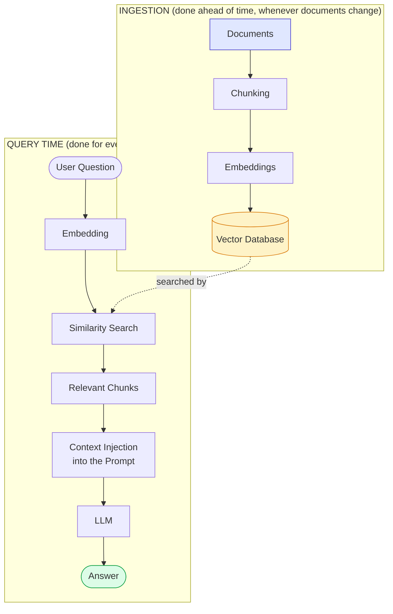

# Module 10 — Retrieval-Augmented Generation (RAG)

### Difficulty
Intermediate

### Learning Objectives
- Understand why LLMs need external knowledge grounding.
- Build the RAG pipeline: ingestion, chunking, embedding, retrieval, context injection.
- Progress from a beginner RAG setup to production-grade techniques.

### Prerequisites
Modules 8–9.

---

## Lesson 10.1 — Why LLMs Need External Knowledge

### Concept Explanation

LLMs only "know" what was in their training data, frozen at a knowledge cutoff date (Module 2.3). They don't know your company's internal documents, today's news, or anything private. **RAG (Retrieval-Augmented Generation)** solves this by retrieving relevant information at query time and inserting it into the prompt, so the model can generate an answer *grounded* in real, current, specific documents instead of relying purely on what it memorized during training.

### Simple Analogy

> Asking a raw LLM about your company's leave policy is like asking a brilliant new hire who has never seen the employee handbook. RAG is like handing that new hire the exact relevant page from the handbook right before they answer — so they answer accurately about specifics they were never trained on.

---

## Lesson 10.2 — The RAG Pipeline

### Visual Diagram



**How to read this graph:** this diagram is really two separate pipelines that happen at very different times, joined by one dotted arrow. The top row (Ingestion) runs rarely — only when your documents are added or updated — and its whole job is to fill up the yellow Vector Database box. The bottom row (Query Time) runs constantly — once per user question — and its whole job is to search that same yellow box for the handful of chunks most relevant to *this specific* question, then hand them to the LLM as extra context before it answers. The dotted arrow is the hinge connecting the two: nothing in the bottom row can work until the top row has run at least once.

### Practical Example (Conceptual Python — Beginner RAG)

```python
from embedding_model import embed_text
from vector_db import VectorDB
from llm_client import ask_llm

db = VectorDB()

# --- Ingestion (run once, or whenever docs update) ---
def ingest(documents: list[str]):
    for doc in documents:
        chunks = chunk_text(doc, size=400)  # ~400 tokens per chunk
        for chunk in chunks:
            db.add(vector=embed_text(chunk), metadata={"text": chunk})

# --- Query time ---
def answer_question(question: str) -> str:
    query_vector = embed_text(question)
    top_chunks = db.search(query_vector, top_k=4)
    context = "\n\n".join(c["metadata"]["text"] for c in top_chunks)

    prompt = f"""Answer the question using ONLY the context below.
If the answer isn't in the context, say "I don't have that information."

Context:
{context}

Question: {question}
"""
    return ask_llm(prompt)
```

*Explanation:* `ingest` runs the chunking → embedding → storage pipeline once per document set. `answer_question` runs at query time: embed the question, retrieve the most similar chunks, inject them as context, and instruct the model to answer *only* from that context — this instruction is critical for reducing hallucination (Module 17).

---

## Lesson 10.3 — From Beginner RAG to Production RAG

### Concept Explanation

Beginner RAG (embed → search → inject → answer) works for demos but has real weaknesses in production: irrelevant retrieval, missing exact-match results, redundant context, and no way to filter by source/date/permissions. Production RAG adds several refinements:

| Technique | What It Does | Why It Matters |
|---|---|---|
| **Hybrid search** | Combines vector (semantic) search with traditional keyword search (e.g., BM25) | Catches exact matches (IDs, codes, names) that pure semantic search can miss |
| **Reranking** | A second, more precise model re-scores the initial retrieved candidates before use | Initial vector search is fast but approximate; reranking improves precision on the final shortlist |
| **Metadata filtering** | Restrict retrieval to chunks matching filters (date range, department, user permissions) | Prevents retrieving outdated, irrelevant, or unauthorized content |
| **Query rewriting** | Reformulate a vague/ambiguous user query into a clearer search query before embedding | Improves retrieval when the user's original phrasing is a poor search query (e.g., pronouns, slang, follow-up questions missing context) |
| **Context compression** | Summarize or trim retrieved chunks before injecting them into the prompt | Reduces token cost and prevents "context rot" from including too much marginal text |

### Visual Diagram — Production RAG Pipeline


**How to read this graph:** compare this to the simple two-row diagram earlier in this module — every extra box here exists to fix one specific weakness of the beginner pipeline. Notice the fork at "Hybrid Search": the question is searched two different ways *at the same time* (semantic meaning via vectors, exact keyword matches via BM25) and both result sets flow back together into "Metadata Filtering" — that fork-and-rejoin is what lets this pipeline catch both fuzzy conceptual questions and exact-code/ID lookups that pure vector search alone would miss (Lesson 10.3). Everything downstream of the fork narrows and cleans up the candidates step by step until only the most relevant, permitted, compressed context reaches the LLM.

### Practical Example — Citing Sources

```python
def answer_with_citations(question: str) -> dict:
    chunks = retrieve_and_rerank(question)   # production retrieval pipeline
    context = "\n\n".join(f"[{i+1}] {c['text']}" for i, c in enumerate(chunks))

    prompt = f"""Answer using only the numbered sources below. Cite sources
inline like [1]. If unsure, say so.

{context}

Question: {question}
"""
    answer = ask_llm(prompt)
    return {"answer": answer, "sources": [c["source"] for c in chunks]}
```

*Explanation:* returning `sources` alongside the answer lets the application (and the user) verify where each claim came from — essential for trust and for catching hallucinated content that isn't actually supported by retrieval.

### Key Takeaways
- RAG grounds LLM answers in real, retrievable documents instead of relying purely on training-time knowledge.
- The core pipeline: ingest → chunk → embed → store; then query → embed → retrieve → inject → generate.
- Production RAG layers in hybrid search, reranking, metadata filtering, query rewriting, and context compression to fix precision and relevance problems that plague beginner RAG.

### Common Mistakes
- Not instructing the model to answer *only* from retrieved context — without this, it may blend in ungrounded, memorized knowledge indistinguishably from retrieved facts.
- Retrieving too many chunks "just in case," bloating the prompt and diluting relevance.
- Ignoring access control — RAG can accidentally leak content a user shouldn't see if metadata filtering isn't enforced.
- Never testing retrieval quality in isolation — a bad answer might be a *generation* problem or a *retrieval* problem, and you need to know which to fix it.

### Exercise
Design a beginner RAG pipeline (on paper) for a company FAQ document with 20 questions and answers. Decide: chunk size, what metadata to store, and what prompt instruction you'd use to reduce hallucination.

### Challenge
A user asks a RAG chatbot: "What about the policy I asked about earlier?" — a vague follow-up question with no explicit subject. Design a query rewriting step that would turn this into a good search query, using the recent conversation history as context.

### Knowledge Check
1. What problem does RAG solve that pure LLM training cannot?
2. Why does hybrid search outperform pure vector search in many real systems?
3. Name two techniques used to go from beginner RAG to production RAG, and what each fixes.
