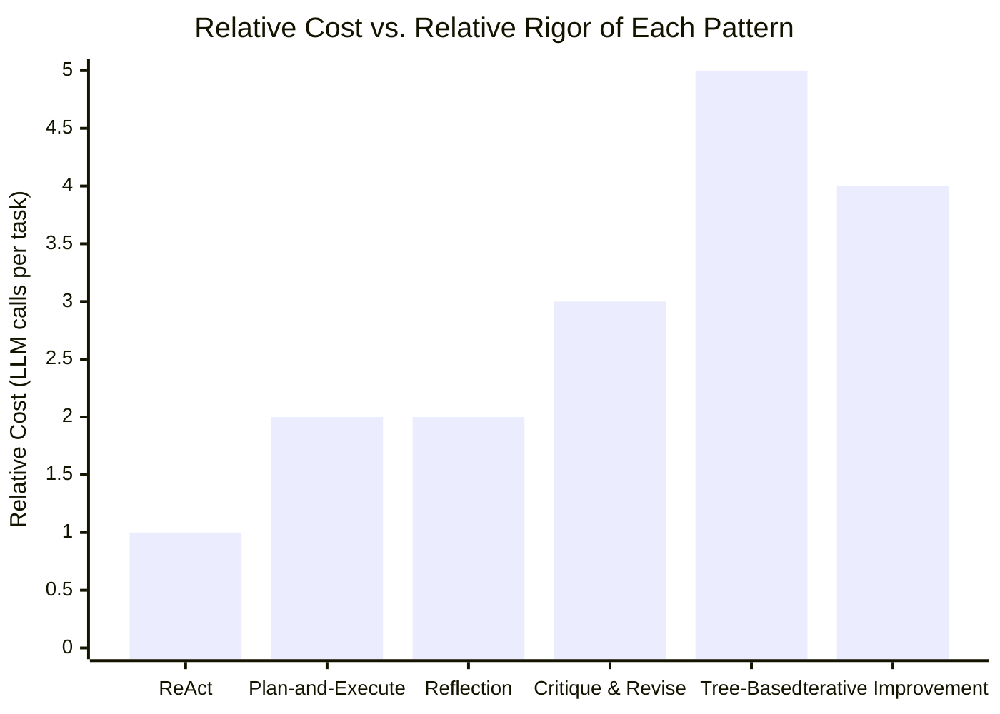
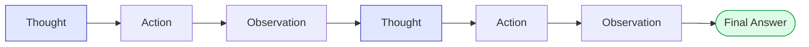

# Module 12 — Reasoning Patterns

### Difficulty
Intermediate → Advanced

### Learning Objectives
- Understand ReAct, plan-and-execute, reflection, critique-and-revise, tree-based exploration, and iterative improvement.
- For each pattern: what problem it solves, how it works, when to use it, advantages, limitations.

### Prerequisites
Modules 6, 7, 11.

> **Note:** All examples below show reasoning via concise decision summaries, explicit plans, tool actions, observations, and conclusions — never raw private chain-of-thought.

---

## Lesson 12.1 — ReAct (Reason + Act)

### What Problem It Solves
Early agents either reasoned in free text without acting, or acted without explaining why — both made debugging and reliable tool use hard. ReAct interleaves reasoning and acting in a tight loop: think a little, act, observe, think again.

### How It Works

```text
Thought: I need the current weather to answer this.
Action: get_weather(city="Pune")
Observation: {"temp_c": 29, "condition": "Sunny"}
Thought: I now have enough information to answer.
Final Answer: It's sunny in Pune, 29°C.
```

### When To Use
Good default pattern for most single-agent tool-using tasks — question answering with tools, simple research tasks.

### Advantages
- Simple, interpretable trace (each step is inspectable).
- Naturally handles multi-step tool use.

### Limitations
- Can be inefficient for tasks needing a lot of upfront planning — it plans only one step at a time, so it may take unnecessary detours.
- Struggles with tasks that need a long-horizon plan established before acting.

### Practical Example
**Task:** "Is it warmer in Pune or Mumbai right now?"
```text
Thought: I need weather for both cities.
Action: get_weather(city="Pune")
Observation: 29°C
Thought: Now I need Mumbai's weather.
Action: get_weather(city="Mumbai")
Observation: 31°C
Thought: I can now compare.
Final Answer: Mumbai is warmer right now (31°C vs 29°C in Pune).
```

---

## Lesson 12.2 — Plan-and-Execute

### What Problem It Solves
ReAct plans only one step ahead, which is inefficient for tasks with a clear multi-step structure known upfront. Plan-and-execute separates planning (produce the full task list first) from execution (carry it out step by step, replanning only if needed).

### How It Works

```text
Plan (generated upfront):
1. Research flight prices
2. Research hotel prices
3. Calculate total budget
4. Recommend within budget or suggest adjustments

Execute step 1 → Observe → (plan unaffected, continue)
Execute step 2 → Observe → (plan unaffected, continue)
Execute step 3 → Observe → (over budget!) → Replan step 4
Execute revised step 4 → Final Answer
```

### When To Use
Tasks with a fairly predictable structure known in advance (e.g., "research and report" tasks), where full upfront planning reduces wasted LLM calls compared to re-deciding the next step from scratch every time.

### Advantages
- More efficient for long, structured tasks — fewer redundant reasoning calls.
- Plan is inspectable and can be shown to the user for early feedback/approval.

### Limitations
- Less adaptive if the domain is highly unpredictable — the upfront plan may need frequent revision, eroding the efficiency gain.
- Requires good judgment about when a deviation is minor (ignore) vs. plan-invalidating (replan) — see Module 11.

---

## Lesson 12.3 — Reflection

### What Problem It Solves
Agents (like people) sometimes produce mediocre first-draft outputs. Reflection has the agent critique its own prior output and improve it, catching errors before finalizing.

### How It Works

```text
Draft Answer: "Paris is the capital of France, with a population of 5 million."
Reflection: Check draft for factual accuracy issues.
  → Population figure looks off; Paris's population is closer to 2.1 million
    (city proper).
Revised Answer: "Paris is the capital of France, with a population of about
2.1 million in the city proper (over 10 million in the greater metro area)."
```

### When To Use
Tasks where accuracy/quality matters more than speed/cost — writing, code generation, factual claims, high-stakes summaries.

### Advantages
- Catches errors a single generation pass would miss.
- Can be applied selectively (only reflect on high-stakes outputs) to control cost.

### Limitations
- Doubles (or more) the LLM calls for a given task — added cost and latency.
- The model reflecting on itself has real blind spots — a model can miss the same errors during "self-review" as during generation, especially for tricky factual verification (external tools/checks help — Module 17).

---

## Lesson 12.4 — Critique and Revise (Two-Model / Two-Role Pattern)

### What Problem It Solves
A single model reflecting on its own output can be less effective than having a separate "critic" perspective — either a different model, a different prompt role, or a dedicated agent — explicitly looking for flaws.

### How It Works

```text
Writer Agent produces draft.
       ↓
Critic Agent reviews draft against explicit criteria (accuracy, tone, completeness).
       ↓
Critic Agent returns specific, actionable feedback (not just "looks fine").
       ↓
Writer Agent revises based on feedback.
       ↓
(Optionally repeat until critic approves or max rounds reached)
```

### When To Use
High-stakes content generation (legal, medical, financial), or multi-agent systems (Module 14–15) where a dedicated reviewer/editor role naturally fits.

### Advantages
- Separation of roles produces more rigorous review than self-reflection alone.
- Naturally extends into multi-agent architectures (Writer + Editor + Fact-Checker).

### Limitations
- More expensive (multiple agent calls per artifact).
- Needs a termination condition (max rounds) to avoid endless back-and-forth (Module 17).

---

## Lesson 12.5 — Tree-Based Exploration

### What Problem It Solves
Some problems have multiple plausible paths forward, and committing to just one (as ReAct does) risks getting stuck on a bad path. Tree-based exploration considers multiple candidate next-steps or full solution paths, evaluates them, and picks (or combines) the best.

### How It Works

```text
Current State
   ├── Option A → estimated outcome: mediocre
   ├── Option B → estimated outcome: strong  ← chosen
   └── Option C → estimated outcome: fails constraint
```

For deeper problems, this can be applied recursively — each option branches into further sub-options, and the agent searches/evaluates across the tree (conceptually similar to how game-playing algorithms search move trees).

### When To Use
Complex problems with several genuinely different strategies where committing early is risky (e.g., complex code refactors with multiple valid approaches, strategic planning problems).

### Advantages
- Reduces risk of committing to a bad path early.
- Can surface genuinely creative/non-obvious solutions by exploring more of the space.

### Limitations
- Expensive: evaluating multiple branches multiplies LLM calls.
- Needs a good evaluation function to score branches — a poor evaluator undermines the whole approach.

---

## Lesson 12.6 — Iterative Improvement

### What Problem It Solves
Some outputs (long documents, complex code, detailed plans) are too large to get right in one pass. Iterative improvement produces a rough version quickly, then repeatedly refines specific parts.

### How It Works

```text
v1: Rough draft covering all required sections, low polish.
       ↓ evaluate against requirements
v2: Fix identified gaps (e.g., missing data, weak section 3).
       ↓ evaluate again
v3: Polish tone, tighten length, fix remaining issues.
       ↓ evaluate — meets bar → done
```

### When To Use
Long-form content generation, complex reports, iterative code development.

### Advantages
- Produces usable output quickly, then improves incrementally instead of trying to be perfect in one pass.
- Each iteration is easier to evaluate and fix than a single giant generation attempt.

### Limitations
- Needs clear stopping criteria, or iteration can continue indefinitely without meaningful improvement (diminishing returns).

---

## Summary Table

| Pattern | Solves | Cost | Best For |
|---|---|---|---|
| ReAct | Interleaving thought and action for tool use | Low-medium | General tool-using tasks |
| Plan-and-Execute | Inefficiency of one-step-at-a-time planning | Medium | Structured multi-step tasks |
| Reflection | Catching self-errors before finalizing | Medium | Accuracy-sensitive single-agent output |
| Critique & Revise | Blind spots of self-review | Medium-high | High-stakes content, multi-agent setups |
| Tree-Based Exploration | Risk of committing to one bad path early | High | Complex problems with multiple strategies |
| Iterative Improvement | Getting large outputs right in one pass | Medium-high | Long-form content, complex code |



**How to read this graph:** the bars are a rough proxy for how many LLM calls each pattern burns through for a comparable task, which is why ReAct — think-then-act one step at a time — sits at the cheap end, while Tree-Based Exploration sits at the expensive end, since it evaluates multiple candidate paths instead of committing to just one. Use this chart as a quick sanity check before reaching for a fancy pattern: if the tallest bars (Tree-Based, Iterative Improvement) don't clearly pay for themselves in better output quality for your specific task, the cheaper bars on the left are very likely the better engineering choice.

### The ReAct Loop, Visualized



**How to read this graph:** unlike the plan-and-execute pattern below, ReAct never writes out a full multi-step plan up front — each "Thought" box only looks one step ahead, immediately triggers one "Action," reads the resulting "Observation," and only *then* decides what to think about next. That tight, one-step-at-a-time rhythm is what makes ReAct cheap and simple, but it's also why it can take inefficient detours on tasks that really did have a clean multi-step structure knowable in advance.

### Common Mistakes
- Using an expensive pattern (tree-based exploration, multi-round critique) for a simple task where ReAct alone would suffice — wastes cost and latency.
- Never setting a maximum iteration/round count for reflection or critique loops — risks infinite refinement loops (Module 17).
- Exposing raw internal reasoning to end users instead of clean decision summaries — creates confusing, potentially misleading, or unnecessarily verbose output.

### Exercise
For the task "Write a product description for a new pair of running shoes," choose the most appropriate reasoning pattern from this module and justify your choice in 2–3 sentences.

### Challenge
Design a two-role critique-and-revise loop for a legal-document summarization agent: define what the "Writer" role does, what specific criteria the "Critic" role checks, and what happens if the critic never approves after 3 rounds.

### Knowledge Check
1. What's the key difference between ReAct and plan-and-execute?
2. Why might critique-and-revise outperform simple self-reflection?
3. What risk does tree-based exploration introduce that simpler patterns don't have?
