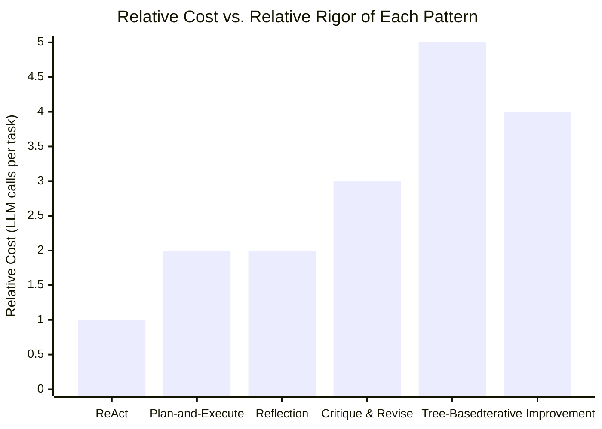

# Module 12 — Reasoning Patterns

### Difficulty
Intermediate → Advanced

### Learning Objectives
- Understand ReAct, plan-and-execute, reflection, critique-and-revise, tree-based exploration, and iterative improvement.
- For each pattern: what problem it solves, how it works, when to use it, advantages, limitations.

### Prerequisites
Modules 6, 7, 11.

> **Note:** All examples below show reasoning via concise decision summaries, explicit plans, tool actions, observations, and conclusions — never raw private chain-of-thought.

### Why This Module Exists

Module 6 gave you the basic agent loop (Observe → Think → Plan → Act → Check → Continue), and Module 11 gave you the general idea of planning and replanning. But neither of those modules told you *exactly how to structure the prompts and control flow* that make an LLM actually behave that way. "Think, then act, then observe" is a description of a desired behavior — it isn't yet a concrete recipe for getting an LLM to reliably do it. That's what this module provides: six distinct, named, battle-tested **recipes** for structuring the prompts and loop logic around an LLM so that it reliably exhibits a particular style of reasoning. Each one is, underneath, just a specific way of repeatedly calling the LLM with a specific prompt shape and a specific way of feeding results back in — there's no separate "reasoning engine" bolted onto the model. Understanding that these patterns are really just *prompt-and-loop templates*, not different kinds of AI, will make everything in this module click much faster.

It's also worth being explicit about why there are *six* of these instead of one universally-best pattern. Every pattern here trades cost (extra LLM calls, extra latency) for some kind of improved reliability or quality, and different tasks sit at different points on that trade-off curve. A pattern that's overkill for a simple weather lookup might be exactly right for a legal contract review. Learning to *match* the pattern to the task — not defaulting to the most sophisticated-sounding one — is as much a part of this module's goal as learning each pattern individually.

---

## Lesson 12.1 — ReAct (Reason + Act)

### What Problem It Solves

Before ReAct, agent builders faced an awkward choice. You could have the model reason in free text ("I should probably look up the weather, then compare the two cities...") without ever actually calling a tool — which produces fluent-sounding plans that may never get executed, or get executed inconsistently because the "plan" was never captured as a structured, actionable step. Or you could have the model call tools directly with no visible reasoning in between — which works, but makes it nearly impossible to debug *why* the agent chose a particular tool, especially when it chooses the wrong one. ReAct (short for "**Rea**soning + A**ct**ing") fixes this by forcing the model to alternate, in a strict, structured rhythm: articulate a short thought, take exactly one action based on that thought, look at what happened, then think again. Neither reasoning nor acting is ever allowed to run ahead of the other.

### How It Works

Mechanically, ReAct is implemented as a loop where each turn of the LLM's response is constrained (usually via the system prompt, sometimes via structured output formatting per Module 2.5) to produce exactly one of two things: a `Thought` followed by an `Action`, or a `Thought` followed by a `Final Answer`. The application code (not the model) is responsible for actually executing whatever `Action` the model requested, formatting the result as an `Observation`, and appending both the model's own output and that observation back into the conversation before calling the model again. This is precisely the tool-calling loop skeleton from Module 7.3 — ReAct is really just a name for "run that loop, and require the model to write a short reasoning sentence immediately before each tool call, instead of jumping straight to the tool call." That one small addition — the explicit `Thought` line — turns out to matter a great deal in practice: forcing the model to articulate *why* it's about to do something, in a sentence a human can read, measurably improves how often it picks the right tool, and it gives you (the developer) a debug trace when it doesn't.

```text
Thought: I need the current weather to answer this.
Action: get_weather(city="Pune")
Observation: {"temp_c": 29, "condition": "Sunny"}
Thought: I now have enough information to answer.
Final Answer: It's sunny in Pune, 29°C.
```

Trace this line by line against the loop skeleton from Module 7.3: the first `Thought` and `Action` line are exactly what `llm_client.decide(...)` returns from that code; the `Observation` line is exactly what gets appended as the `tool_result` message; and the second `Thought`/`Final Answer` pair is what the *next* call to `llm_client.decide(...)` returns, now that the conversation history includes the observation. Nothing new is happening mechanically — ReAct is a naming convention and a prompting discipline layered on top of code you've already seen.

### A Common Question

**"Why does forcing the model to write out a 'Thought' actually change its behavior — isn't it just generating text either way?"** This is a genuinely useful question, and the honest answer connects back to Module 2's explanation of how LLMs generate text: token by token, each token conditioned on everything generated so far. When a model is required to first write "Thought: I need the current weather to answer this" *before* it writes the tool call, that thought becomes part of the context the model conditions the tool-call decision on — in effect, the model is forced to "commit" to a stated reason before acting on it, which measurably reduces impulsive or inconsistent tool selection compared to jumping straight to an action with no stated reasoning. It's not fundamentally different from how asking a person to say "I'm reaching for the stapler because I need to bind these pages" out loud, rather than silently grabbing it, tends to produce more deliberate, catchable decisions than silent action — the verbalization step itself changes what happens next, even for the same underlying "brain."

**"What stops the model from writing a Thought that doesn't actually match the Action it takes?"** Nothing forces alignment automatically — this is exactly why ReAct traces are valuable for debugging (Module 17): if you see a `Thought` that says "I need Mumbai's weather" followed by an `Action` that calls `get_weather(city="Pune")` again, that mismatch is a visible, catchable bug rather than a silent one. Production systems sometimes add an explicit validation step that checks the action's tool name/input is consistent with what the thought described, rejecting and re-prompting when they diverge — but this is an added safeguard, not something ReAct guarantees on its own.

### When To Use

Good default pattern for most single-agent tool-using tasks — question answering with tools, simple research tasks. In practice, ReAct is the pattern you should reach for *first*, by default, for any tool-using agent, and only move to something more elaborate (plan-and-execute, tree-based exploration) once you have a concrete reason to believe ReAct's one-step-at-a-time approach is actually causing a specific measured problem (inefficient detours, wasted tool calls) on your specific task.

### Advantages
- Simple, interpretable trace (each step is inspectable) — you can literally read the Thought/Action/Observation sequence top to bottom and understand exactly what the agent did and why, which is enormously valuable when something goes wrong.
- Naturally handles multi-step tool use, without requiring any upfront planning machinery.
- Cheap relative to the other patterns in this module (see the cost chart at the end of this module) — it makes exactly as many LLM calls as there are reasoning/action steps, with no redundant planning or review calls layered on top.

### Limitations
- Can be inefficient for tasks needing a lot of upfront planning — it plans only one step at a time, so it may take unnecessary detours. Concretely: if a task genuinely has five clearly-orderable steps known in advance (like "research flights, then hotels, then compute budget, then recommend"), a pure ReAct agent has to *rediscover* that structure fresh, one step at a time, on every single run, sometimes producing an inefficient order (checking budget before it has gathered any prices to check against, for instance) that a one-time upfront plan would have avoided.
- Struggles with tasks that need a long-horizon plan established before acting — because ReAct never looks more than one step ahead, it has no mechanism to notice "step 4 depends on a decision I should be making right now at step 1" unless the model happens to reason its way there in the moment.

### Practical Example
**Task:** "Is it warmer in Pune or Mumbai right now?"
```text
Thought: I need weather for both cities.
Action: get_weather(city="Pune")
Observation: 29°C
Thought: Now I need Mumbai's weather.
Action: get_weather(city="Mumbai")
Observation: 31°C
Thought: I can now compare.
Final Answer: Mumbai is warmer right now (31°C vs 29°C in Pune).
```

Notice what a pure ReAct agent does *not* do here: it doesn't produce an upfront plan like "Step 1: get Pune weather. Step 2: get Mumbai weather. Step 3: compare." It discovers the need for a second `get_weather` call only *after* observing the result of the first one — which happens to work out fine for a simple two-lookup task like this, but is exactly the "no long-horizon plan" limitation described above, ready to bite on anything more structurally complex.

---

## Lesson 12.2 — Plan-and-Execute

### What Problem It Solves

ReAct plans only one step ahead, which is inefficient for tasks with a clear multi-step structure known upfront. Plan-and-execute separates planning (produce the full task list first) from execution (carry it out step by step, replanning only if needed) — it is, in fact, exactly the two-phase structure introduced conceptually in Module 11 (Lesson 11.1's decomposition, Lesson 11.2's dynamic replanning), now formalized as a named reasoning pattern you choose deliberately, in contrast to ReAct.

### How It Works

Mechanically, this pattern makes (at minimum) two distinct kinds of LLM calls instead of one uniform kind. The first is a **planning call**: a single prompt whose only job is "given this goal, produce an ordered list of concrete subtasks" — this is a structured-output call (Module 2.5), typically returning something like a JSON list of steps, with no tool execution happening yet. The second kind is an **execution call** per step: for each item in the plan, the agent runs something that looks a lot like a small ReAct loop (or even just a single tool call, for simple steps) to actually carry out that one subtask. Crucially, the execution calls only ever see *one step's worth* of the plan as their immediate task, plus enough surrounding context to know what came before — they are not re-deriving the whole strategy each time, which is exactly what saves the redundant reasoning calls ReAct would otherwise spend.

```text
Plan (generated upfront):
1. Research flight prices
2. Research hotel prices
3. Calculate total budget
4. Recommend within budget or suggest adjustments

Execute step 1 → Observe → (plan unaffected, continue)
Execute step 2 → Observe → (plan unaffected, continue)
Execute step 3 → Observe → (over budget!) → Replan step 4
Execute revised step 4 → Final Answer
```

Follow the branch at step 3 closely, because it's the entire point of combining planning with *dynamic* execution rather than blind execution: the observation from step 3 ("over budget") doesn't just get logged and ignored — it triggers exactly the "does this invalidate a downstream step?" check from Module 11.2, and because it does invalidate step 4 as originally planned ("recommend within budget" no longer makes sense if nothing is within budget), the agent regenerates just that one step rather than the whole four-step plan. Steps 1 and 2 aren't rerun, and their results (the actual flight and hotel prices found) are carried forward into the revised step 4 unchanged.

### A Common Question

**"If the agent replans mid-execution anyway, how is this actually different from ReAct with an extra planning step tacked onto the front?"** The difference is in what each *individual* execution step gets to assume. In pure ReAct, every single step must independently figure out, from scratch, "what should happen next given everything so far" — there is no persistent notion of "step 3 of 4." In plan-and-execute, each execution step is handed a specific, narrow sub-goal from the plan (and Module 16's persisted state can literally store "currently on step 3 of 4"), so the model's reasoning at that point is scoped down to "how do I accomplish *this* narrow thing," which tends to be both cheaper (less context needed per call) and more consistent (less room for the model to wander toward an unrelated but superficially plausible next action). The planning call is doing real, separable work — establishing structure — not just decoration on top of ReAct.

**"What if the plan is simply wrong from the very first step — do you still 'execute step 1' before noticing?"** Yes, and this is a genuine, known weakness of the pattern: plan-and-execute commits to acting on the plan's early steps before validating that the *whole* plan is sound, because validating a whole multi-step plan's soundness often requires information (like actual flight prices) that's only available *after* executing the earlier steps. This is different from Tree-Based Exploration (Lesson 12.5), which evaluates multiple *whole candidate plans* before committing to any of them — at higher cost. Plan-and-execute is a bet that "mostly right, cheaply revised when wrong" beats "fully validated upfront, expensively."

### When To Use

Tasks with a fairly predictable structure known in advance (e.g., "research and report" tasks), where full upfront planning reduces wasted LLM calls compared to re-deciding the next step from scratch every time.

### Advantages
- More efficient for long, structured tasks — fewer redundant reasoning calls, because each execution step is scoped to a narrow sub-goal instead of re-deriving the whole strategy.
- Plan is inspectable and can be shown to the user for early feedback/approval — this pairs naturally with Module 18's human-in-the-loop gating: a user (or a supervisor agent, Module 14) can review and approve the plan *before* any tool calls with real-world side effects happen.

### Limitations
- Less adaptive if the domain is highly unpredictable — the upfront plan may need frequent revision, eroding the efficiency gain; in the worst case (a domain where almost every step surprises the plan), you end up paying for both the planning call *and* nearly as much per-step improvisation as ReAct would have needed anyway.
- Requires good judgment about when a deviation is minor (ignore) vs. plan-invalidating (replan) — see Module 11's explicit test for this ("would the rest of the plan still make sense unchanged?").

---

## Lesson 12.3 — Reflection

### What Problem It Solves

Agents (like people) sometimes produce mediocre first-draft outputs. This isn't a flaw specific to any one model — it's a structural consequence of how LLMs generate text (Module 2.3–2.4): a model produces its response token by token in a single forward pass, without the ability to "look ahead," notice an error three sentences later, and silently go back and fix it before you ever see the output. A human writer drafts, rereads, and revises; a raw single LLM call only drafts. Reflection is the pattern that adds the "reread and revise" step back in, explicitly, as a second (or further) LLM call whose entire job is to critique the first call's output and produce an improved version.

### How It Works

Concretely, this is two sequential LLM calls with different prompts, not one call doing two things at once. The first call is an ordinary generation call, producing a draft. The second call is given the *draft itself* (not the original request in isolation) and instructed to check it against specific criteria — factual accuracy, completeness, tone, whatever matters for the task — and either approve it as-is or point out concrete issues. If issues are found, a third call (or the same call, extended) produces the revised version incorporating that feedback. The key mechanical detail that makes this work at all: the second call is given the draft as *external input to critique*, in the same role a retrieved document plays in RAG (Module 10) — the model is reasoning *about* a piece of text handed to it, not simply continuing to generate the same text it was already producing, which puts it in a genuinely different "mode" than the one that produced the error in the first place.

```text
Draft Answer: "Paris is the capital of France, with a population of 5 million."
Reflection: Check draft for factual accuracy issues.
  → Population figure looks off; Paris's population is closer to 2.1 million
    (city proper).
Revised Answer: "Paris is the capital of France, with a population of about
2.1 million in the city proper (over 10 million in the greater metro area)."
```

Notice the "Revised Answer" doesn't just correct the wrong number — it adds a clarifying distinction ("city proper" vs. "greater metro area") that resolves *why* the original number was arguably defensible-sounding in the first place (people do sometimes casually say "Paris has 5-10 million people," referring to the metro area). A good reflection step doesn't just flag "this is wrong" — the best ones surface *why* a plausible-sounding error crept in, which is exactly the kind of correction a second independent look tends to catch that the original generation pass couldn't.

### A Common Question

**"If it's the same underlying model doing the reflecting, why would it catch an error it just made itself moments ago?"** This connects to the note above about "mode": the model isn't literally introspecting on its previous thought process (there's no persistent internal state carried between calls beyond what's in the text context, per Module 2.2-2.3) — it's being asked a *different question* the second time. The first call answers "what's the capital of France and roughly how big is it?" The second call answers "does this specific written claim about Paris's population hold up to scrutiny?" Those are different tasks that happen to be about the same topic, and a model can be meaningfully better at the second (narrow, verification-shaped) task than it was at getting the first (open-ended, generation-shaped) task perfectly right the first time — in the same way a person proofreading someone else's essay for factual claims is doing a different cognitive task than the one who wrote it from scratch, even if it's the same person doing both.

**"Does reflection guarantee the revised answer is actually better?"** No — and this is the honest limitation the Limitations section below names directly. Reflection reduces the *rate* of certain kinds of errors slipping through, but a model can also reflect on a *correct* draft and "fix" it into something worse (a false-positive correction), or fail to catch the exact same category of error on the second pass that it made on the first, especially for genuinely obscure facts the model never had reliable information about in the first place. This is why, for facts that truly matter, Module 17's grounding techniques (RAG, external verification tools) are a stronger fix than reflection alone — reflection catches self-inconsistency and "does this sound right" issues well; it is not a substitute for checking a claim against a real source.

### When To Use

Tasks where accuracy/quality matters more than speed/cost — writing, code generation, factual claims, high-stakes summaries.

### Advantages
- Catches errors a single generation pass would miss, because the review step operates in a different "mode" (verification, not generation) even when using the same underlying model.
- Can be applied selectively (only reflect on high-stakes outputs) to control cost — you don't have to apply reflection uniformly to every single agent output; a cheap classification task might skip it entirely while a customer-facing summary always goes through it.

### Limitations
- Doubles (or more) the LLM calls for a given task — added cost and latency (see Module 22 for how to budget this deliberately rather than applying it everywhere by default).
- The model reflecting on itself has real blind spots — a model can miss the same errors during "self-review" as during generation, especially for tricky factual verification (external tools/checks help — Module 17), and can occasionally "correct" something that was already right, introducing a new error where there wasn't one before.

---

## Lesson 12.4 — Critique and Revise (Two-Model / Two-Role Pattern)

### What Problem It Solves

A single model reflecting on its own output can be less effective than having a separate "critic" perspective — either a different model, a different prompt role, or a dedicated agent — explicitly looking for flaws. The core insight extending beyond Reflection (Lesson 12.3) is this: Reflection already showed that giving the *same* model a differently-framed second task ("verify this" instead of "write this") improves error-catching. Critique and Revise pushes that idea one step further by making the reviewer a genuinely separate role — with its own system prompt, its own explicit grading criteria, and sometimes even a different underlying model entirely — rather than the same conversational context just asked to "double-check itself." A truly separate critic role has no attachment to defending choices it just made, because it never made them; it's approaching the draft cold, the way an outside editor would.

### How It Works

```text
Writer Agent produces draft.
       ↓
Critic Agent reviews draft against explicit criteria (accuracy, tone, completeness).
       ↓
Critic Agent returns specific, actionable feedback (not just "looks fine").
       ↓
Writer Agent revises based on feedback.
       ↓
(Optionally repeat until critic approves or max rounds reached)
```

Two implementation details make or break this pattern in practice, and they're both about the Critic Agent's prompt specifically. First, the critic needs **explicit, named criteria** to check against — a prompt like "review this and say if it's good" produces vague, low-value feedback ("looks fine" or "could be better"), whereas a prompt like "check this against: (1) every numeric claim is sourced, (2) tone matches a formal legal register, (3) no section exceeds 200 words" produces specific, actionable findings the Writer can actually act on. Second, the critic's output should be **structured, not just prose** — a list of `{issue, location, severity}` objects (Module 2.5's structured-output pattern again) is far more useful to feed back into the Writer's next call than a paragraph of loosely-organized feedback, because the Writer's revision prompt can then say "fix these specific N issues" rather than re-parsing free text to figure out what changed.

### A Common Question

**"Does the Critic need to be a genuinely different LLM (a different provider or model size), or can it just be the same model with a different system prompt?"** In practice, a different system prompt and a fresh conversation context (so the critic isn't influenced by having "written" the draft) captures most of the benefit — you don't strictly need a different model. Using a genuinely different model (or a larger, more capable one specifically for the critic role, tying into Module 22's cost-tiering idea) can catch a different distribution of errors, since different models have different blind spots, but this is an optimization on top of the core pattern, not a requirement for it to work at all.

**"How is this different from Debate (Module 15, Pattern 5)?"** Critique and Revise has one producer and one reviewer working *cooperatively* toward a single improved artifact — the Critic's job is to help the Writer get better, and there's no adversarial framing. Debate, covered later as a multi-agent pattern, deliberately sets up two agents to argue *opposing* positions before a third judges between them — it's suited to genuinely contested, ambiguous questions where there may be no single "correct" direction, whereas Critique and Revise assumes there's one artifact getting objectively better with each round of specific feedback.

### When To Use

High-stakes content generation (legal, medical, financial), or multi-agent systems (Module 14–15) where a dedicated reviewer/editor role naturally fits.

### Advantages
- Separation of roles produces more rigorous review than self-reflection alone, because the critic isn't reasoning from inside the same context that produced the draft.
- Naturally extends into multi-agent architectures (Writer + Editor + Fact-Checker) — this pattern is, in fact, exactly what Module 15's "Critic Architecture" formalizes as a standalone multi-agent design pattern.

### Limitations
- More expensive (multiple agent calls per artifact) — every round costs at least two calls (critique + revision), and multi-round loops multiply this further.
- Needs a termination condition (max rounds) to avoid endless back-and-forth (Module 17) — without an explicit cap, a critic that's calibrated to be extremely strict can, in principle, never fully approve anything, leaving the loop with no natural exit.

---

## Lesson 12.5 — Tree-Based Exploration

### What Problem It Solves

Some problems have multiple plausible paths forward, and committing to just one (as ReAct does, one step at a time, or as Plan-and-Execute does, one whole plan at a time) risks getting stuck on a bad path that only reveals its weakness several steps later, after real cost has already been sunk into it. Tree-based exploration solves this by considering multiple candidate next-steps or full solution paths *before* committing, evaluating each, and picking (or in some variants, combining) the best.

### How It Works

```text
Current State
   ├── Option A → estimated outcome: mediocre
   ├── Option B → estimated outcome: strong  ← chosen
   └── Option C → estimated outcome: fails constraint
```

Mechanically, this requires two ingredients that the earlier patterns didn't need: a way to **generate multiple distinct candidates** for the next move (usually by prompting the model multiple times, sometimes at a higher temperature per Module 2.4 to encourage genuinely different suggestions rather than near-duplicates), and a way to **score or evaluate** each candidate so the agent can actually compare them rather than just picking arbitrarily. That evaluation step is often itself an LLM call — "given these three candidate approaches to this code refactor, which is most likely to satisfy the following constraints, and why?" — but it can also be a programmatic check (does this candidate pass the existing test suite? does this candidate stay under the budget constraint?) wherever an objective check is available, which is both cheaper and more trustworthy than an LLM's subjective judgment call.

For deeper problems, this can be applied recursively — each option branches into further sub-options, and the agent searches/evaluates across the tree (conceptually similar to how game-playing algorithms search move trees, such as the minimax-style search classic chess engines use to look several moves ahead before committing to one). The recursive version is considerably more expensive, since the number of candidates evaluated can grow multiplicatively with tree depth — most practical agentic applications of this pattern therefore limit themselves to a shallow tree (one level of branching, occasionally two) rather than a deep, exhaustive search, because the cost of a truly deep search rarely pays for itself outside of genuinely high-stakes, high-ambiguity problems.

### A Common Question

**"Who decides what counts as a 'strong' vs. 'mediocre' outcome in the diagram above — isn't that itself a judgment call that could be wrong?"** Yes, and this is precisely why the Limitations section flags "needs a good evaluation function" as the central risk of this pattern. If the thing scoring the candidates is a weak or miscalibrated judge — an LLM prompt that doesn't actually capture what "good" means for this task, or a programmatic check that only tests a narrow slice of correctness — the entire tree-search apparatus can confidently select a bad option while looking, on the diagram, exactly as rigorous as if the evaluation were sound. The sophistication of exploring multiple branches is only as good as the sophistication of judging them; a tree search with a bad evaluator is worse than no tree search at all, because it adds cost while providing false confidence in whatever it picked.

**"Is this the same as just running the agent multiple times and picking the best result?"** Closely related, but usually applied at a finer grain. "Run the whole agent multiple times and pick the best final output" is a valid, simpler technique (sometimes called best-of-N sampling), but tree-based exploration as described here is typically applied at the level of individual *decision points* within a single run — branching at the moment of uncertainty, evaluating locally, then continuing forward with the chosen branch — rather than only comparing complete, independently-generated end-to-end attempts. The finer-grained version can be considerably cheaper, since only the genuinely uncertain decision points get multiple candidates generated, while the rest of the run proceeds as a normal single path.

### When To Use

Complex problems with several genuinely different strategies where committing early is risky (e.g., complex code refactors with multiple valid approaches, strategic planning problems).

### Advantages
- Reduces risk of committing to a bad path early, by comparing alternatives before any one of them incurs real downstream cost.
- Can surface genuinely creative/non-obvious solutions by exploring more of the space than a single greedy pass would ever consider.

### Limitations
- Expensive: evaluating multiple branches multiplies LLM calls — see the cost chart at the end of this module, where Tree-Based sits at the top of the relative-cost scale among all six patterns.
- Needs a good evaluation function to score branches — a poor evaluator undermines the whole approach, in the specific and dangerous way described in the "Common Question" above: it produces false confidence, not just mediocre results.

---

## Lesson 12.6 — Iterative Improvement

### What Problem It Solves

Some outputs (long documents, complex code, detailed plans) are too large to get right in one pass. Trying to generate a polished, fully-correct 20-page report in a single LLM call asks the model to simultaneously get right dozens of independent things at once — structure, factual accuracy in every section, consistent tone throughout, correct formatting — and a single pass has no opportunity to notice that section 3 contradicts something stated in section 1, because by the time section 3 is being generated, the model isn't re-reading and re-checking section 1 against it. Iterative improvement produces a rough version quickly, then repeatedly refines specific parts, treating the output the way a human writer treats a long document: draft everything roughly first, then pass back over it multiple times fixing specific, identified problems.

### How It Works

```text
v1: Rough draft covering all required sections, low polish.
       ↓ evaluate against requirements
v2: Fix identified gaps (e.g., missing data, weak section 3).
       ↓ evaluate again
v3: Polish tone, tighten length, fix remaining issues.
       ↓ evaluate — meets bar → done
```

The mechanical difference between this and Reflection (Lesson 12.3) is scope and iteration count: Reflection is typically a single critique-then-revise pass applied to a whole (usually shorter) output. Iterative Improvement is explicitly *multi-round* and typically works section-by-section or issue-by-issue on a larger artifact, with each round's "evaluate" step producing a *specific, scoped* list of what still needs fixing (much like the Critic Agent's structured feedback in Lesson 12.4) rather than a single holistic verdict. In practice, this often means the "evaluate against requirements" step is checking off a concrete checklist — did every required section get covered? are there any TODOs or placeholder text remaining? does the total length fit the target? — and each version only needs to close the specific gaps the checklist surfaces, not regenerate the whole document from nothing.

### A Common Question

**"How is 'v1, v2, v3' different from just running Reflection three times in a row?"** They're closely related and the line between them is genuinely blurry — the useful distinction is less about mechanism and more about intent and scope. Reflection, as introduced in this module, is framed around catching *errors* in an already-mostly-complete output. Iterative Improvement is framed around *building up completeness and polish* over multiple rounds on an artifact that was never expected to be complete after round one — v1 is explicitly allowed to be rough and partial, which is a different starting assumption than Reflection's "here's a finished draft, find what's wrong with it." In practice, real systems often blend the two: early rounds behave like iterative improvement (filling gaps, adding missing sections), and a final round behaves like reflection (a last accuracy/tone pass over an already-complete draft).

**"What stops this from just being expensive without visibly better results, since you're not comparing against a genuinely different approach the way Tree-Based Exploration does?"** This is exactly why the Limitations section calls out the need for clear stopping criteria — without a concrete definition of "good enough" (a checklist, a length target, an explicit rubric), successive rounds can keep making small, low-value tweaks indefinitely, each one technically a "change" but not a meaningful improvement, which burns cost without commensurate benefit. The fix, mirroring Module 17's approach to loop detection generally, is to define what "done" looks like *before* starting the iteration loop, and stop as soon as that bar is met rather than continuing purely because more rounds are still available.

### When To Use

Long-form content generation, complex reports, iterative code development.

### Advantages
- Produces usable output quickly, then improves incrementally instead of trying to be perfect in one pass — you always have a working v1 to fall back on if later rounds run out of budget or hit a limit.
- Each iteration is easier to evaluate and fix than a single giant generation attempt, because the evaluation step can be scoped to a checklist of specific, checkable requirements rather than a vague holistic judgment.

### Limitations
- Needs clear stopping criteria, or iteration can continue indefinitely without meaningful improvement (diminishing returns) — define "good enough" before you start, not as an afterthought once cost has already crept up.

---

## Summary Table

| Pattern | Solves | Cost | Best For |
|---|---|---|---|
| ReAct | Interleaving thought and action for tool use | Low-medium | General tool-using tasks |
| Plan-and-Execute | Inefficiency of one-step-at-a-time planning | Medium | Structured multi-step tasks |
| Reflection | Catching self-errors before finalizing | Medium | Accuracy-sensitive single-agent output |
| Critique & Revise | Blind spots of self-review | Medium-high | High-stakes content, multi-agent setups |
| Tree-Based Exploration | Risk of committing to one bad path early | High | Complex problems with multiple strategies |
| Iterative Improvement | Getting large outputs right in one pass | Medium-high | Long-form content, complex code |



**How to read this graph:** the bars are a rough proxy for how many LLM calls each pattern burns through for a comparable task, which is why ReAct — think-then-act one step at a time — sits at the cheap end, while Tree-Based Exploration sits at the expensive end, since it evaluates multiple candidate paths instead of committing to just one. Use this chart as a quick sanity check before reaching for a fancy pattern: if the tallest bars (Tree-Based, Iterative Improvement) don't clearly pay for themselves in better output quality for your specific task, the cheaper bars on the left are very likely the better engineering choice. As a practical heuristic worth internalizing: start every new agent design with plain ReAct, and only reach for one of the more expensive patterns once you can point to a specific, observed failure mode (from real runs, not hypothetical worry) that ReAct alone doesn't fix — this mirrors the same discipline Module 5 teaches for choosing between a chatbot, a workflow, and an agent in the first place.

### The ReAct Loop, Visualized


**How to read this graph:** unlike the plan-and-execute pattern below, ReAct never writes out a full multi-step plan up front — each "Thought" box only looks one step ahead, immediately triggers one "Action," reads the resulting "Observation," and only *then* decides what to think about next. That tight, one-step-at-a-time rhythm is what makes ReAct cheap and simple, but it's also why it can take inefficient detours on tasks that really did have a clean multi-step structure knowable in advance. Compare this shape mentally against Lesson 12.4's Critique-and-Revise loop: both are cyclic, but ReAct's cycle is one agent alternating between two internal modes (thinking, acting), while Critique-and-Revise's cycle is two distinct roles handing an artifact back and forth — a structurally different kind of loop even though both "keep going until done" is the surface-level similarity.

### Common Mistakes
- **Using an expensive pattern (tree-based exploration, multi-round critique) for a simple task where ReAct alone would suffice.** This usually happens when a team reaches for the most sophisticated-sounding pattern by default, rather than starting cheap and only escalating once a concrete, observed failure justifies the extra cost — wastes cost and latency for no measurable quality gain.
- **Never setting a maximum iteration/round count for reflection or critique loops.** Without an explicit cap, a strict critic or an evaluator with a moving bar can keep finding "one more thing" indefinitely, and the loop never naturally terminates — risks infinite refinement loops (Module 17), which is the reasoning-pattern-level version of the same runaway-loop problem Module 17 covers for tool calls generally.
- **Exposing raw internal reasoning to end users instead of clean decision summaries.** Showing a user every intermediate "Thought" verbatim, especially ones that reflect false starts or dead ends the agent later abandoned, creates confusing, potentially misleading, or unnecessarily verbose output — the note at the top of this module (concise decision summaries, not raw chain-of-thought) exists specifically to prevent this.
- **Confusing "more rounds" with "better outcome" in Critique & Revise or Iterative Improvement.** Each additional round has diminishing returns and non-zero risk of a false-positive "correction" (as discussed in Lesson 12.3's Common Question) — more rounds are not free quality, they're a trade you should make deliberately, bounded by an explicit stopping criterion, not by default habit.

### Exercise
For the task "Write a product description for a new pair of running shoes," choose the most appropriate reasoning pattern from this module and justify your choice in 2–3 sentences.

### Challenge
Design a two-role critique-and-revise loop for a legal-document summarization agent: define what the "Writer" role does, what specific criteria the "Critic" role checks, and what happens if the critic never approves after 3 rounds.

### Knowledge Check
1. What's the key difference between ReAct and plan-and-execute?
2. Why might critique-and-revise outperform simple self-reflection?
3. What risk does tree-based exploration introduce that simpler patterns don't have?
4. Why does forcing an LLM to write an explicit "Thought" before an "Action" change its behavior, given that it's still the same underlying model generating text either way?

Continue to **[13-Module13-Agent-Frameworks.md](13-Module13-Agent-Frameworks.md)**.
