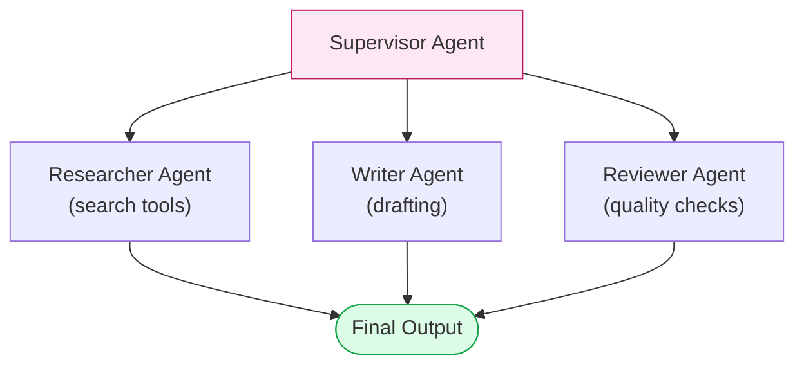
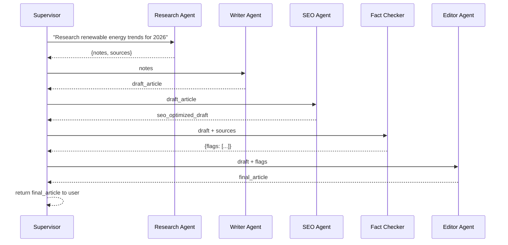

# Module 14 — Multi-Agent Architecture

### Difficulty
Advanced

### Learning Objectives
- Understand why multiple specialized agents can outperform one generalist agent.
- Understand delegation, coordination, communication, shared memory, and supervisors.
- Design a concrete multi-agent example: an AI content team.

### Prerequisites
Modules 1–13.

---

## Lesson 14.1 — Why Multiple Agents?

### Concept Explanation

A single agent juggling many responsibilities (research, writing, fact-checking, editing) tends to do all of them adequately but none excellently. To understand precisely *why* this happens rather than just accepting it as a rule of thumb, think back to Module 6.1's point that an agent's "brain" is a single LLM call, and Module 2.2's point that every call has a finite context window and a finite amount of the model's "attention" to spend across whatever is in that window. A generalist agent's system prompt (Module 3) has to simultaneously encode instructions for research standards, writing style, SEO best practices, fact-checking rigor, and editorial polish, all at once, in every single call — and its available tools list has to include search tools, keyword tools, citation-checking tools, and anything else any of its jobs might need, all visible to the model on every decision, whether or not that decision is even related to that particular tool. This is precisely the "incorrect tool selection" failure mode from Module 17.1, made worse by sheer instruction volume: the more competing concerns crammed into one prompt, the more likely the model misapplies guidance from one role while doing work that belongs to another, or picks a tool meant for a different concern entirely.

**Multi-agent systems** fix this by splitting responsibilities across specialized agents, each with a focused role, tools, and instructions, coordinated toward a shared goal. Each specialist's system prompt only has to encode *its own* concern — the Fact Checker's prompt never has to mention SEO keyword density, because the Fact Checker never has to think about SEO at all. This isn't merely tidier organization; it has a real, mechanical effect on quality, because a shorter, single-purpose prompt gives the model less irrelevant context to be distracted by (or to misapply) when making decisions specific to that one job.

### A Common Question

**"Couldn't I get the same benefit just by writing one really excellent, well-organized system prompt that clearly separates the different concerns with headers?"** Up to a point, yes — a well-organized single prompt with clear section headers for "research standards," "writing style," and so on is a real, valid improvement over a disorganized one, and for genuinely small tasks it may be entirely sufficient (this echoes Module 5's core lesson: don't reach for more architecture than the task needs). But this approach hits a hard ceiling that splitting into separate agents doesn't: a single agent still only gets *one* context window and *one* LLM call's worth of attention per turn, no matter how well-organized the prompt is, and it still has to hold every tool from every concern visible simultaneously. A dedicated Fact Checker agent, by contrast, can spend its *entire* context budget and *all* of its attention purely on fact-checking, with zero competing instructions in view, and only the tools fact-checking actually needs. Splitting into agents is what lets you scale total task complexity past what a single context window and a single prompt can gracefully hold, not just an organizational nicety.

**"Does adding more agents always mean better quality?"** No — and this is worth flagging before Lesson 14.2 makes coordination and communication sound like a purely mechanical exercise. Every additional agent boundary is also an additional hand-off, and every hand-off is a place where information can be lost, misrepresented, or delayed (Module 14.3's Common Mistakes returns to this directly). The right number of agents is the smallest number that lets each one hold a genuinely coherent, focused role — not the largest number you can think of a plausible-sounding job title for. Module 15's "Common Mistakes" explicitly calls out over-fragmentation as a real failure mode, not a hypothetical one.

### Simple Analogy

> A single generalist agent is like one person trying to be researcher, writer, editor, and fact-checker for a big report simultaneously — context-switching hurts quality, and it's worse than it sounds: every time that one person shifts from "writing mode" to "fact-checking mode," they have to mentally set aside everything they were just thinking about as a writer and load in an entirely different mindset, and human context-switching (like an LLM's attention across a crowded prompt) has a real, measurable cost every single time it happens. A multi-agent system is like an actual editorial team: a researcher gathers facts, a writer drafts, an editor polishes, and a fact-checker verifies — each focused, each better at their narrow job, and crucially, each one only has to load *one* mindset for their entire portion of the work rather than switching back and forth.

---

## Lesson 14.2 — Core Concepts

- **Agent specialization**: each agent has a narrow role, its own system prompt, and often its own specific tools (e.g., a Researcher agent gets search tools; a Writer agent doesn't). Specialization is the direct implementation of Lesson 14.1's core argument — the narrower and more focused an agent's role, the shorter and less ambiguous its prompt can be, and the smaller its tool list needs to be, both of which reduce the surface area for mistakes.
- **Delegation**: a coordinating agent (or process) assigns sub-tasks to the specialist best suited for them. Delegation is a decision, not just a hand-off — deciding *which* specialist should handle a given piece of work (and what, specifically, to tell them) is itself a small planning problem (Module 11), usually solved by whatever plays the Supervisor role below.
- **Coordination**: the logic that determines execution order — sequential, parallel, or conditional based on results. This is the multi-agent equivalent of the execution loop from Module 6.1: just as a single agent's loop decides "what's the next action," a multi-agent system's coordination logic decides "which agent acts next, and does that decision depend on what a previous agent just produced." Module 15 catalogs seven distinct shapes this coordination logic can take.
- **Communication**: how agents pass information to each other — shared message threads, structured handoff objects, or a shared memory store. This is worth taking as seriously as the agents themselves: an excellent Research Agent whose findings get garbled or truncated on the way to the Writer Agent produces the same bad outcome as a mediocre Research Agent, because from the Writer's point of view, the information simply isn't there either way.
- **Shared memory**: a common store (Module 8–9) multiple agents can read/write to, so context isn't lost as tasks pass between them. Shared memory is a *different* communication mechanism than direct message-passing — instead of Agent A handing its output directly to Agent B, both agents read from and write to a common store (a database, a vector store), which is especially useful when more than two agents need access to the same piece of information without every pair of agents needing a direct communication path.
- **Supervisor**: a coordinating agent (or fixed logic) that decides which specialist agent acts next, based on the current state of the task. A supervisor doesn't have to be an LLM itself — for simple, fixed sequences (like the Pipeline pattern in Module 15), the supervisor can just be ordinary code executing a fixed order. A supervisor becomes an LLM-powered agent in its own right specifically when the *decision* of what happens next genuinely requires judgment (which specialist is actually needed for this particular request, whether a result is good enough to move forward, whether to loop back to an earlier specialist).

### Visual Diagram



**How to read this graph:** the pink Supervisor box is the only node that talks to all three specialists — the specialists don't necessarily talk to each other directly, they report through the supervisor and their outputs converge back into one "Final Output." This star-shaped ("hub and spoke") structure is exactly what makes supervisor-pattern systems easy to reason about: if something goes wrong, you know to look at either one specialist's output or the supervisor's coordination logic, not a tangle of every-agent-talks-to-every-agent connections. Contrast this mentally with Module 15's Peer-to-Peer pattern, where that "every-agent-talks-to-every-agent" tangle is exactly what you get instead — the hub-and-spoke shape here is a deliberate simplification, not the only way multi-agent systems can be wired, and Module 15 covers when you'd deliberately choose a different shape.

---

## Lesson 14.3 — Example: AI Content Team

### Concept Explanation

**Goal:** "Produce a well-researched, SEO-optimized, fact-checked blog post about renewable energy trends."

| Agent | Role | Tools | Input | Output |
|---|---|---|---|---|
| Research Agent | Gathers current facts and sources | Web search, document retrieval | Topic | Structured research notes with sources |
| Writer Agent | Drafts the article from research notes | None (pure generation) | Research notes | Draft article |
| SEO Agent | Optimizes structure, keywords, headings | Keyword research tool | Draft article | SEO-optimized draft |
| Fact Checker Agent | Verifies claims against sources | Search/citation-check tool | SEO-optimized draft + sources | List of flagged claims (verified/unverified) |
| Editor Agent | Final polish, tone, coherence, resolves flags | None | Draft + fact-check results | Final article |

Look closely at the "Tools" column, because it's a direct application of the least-privilege thinking Module 21.3 covers in a security context, applied here purely for quality reasons: the Writer Agent and Editor Agent are given *no* tools at all. This is deliberate, not an oversight — their jobs are pure language generation and revision tasks, and giving them search or keyword tools they don't need would only create more opportunities for them to wander off-task (calling a tool "just in case," as Module 7's Common Mistakes warns against) without any benefit to the quality of their actual work.

### Communication Flow



**How to read this graph:** every specialist agent only ever talks to the Supervisor — notice there's no arrow directly connecting, say, the Research Agent to the Editor Agent. The Supervisor is a relay: it takes one agent's output, decides what the *next* agent needs from it, and forwards exactly that (not everything). This is why careful hand-off design matters so much in this pattern — if the Supervisor forwarded the Research Agent's raw notes to the Editor instead of the final draft, the Editor would be reviewing the wrong artifact entirely. Notice also exactly *what* gets forwarded at each step, since it's never simply "everything so far": the Writer only receives `notes`, not the raw search results the Research Agent may have sifted through to produce those notes; the SEO Agent only receives `draft_article`, with no need to see the original research notes at all, since its job is purely about structure and keywords in the text that already exists. Each hand-off is trimmed to exactly what that next specialist's narrow job requires — this is the practical, per-message version of the "context optimization" principle from Module 22.3, applied at the level of inter-agent communication rather than a single agent's own conversation history.

### What Happens When a Specialist Flags a Problem

The sequence diagram above shows the clean, everything-goes-well path. Real runs don't always look like that — here's what happens when the Fact Checker actually finds something wrong, since that's exactly the kind of branch a rigid Pipeline (Module 15, Pattern 4) would struggle to handle gracefully:

```text
S->>FC: draft + sources
FC-->>S: {flags: [{claim: "Solar capacity grew 40% in 2025",
                    status: "unverified", reason: "no matching source found"}]}

Supervisor's decision: one unverified claim out of several is below the
"escalate to human" threshold, but above the "silently ignore" threshold —
route back to the Writer, not straight to the Editor.

S->>W: "Revise this draft: the claim 'Solar capacity grew 40% in 2025' could
        not be verified against the provided sources. Either find a supporting
        source in the original research notes, remove the specific number and
        speak more generally, or flag it as an estimate."
W-->>S: revised_draft (claim softened to "solar capacity grew significantly
         in 2025, according to industry estimates")

S->>SEO: revised_draft   (re-run SEO pass, since the text changed)
SEO-->>S: seo_optimized_draft_v2
S->>FC: seo_optimized_draft_v2 + sources
FC-->>S: {flags: []}   ✅ no unverified claims remain
S->>E: seo_optimized_draft_v2 + flags: []
E-->>S: final_article
```

Notice two design decisions embedded in this trace, both worth calling out explicitly. First, the Supervisor doesn't treat "one flagged claim" as an automatic hard failure — it makes a judgment call about severity (a pattern that connects directly to Module 18's risk-tiering: not every problem warrants the same response), and only loops back to the Writer rather than escalating to a human, because a single softened claim is a low-stakes fix. Second, once the Writer revises the draft, the Supervisor correctly re-runs the SEO pass *before* re-checking facts — because the text changed, the previous SEO-optimized version is now stale, and skipping that re-run would let an outdated, no-longer-accurate draft slip through to the Editor. This targeted, "figure out exactly which downstream steps are now stale and only redo those" logic is the multi-agent equivalent of the targeted-replanning discipline from Module 11.2 — the Supervisor doesn't restart the whole pipeline from Research, it only re-runs the specific specialists whose outputs depended on the thing that just changed.

### Practical Example (Conceptual Python Skeleton)

```python
def run_content_team(topic: str, max_revision_rounds: int = 2) -> str:
    notes = research_agent.run(f"Research current trends: {topic}")
    draft = writer_agent.run(f"Write an article using these notes:\n{notes}")

    for round_num in range(max_revision_rounds):
        seo_draft = seo_agent.run(f"Optimize this draft for SEO:\n{draft}")
        fact_check = fact_checker_agent.run(
            f"Verify claims in this draft against sources:\n{seo_draft}\n\nSources:\n{notes['sources']}"
        )

        if not fact_check["flags"]:
            break  # nothing left to fix — move on to final editing

        # Targeted replan: only the Writer needs to act on these specific flags
        draft = writer_agent.run(
            f"Revise this draft to address these unverified claims:\n{seo_draft}\n\nFlags:\n{fact_check['flags']}"
        )
    else:
        # Loop exhausted max_revision_rounds without a clean fact-check —
        # escalate rather than silently publishing an unverified claim (Module 18)
        return escalate_to_human(seo_draft, fact_check["flags"])

    final = editor_agent.run(
        f"Polish this draft, resolving these flagged issues:\n{seo_draft}\n\nFlags:\n{fact_check}"
    )
    return final
```

*Explanation, line by line intent:* the original single-pass version of this skeleton (a straight sequential hand-off with no loop) is the right amount of complexity for the "everything goes well" path, but it has nowhere to go if the Fact Checker ever finds a real problem — it would either ignore the flags or crash. This revised version wraps the SEO → Fact Check → (maybe) Revise sequence in a bounded loop: `max_revision_rounds` is the same hard-limit discipline Module 17 insists on for any loop that could otherwise run forever, and the `for...else` construct (a genuine, if slightly obscure, Python feature — the `else` block runs only if the loop completes *without* hitting `break`) is what implements "if we never got a clean fact-check within the allowed rounds, escalate instead of silently shipping an unverified claim," directly matching Module 18's human-in-the-loop philosophy. More sophisticated supervisors (Module 15) can branch further, run agents in parallel where there's no dependency between them, or use a genuine LLM-powered supervisor to decide the routing dynamically instead of this hardcoded loop.

### Key Takeaways
- Multi-agent systems trade single-agent simplicity for specialization, focus, and (often) higher quality per sub-task — the mechanism is real and specific: shorter, single-purpose prompts and smaller tool lists reduce the surface area for the tool-selection and instruction-following mistakes Module 17 catalogs.
- A supervisor coordinates delegation; shared memory/structured handoffs keep context intact across agents. What gets forwarded between agents should be exactly what the next specialist needs — never everything, and never nothing.
- Communication design (what exactly gets passed between agents) is as important as the agents themselves — vague hand-offs cause the same context-loss problems a single overloaded agent has, just relocated to the boundary between two agents instead of inside one.
- When a specialist flags a problem, a well-designed supervisor performs a targeted response (loop back to just the affected specialist, re-run just the stale downstream steps) rather than either ignoring the flag or restarting the whole pipeline — this is Module 11.2's targeted-replanning discipline applied at the multi-agent level.

### Common Mistakes
- **Over-fragmenting into too many tiny agents**, adding coordination overhead without meaningful quality gains. Every agent boundary is a hand-off, and every hand-off has to be designed, tested, and can fail — splitting a genuinely coherent, small task (like "check tone and grammar") into two separate agents just to have more specialists adds real complexity cost for no corresponding drop in per-agent prompt complexity, since the task was never big enough to overload a single agent's context in the first place.
- **Passing full raw context (huge token dumps) between every agent instead of structured, relevant summaries** — burns cost and risks context rot at every hop. The trace above shows the fix directly: the Writer gets `notes`, not the Research Agent's entire raw search history; the SEO Agent gets `draft_article`, not the original research notes at all. Always ask "what does the *next* specialist's specific, narrow job actually require" before deciding what to forward.
- **No error handling for a specialist agent's failure** (e.g., what happens if Fact Checker times out or returns malformed output) — covered further in Module 17. A supervisor's coordination logic needs the same retry/timeout/fallback discipline Module 17 requires of any individual tool call, applied one level up: what should happen if an entire specialist agent's call fails, not just one of its tool calls?
- **Treating every flagged issue as either "ignore it" or "restart everything."** As the Fact Checker example shows, the useful middle ground — loop back to just the affected specialist, re-run just the stale downstream steps — requires the supervisor to actually reason about *which* steps depend on what changed, rather than defaulting to one of the two easy extremes.

### Exercise
Design a 3-agent system for handling customer support escalations: define each agent's role, what it receives, and what it produces. Include a supervisor.

### Challenge
Extend your Exercise design: what happens if the "Fact Checker" equivalent (or a similar verification agent) rejects the specialist's output twice in a row? Design the supervisor's fallback behavior (retry, escalate to human, return a partial result), and specify a concrete `max_rounds` value with a justification for why you chose that number rather than a much higher or lower one.

### Knowledge Check
1. Why might a multi-agent system outperform a single generalist agent on a complex task?
2. What is a supervisor's role in a multi-agent system?
3. Why is careful handoff design between agents important, not just the individual agents' quality?
4. When a downstream specialist flags a problem, why is "loop back to just the affected specialist and re-run only the stale steps" usually better than either ignoring the flag or restarting the whole pipeline from the beginning?

Continue to **[15-Module15-MultiAgent-Patterns.md](15-Module15-MultiAgent-Patterns.md)**.
