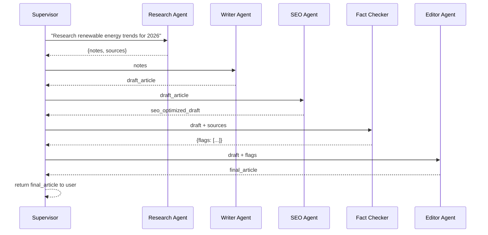

# Module 14 — Multi-Agent Architecture

### Difficulty
Advanced

### Learning Objectives
- Understand why multiple specialized agents can outperform one generalist agent.
- Understand delegation, coordination, communication, shared memory, and supervisors.
- Design a concrete multi-agent example: an AI content team.

### Prerequisites
Modules 1–13.

---

## Lesson 14.1 — Why Multiple Agents?

### Concept Explanation

A single agent juggling many responsibilities (research, writing, fact-checking, editing) tends to do all of them adequately but none excellently — its system prompt grows bloated, and its context window fills with unrelated concerns. **Multi-agent systems** split responsibilities across specialized agents, each with a focused role, tools, and instructions, coordinated toward a shared goal.

### Simple Analogy

> A single generalist agent is like one person trying to be researcher, writer, editor, and fact-checker for a big report simultaneously — context-switching hurts quality. A multi-agent system is like an actual editorial team: a researcher gathers facts, a writer drafts, an editor polishes, and a fact-checker verifies — each focused, each better at their narrow job.

---

## Lesson 14.2 — Core Concepts

- **Agent specialization**: each agent has a narrow role, its own system prompt, and often its own specific tools (e.g., a Researcher agent gets search tools; a Writer agent doesn't).
- **Delegation**: a coordinating agent (or process) assigns sub-tasks to the specialist best suited for them.
- **Coordination**: the logic that determines execution order — sequential, parallel, or conditional based on results.
- **Communication**: how agents pass information to each other — shared message threads, structured handoff objects, or a shared memory store.
- **Shared memory**: a common store (Module 8–9) multiple agents can read/write to, so context isn't lost as tasks pass between them.
- **Supervisor**: a coordinating agent (or fixed logic) that decides which specialist agent acts next, based on the current state of the task.

### Visual Diagram


**How to read this graph:** the pink Supervisor box is the only node that talks to all three specialists — the specialists don't necessarily talk to each other directly, they report through the supervisor and their outputs converge back into one "Final Output." This star-shaped ("hub and spoke") structure is exactly what makes supervisor-pattern systems easy to reason about: if something goes wrong, you know to look at either one specialist's output or the supervisor's coordination logic, not a tangle of every-agent-talks-to-every-agent connections.

---

## Lesson 14.3 — Example: AI Content Team

### Concept Explanation

**Goal:** "Produce a well-researched, SEO-optimized, fact-checked blog post about renewable energy trends."

| Agent | Role | Tools | Input | Output |
|---|---|---|---|---|
| Research Agent | Gathers current facts and sources | Web search, document retrieval | Topic | Structured research notes with sources |
| Writer Agent | Drafts the article from research notes | None (pure generation) | Research notes | Draft article |
| SEO Agent | Optimizes structure, keywords, headings | Keyword research tool | Draft article | SEO-optimized draft |
| Fact Checker Agent | Verifies claims against sources | Search/citation-check tool | SEO-optimized draft + sources | List of flagged claims (verified/unverified) |
| Editor Agent | Final polish, tone, coherence, resolves flags | None | Draft + fact-check results | Final article |

### Communication Flow



**How to read this graph:** every specialist agent only ever talks to the Supervisor — notice there's no arrow directly connecting, say, the Research Agent to the Editor Agent. The Supervisor is a relay: it takes one agent's output, decides what the *next* agent needs from it, and forwards exactly that (not everything). This is why careful hand-off design matters so much in this pattern — if the Supervisor forwarded the Research Agent's raw notes to the Editor instead of the final draft, the Editor would be reviewing the wrong artifact entirely.

### Practical Example (Conceptual Python Skeleton)

```python
def run_content_team(topic: str) -> str:
    notes = research_agent.run(f"Research current trends: {topic}")
    draft = writer_agent.run(f"Write an article using these notes:\n{notes}")
    seo_draft = seo_agent.run(f"Optimize this draft for SEO:\n{draft}")
    fact_check = fact_checker_agent.run(
        f"Verify claims in this draft against sources:\n{seo_draft}\n\nSources:\n{notes['sources']}"
    )
    final = editor_agent.run(
        f"Polish this draft, resolving these flagged issues:\n{seo_draft}\n\nFlags:\n{fact_check}"
    )
    return final
```

*Explanation:* the supervisor logic here is simple sequential hand-off — each specialist's output becomes the next specialist's input. More sophisticated supervisors (Module 15) can branch, loop back (e.g., send back to Writer if fact-check flags too many issues), or run agents in parallel.

### Key Takeaways
- Multi-agent systems trade single-agent simplicity for specialization, focus, and (often) higher quality per sub-task.
- A supervisor coordinates delegation; shared memory/structured handoffs keep context intact across agents.
- Communication design (what exactly gets passed between agents) is as important as the agents themselves — vague hand-offs cause the same context-loss problems a single overloaded agent has.

### Common Mistakes
- Over-fragmenting into too many tiny agents, adding coordination overhead without meaningful quality gains.
- Passing full raw context (huge token dumps) between every agent instead of structured, relevant summaries — burns cost and risks context rot at every hop.
- No error handling for a specialist agent's failure (e.g., what happens if Fact Checker times out or returns malformed output) — covered further in Module 17.

### Exercise
Design a 3-agent system for handling customer support escalations: define each agent's role, what it receives, and what it produces. Include a supervisor.

### Challenge
Extend your Exercise design: what happens if the "Fact Checker" equivalent (or a similar verification agent) rejects the specialist's output twice in a row? Design the supervisor's fallback behavior (retry, escalate to human, return a partial result).

### Knowledge Check
1. Why might a multi-agent system outperform a single generalist agent on a complex task?
2. What is a supervisor's role in a multi-agent system?
3. Why is careful handoff design between agents important, not just the individual agents' quality?
