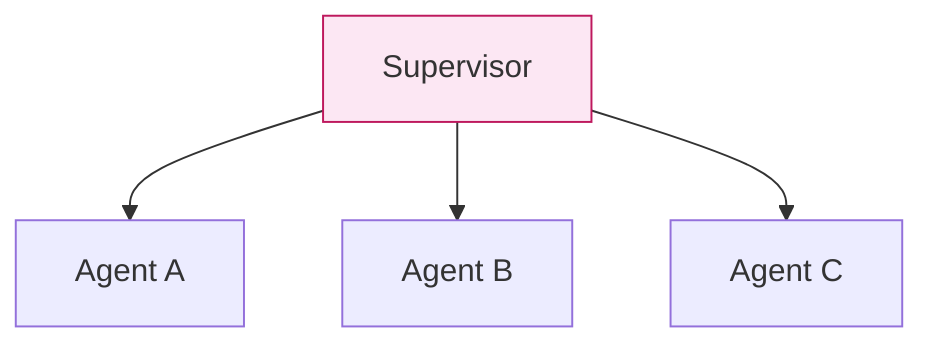
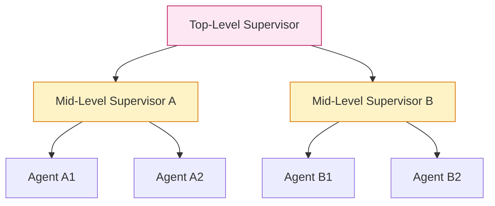
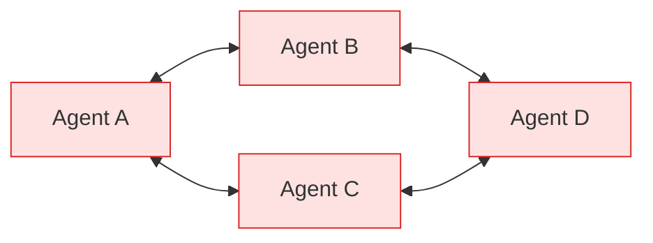
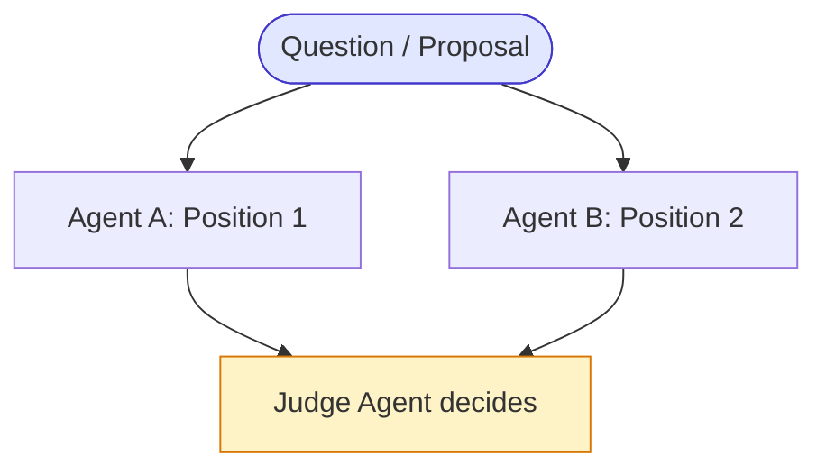
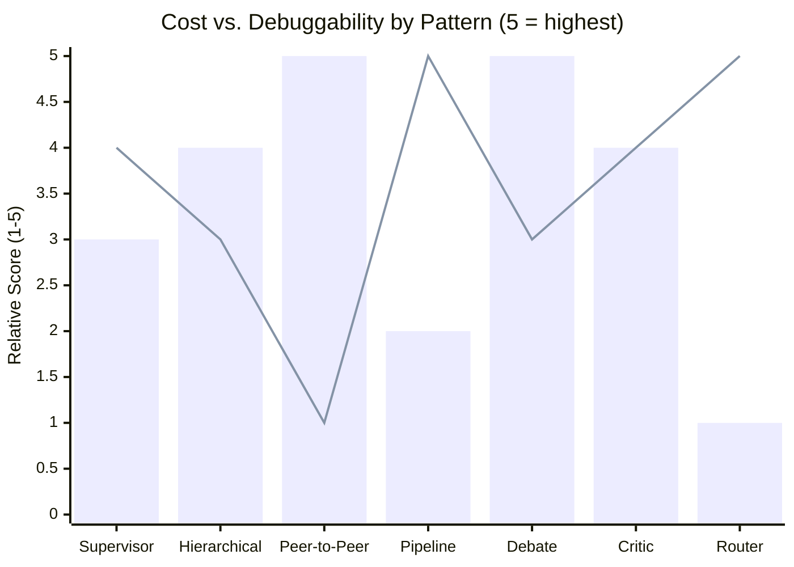

# Module 15 — Multi-Agent Design Patterns

### Difficulty
Advanced

### Learning Objectives
- Learn 7 concrete multi-agent design patterns, each with diagram, example, advantages, disadvantages, and when to use it.

### Prerequisites
Module 14.

---

## Pattern 1 — Supervisor Pattern

*One hub, several spokes — every specialist reports only to the Supervisor.*

**Example:** A supervisor agent receives a customer query, decides whether to route it to a Billing Agent, Technical Support Agent, or Returns Agent, then relays the answer back.

**Advantages:** Central control point; easy to reason about and debug; simple to add new specialists.
**Disadvantages:** Supervisor can become a bottleneck; a single point of failure/misrouting affects everything downstream.
**When to use:** Clear specialist roles with a natural routing decision at the top.

---

## Pattern 2 — Hierarchical Agents

*A supervisor of supervisors — the top level never talks to the leaf agents directly, only to its two mid-level delegates.*

**Example:** A company automation platform with a top-level supervisor delegating to a "Marketing" sub-supervisor (which manages Content and SEO agents) and a "Sales" sub-supervisor (which manages Lead-Qualification and Outreach agents).

**Advantages:** Scales to large numbers of agents by grouping responsibility; each supervisor's scope stays manageable.
**Disadvantages:** More layers = more latency and more places for miscommunication; harder to debug end-to-end.
**When to use:** Large systems with naturally nested domains (departments within a company, for example).

---

## Pattern 3 — Peer-to-Peer Agents

*No hub at all — every agent can talk to every other agent, which is exactly why this pattern is the hardest to predict and debug (there's no single node you can watch to understand the whole conversation).*

**Example:** A group of specialist agents (e.g., a Frontend Agent and a Backend Agent) directly negotiate an API contract with each other without a central coordinator, converging on agreement.

**Advantages:** No single bottleneck; can be more flexible/organic for negotiation-style tasks.
**Disadvantages:** Much harder to predict, control, and debug; risk of circular conversations with no natural termination.
**When to use:** Rare in production; more common in research settings or tightly bounded negotiation subtasks with a hard cap on rounds.

---

## Pattern 4 — Pipeline Architecture

*A straight, one-directional line — no branches, no loops back. Simple to follow, but rigid if an earlier stage needs revisiting.*

**Example:** The AI Content Team from Module 14 (Research → Write → SEO → Fact-Check → Edit) is a pipeline — strict, fixed sequential hand-off.

**Advantages:** Simple, predictable, easy to test each stage independently.
**Disadvantages:** Rigid — doesn't easily handle needing to loop back to an earlier stage (e.g., sending a bad draft back to the Writer).
**When to use:** Well-understood, mostly linear processes with low need for backtracking.

---

## Pattern 5 — Debate Architecture

*Two agents deliberately argue opposite sides before a third agent judges — the diamond-then-triangle shape (split, then rejoin at the Judge) is what forces both viewpoints onto the table before a decision is made.*

**Example:** Two agents argue opposing interpretations of an ambiguous contract clause; a Judge agent evaluates both arguments and produces a final recommendation, citing which points were more convincing.

**Advantages:** Surfaces considerations a single agent might miss by forcing explicit adversarial scrutiny; useful for ambiguous or high-stakes judgment calls.
**Disadvantages:** Expensive (multiple agents, multiple rounds); the "Judge" step is itself a single point of potential bias/error.
**When to use:** Ambiguous decisions where seeing both sides argued explicitly improves final judgment quality (e.g., risk assessment, contested claims).

---

## Pattern 6 — Critic Architecture

*Notice the loop between Producer and Critic — this is the same kind of loop-back you saw in the agent loop in Module 4, just with two agents instead of one agent talking to itself. It must have a round limit, or it can spin forever (Module 17).*

**Example:** A code-generation agent produces code; a dedicated Critic agent checks it against requirements and style rules, returning specific issues; the Producer revises until the Critic approves or a round limit is hit.

**Advantages:** Improves output quality via a genuinely separate evaluative perspective (see Module 12.4); works well combined with automated tests as an additional critic.
**Disadvantages:** Added latency/cost per round; needs a hard round limit to avoid endless refinement loops.
**When to use:** Any task where output quality materially benefits from a dedicated review pass (writing, code, structured data extraction).

---

## Pattern 7 — Router Architecture

*The dotted lines mark the paths NOT taken — unlike the Supervisor pattern (Pattern 1), where all specialists can potentially be invoked, a Router sends the request down exactly one solid path and nowhere else.*

**Example:** An incoming support ticket is routed to exactly one of: Billing Agent, Bug Report Agent, or Feature Request Agent, based on classification — no further coordination is needed after routing.

**Advantages:** Very efficient (only one agent runs per request); simple to reason about.
**Disadvantages:** Misclassification sends the request to the wrong specialist entirely, with no built-in correction unless a fallback/escalation path is added.
**When to use:** Tasks with clearly distinct categories that rarely overlap, and where fast, low-cost handling matters more than a supervisor double-checking the routing decision.

---

## Pattern Comparison Table

| Pattern | Coordination Style | Cost | Debuggability | Best Fit |
|---|---|---|---|---|
| Supervisor | Central | Medium | High | General multi-specialist systems |
| Hierarchical | Nested central | Medium-High | Medium | Large systems with natural domain grouping |
| Peer-to-Peer | Decentralized | High (unpredictable) | Low | Rare; bounded negotiation only |
| Pipeline | Fixed sequential | Low-Medium | High | Linear, well-understood processes |
| Debate | Adversarial + judge | High | Medium | Ambiguous, high-stakes judgment calls |
| Critic | Iterative producer/reviewer | Medium-High | High | Quality-critical single-artifact production |
| Router | Classify-then-dispatch | Low | High | Clearly distinct request categories |

**How to read this graph:** the bars show relative *cost* and the line shows relative *debuggability* for each pattern, side by side. The pattern to watch is Peer-to-Peer: it has the tallest bar (most expensive/unpredictable) paired with the lowest point on the line (hardest to debug) — the worst combination on the chart, which is exactly why the module text calls it "rare in production." Router sits at the opposite corner: cheapest bar, highest debuggability point — the easy, safe default whenever your request categories are genuinely distinct.

### Common Mistakes
- Choosing Peer-to-Peer or Debate patterns by default because they sound sophisticated — they're expensive and hard to control; reserve them for cases that specifically need adversarial or negotiated reasoning.
- Building a Pipeline for a process that actually needs backtracking (should be a graph/supervisor pattern instead, allowing loops back to earlier stages).
- Skipping a round limit on Debate or Critic patterns.

### Exercise
For each business scenario, pick the best-fit pattern and justify: (a) triaging incoming support tickets into 5 categories, (b) a company-wide automation platform spanning Marketing, Sales, and Support departments, (c) reviewing a legal contract for risk before signing.

### Challenge
Design a hybrid system: a Router pattern at the top level that, for one specific category ("complex disputes"), hands off to a Debate pattern instead of a single specialist agent. Sketch the full flow.

### Knowledge Check
1. What's the key risk of the Peer-to-Peer pattern that the other patterns largely avoid?
2. Why does the Critic pattern need a hard round limit?
3. When would Debate be worth its extra cost compared to a single specialist agent?
