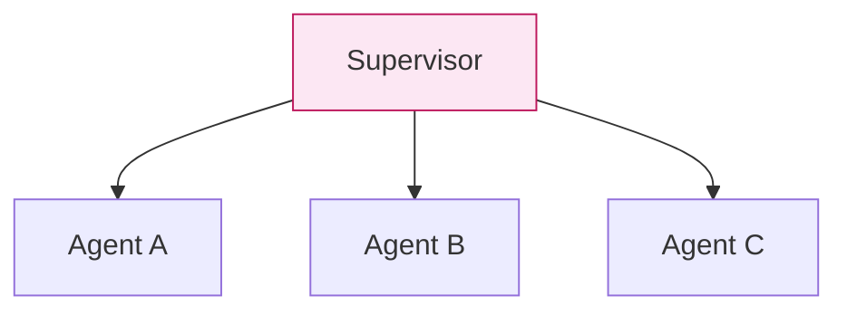
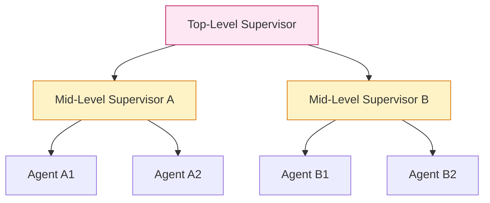
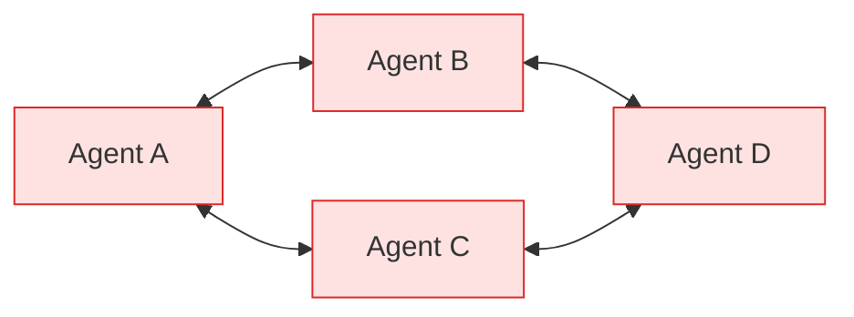
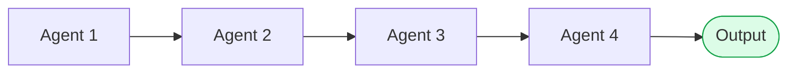
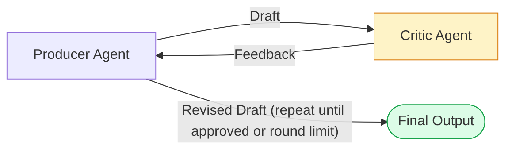
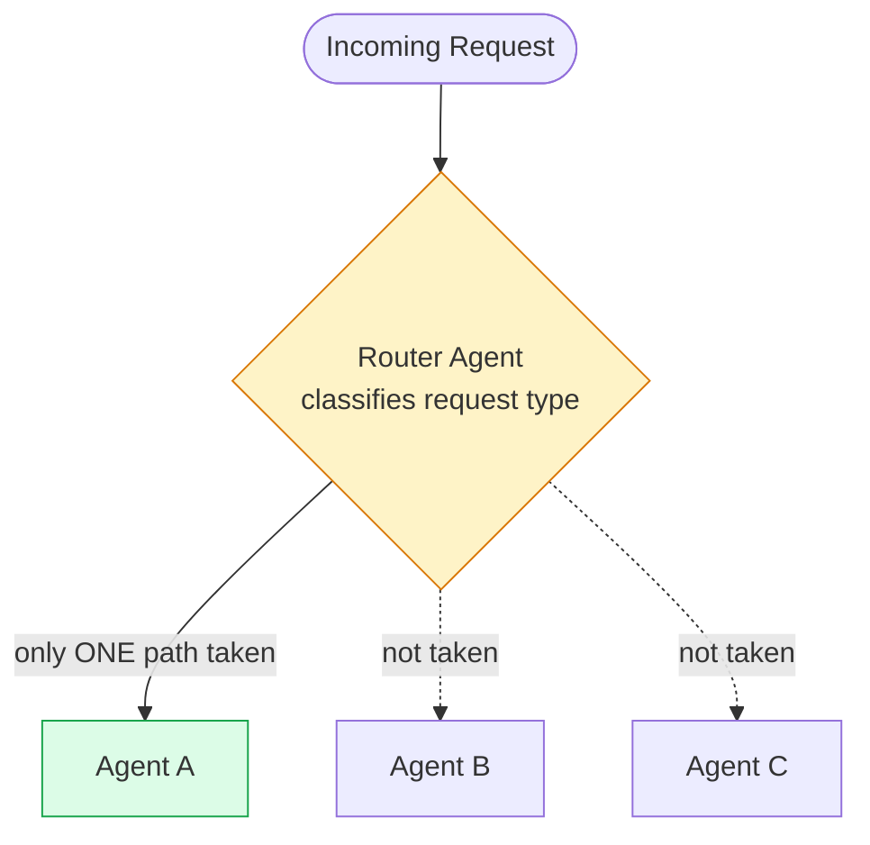
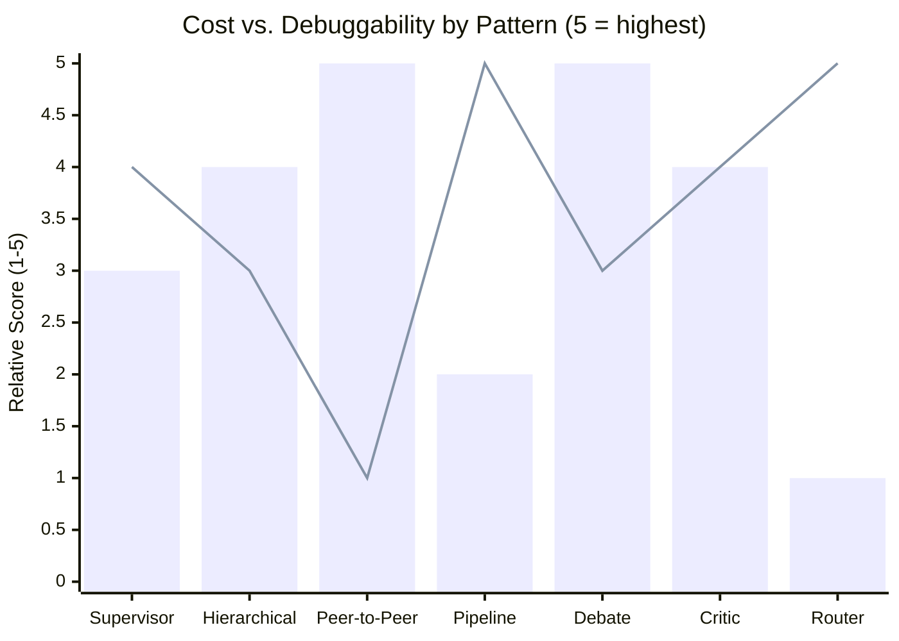

# Module 15 — Multi-Agent Design Patterns

### Difficulty
Advanced

### Learning Objectives
- Learn 7 concrete multi-agent design patterns, each with diagram, example, advantages, disadvantages, and when to use it.
- Understand *why* each pattern's shape exists — what specific coordination problem it solves that a simpler shape can't.

### Prerequisites
Module 14.

---

## Why Coordination "Shape" Matters at All

Before diving into the seven patterns, it's worth being explicit about what's actually being decided here. Module 14 established that a group of specialized agents can outperform one generalist agent. But specialization creates a new problem that a single agent never had: **how do these separate agents actually find out what each other is doing?** A single agent has one continuous stream of context — its own memory, its own plan, its own tool results, all in one place. The moment you split work across multiple agents, that continuity breaks. Agent B doesn't automatically know what Agent A just learned unless something explicitly tells it.

A "multi-agent design pattern" is really just an answer to the question: **who is allowed to talk to whom, in what order, and who decides when the whole thing is done?** That's it. Every pattern in this module is a different answer to that same question, and the "shape" of the diagram (star, tree, mesh, line, diamond, loop, fork) is a direct visual encoding of that answer. Once you see the patterns this way, you stop thinking of them as arbitrary named recipes to memorize and start recognizing them as the natural consequence of a few structural decisions:

- Is there a central coordinator, or do agents talk directly to each other?
- Does every specialist run on every request, or only a subset?
- Can the flow ever go *backward* (an earlier stage gets revisited), or only forward?
- Is there a review/approval step before the result is considered final?

Keep these four questions in mind as you read each pattern below — they're what actually differentiates them, far more than the specific example use case attached to each one.

---

## Pattern 1 — Supervisor Pattern

*One hub, several spokes — every specialist reports only to the Supervisor.*

**How this pattern actually works, mechanically:** the Supervisor is itself an LLM call (or a simple classifier) whose entire job is to look at an incoming request and its own knowledge of what each specialist agent is good at, and decide which one to hand off to. Concretely, its system prompt looks something like: *"You are a routing supervisor. You have three specialists available: Billing Agent (handles payment, refund, and invoice questions), Technical Support Agent (handles bugs, errors, and how-to questions), and Returns Agent (handles product returns and exchanges). Given the user's message, decide which specialist should handle it, and forward only the information that specialist needs."* Notice the second half of that instruction — the Supervisor isn't just picking a specialist, it's also deciding *what to tell them*. This is important: the Supervisor doesn't blindly forward the entire conversation history to every specialist; it curates what gets passed along, which keeps each specialist's context focused on exactly what they need to do their job (this connects directly back to the "handoff design" lesson in Module 14.3).

**Why this shape solves the coordination problem:** think about what happens *without* a Supervisor — you'd need every specialist to somehow know when it's their turn to act, which either means giving every specialist the ability to inspect the raw incoming request themselves (wasteful — you're now running three LLM calls, one per specialist, just to figure out which *one* was actually needed) or hardcoding a fixed order (which breaks the moment a request needs, say, only the Returns Agent and not the other two). The Supervisor centralizes that one decision — "who should act" — into a single, cheap, fast classification step, so only the actually-relevant specialist runs.

### A Common Question
*"Isn't the Supervisor just another agent, so aren't we back to square one — who decides the Supervisor's plan?"* Not quite, and this is a subtle but important point. The Supervisor's job is narrower and simpler than a general-purpose agent's: it's making one classification/routing decision per turn, not solving the whole task itself. It doesn't need deep domain knowledge about billing or returns — it only needs to recognize *which kind* of request it's looking at. This makes the Supervisor's own prompt small, cheap, and (because the decision space is narrow) far more reliable than asking a single generalist agent to both classify AND solve the problem in one shot.

**Example:** A supervisor agent receives a customer query, decides whether to route it to a Billing Agent, Technical Support Agent, or Returns Agent, then relays the answer back.

**Advantages:** Central control point makes the whole system's behavior easy to reason about — if something's wrong, you check either the routing decision or the one specialist that ran, never a tangle of five agents' worth of history. It's simple to add new specialists (register a new agent, teach the Supervisor's prompt/logic about it — nothing else in the system needs to change). Debugging is straightforward because every request has exactly one traceable path: request → Supervisor → one specialist → response.

**Disadvantages:** The Supervisor can become a bottleneck in two distinct senses — a *performance* bottleneck (every single request passes through it, so if it's slow, everything is slow) and a *correctness* bottleneck (if it misclassifies, the wrong specialist runs and there's no built-in mechanism to catch that unless you explicitly add one). It's also a single point of failure: if the Supervisor's logic breaks, the entire system stops routing, even though the specialists themselves are fine.

**When to use:** Clear specialist roles with a natural routing decision at the top — this is the right default choice for the majority of multi-agent systems you'll build, precisely because it's the easiest pattern to debug and extend.

---

## Pattern 2 — Hierarchical Agents

*A supervisor of supervisors — the top level never talks to the leaf agents directly, only to its two mid-level delegates.*

**Why this pattern exists — the scaling problem it solves:** the Supervisor pattern works beautifully with 3-5 specialists, because the Supervisor's classification prompt only has to distinguish between a handful of options. But what happens when you have 20 specialists spanning entirely different domains (Marketing has 6 sub-agents, Sales has 5, Support has 4, Finance has 5)? A single flat Supervisor now has to hold detailed knowledge of all 20 agents' capabilities in one prompt, and its classification decision becomes a much harder 20-way choice instead of an easy 3-way choice — accuracy degrades as the option set grows, simply because there's more room for the model to confuse similar-sounding specialists. Hierarchical agents solve this by nesting the same Supervisor pattern recursively: the Top-Level Supervisor only has to make an *easy* 2-way decision ("is this a Marketing thing or a Sales thing?"), and then hands off to a Mid-Level Supervisor whose job is the *same kind of easy decision*, just one level down and with a smaller, more specific set of options ("within Marketing, is this a Content thing or an SEO thing?"). Each individual routing decision stays simple; the complexity is absorbed by adding *layers*, not by making any single decision harder.

**How the request actually flows:** a request enters at the Top-Level Supervisor, which classifies it into a broad domain and forwards it (along with whatever curated context that domain needs) to the matching Mid-Level Supervisor. That Mid-Level Supervisor then repeats the exact same process at a finer grain, ultimately delegating to one leaf agent. The response then travels back up the same path it came down — Mid-Level Supervisor may do some light post-processing or format-checking before handing the result back to the Top-Level Supervisor, which delivers the final answer to the user. From the leaf agent's perspective, this looks exactly like the Supervisor pattern — it has one boss, does its job, and reports back. The nesting is invisible to it.

### A Common Question
*"If a request genuinely spans two departments — say, a marketing campaign that also needs a sales handoff — doesn't the strict tree structure break?"* Yes, this is a real limitation, and it's the honest answer to why Hierarchical Agents isn't a free scaling upgrade with no cost. A pure tree assumes every request cleanly belongs under exactly one branch. Cross-cutting requests either need the Top-Level Supervisor to explicitly split the request into two sub-requests and route each separately (adding complexity back at the top), or you need an escape hatch where a Mid-Level Supervisor can request input from a sibling branch — which starts to blur into the Peer-to-Peer pattern below. In practice, most production hierarchical systems accept this limitation and handle genuinely cross-cutting requests as a special case rather than trying to make the tree structure handle everything.

**Example:** A company automation platform with a top-level supervisor delegating to a "Marketing" sub-supervisor (which manages Content and SEO agents) and a "Sales" sub-supervisor (which manages Lead-Qualification and Outreach agents).

**Advantages:** Scales to large numbers of agents by grouping responsibility — you can keep adding leaf agents and even entire new mid-level branches without ever making any single supervisor's decision space unmanageably large. Each supervisor's scope stays cognitively manageable, both for the LLM making the routing decision and for the human engineer debugging it.

**Disadvantages:** More layers mean more hops, and each hop is a full LLM call with its own latency — a request that goes Top → Mid → Leaf → Mid → Top incurs at least three to four sequential LLM calls before the user sees anything, compared to one or two in the flat Supervisor pattern. It's also harder to debug end-to-end: a wrong final answer could be a misclassification at the top level, the mid level, or a genuine error from the leaf agent, and you have to trace back through every layer to find which one.

**When to use:** Large systems with naturally nested domains (departments within a company, categories within a product catalog, regions within a global business) — situations where the domain itself already has a natural tree structure you can mirror directly in your agent hierarchy.

---

## Pattern 3 — Peer-to-Peer Agents

*No hub at all — every agent can talk to every other agent, which is exactly why this pattern is the hardest to predict and debug (there's no single node you can watch to understand the whole conversation).*

**Why anyone would deliberately choose the hardest-to-control pattern:** every pattern so far assumes there's a natural "boss" who knows enough to make the routing/coordination decision correctly. But some problems genuinely don't have that — the two agents involved may each hold information the other doesn't have, and the "right answer" only emerges through direct back-and-forth negotiation between them, the same way two human engineers hash out an API contract in a meeting rather than a manager dictating the interface to both of them. Peer-to-Peer removes the central coordinator specifically because, for negotiation-shaped problems, forcing everything through a middleman actually loses information — the middleman would have to perfectly relay every nuance of Agent A's constraints to Agent B and vice versa, which is strictly harder than just letting them talk directly.

**How it actually runs, and why it's dangerous without limits:** in practice, Peer-to-Peer is usually implemented as a shared message thread or a round-based exchange, where each agent gets a turn to read what's been said and respond. There is no built-in mechanism that knows when the conversation should stop — the "end" of the negotiation is whatever the agents themselves converge on, which means the system's termination condition lives *inside* the agents' own outputs (e.g., an agent explicitly says "I agree, here's the final contract") rather than in the surrounding code. This is precisely why the risk of "circular conversations with no natural termination" is listed as a disadvantage: two agents can, in principle, keep restating slightly different positions indefinitely, each waiting for the other to concede, with nothing external forcing a stop. Any production use of this pattern must therefore impose an artificial round limit and a fallback (e.g., "if no agreement after 5 rounds, escalate to a human or fall back to a default contract") — this is the same reliability principle covered in Module 17 applied specifically to multi-agent dialogue.

### A Common Question
*"Doesn't the Debate pattern (Pattern 5) also have two agents talking about the same thing — what's actually different?"* The key difference is the presence of a Judge. In Debate, the two arguing agents never have to reach agreement with each other — they each just make their best case, and a third agent (the Judge) makes the final call, which guarantees termination after exactly one round of arguments plus one judgment. In pure Peer-to-Peer, there is no third party — the two (or more) agents themselves must reach the resolution, which is why it's structurally more prone to running forever.

**Example:** A group of specialist agents (e.g., a Frontend Agent and a Backend Agent) directly negotiate an API contract with each other without a central coordinator, converging on agreement.

**Advantages:** No single bottleneck, since there's no hub any request must pass through. Can be more flexible and organic for genuinely negotiation-shaped tasks, where forcing a rigid structure would actually lose information that only emerges through direct exchange.

**Disadvantages:** Much harder to predict, control, and debug, because there's no single node whose logs tell you "what happened" — you have to reconstruct the whole multi-turn exchange. Real risk of circular conversations with no natural termination, unless you build in an artificial stopping mechanism from the start.

**When to use:** Rare in production; more common in research settings or tightly bounded negotiation subtasks with a hard cap on rounds and an explicit fallback if that cap is reached.

---

## Pattern 4 — Pipeline Architecture

*A straight, one-directional line — no branches, no loops back. Simple to follow, but rigid if an earlier stage needs revisiting.*

**Why this is the simplest possible multi-agent shape:** a Pipeline makes one very strong assumption: the work genuinely decomposes into ordered stages where each stage only ever needs the *previous* stage's output, never anything from two stages back or from a stage yet to come. When that assumption holds, you don't need any routing logic, any classification, any judge — you just wire Agent 1's output directly into Agent 2's input, and so on. This is, structurally, identical to a plain software pipeline (think Unix pipes: `cat file | grep pattern | sort | uniq`) — the only difference is that each stage here happens to be an LLM-powered agent instead of a small deterministic program. That similarity is worth sitting with: a Pipeline is the pattern you reach for when the *coordination* problem barely exists, because the order was never actually in question.

**Why "rigid" is a precise criticism, not a vague one:** the specific failure this pattern cannot handle is when a *later* stage discovers a problem that should have been caught by an *earlier* stage. In the AI Content Team example, if the Fact Checker (stage 4) finds a factual error, the true fix is for the Writer (stage 2) to revise — but a strict Pipeline has no mechanism for information to flow backward. The naive workaround (have the Fact Checker try to patch the error itself) means the Fact Checker is now doing writing work it wasn't designed or prompted for, defeating the purpose of having a specialized Writer agent in the first place. This is exactly the scenario that motivates combining Pipeline with the Critic pattern (Pattern 6) for the specific stages that need revision capability, while keeping the rest of the flow as a simple forward pipeline — you don't have to choose only one pattern for an entire system.

**Example:** The AI Content Team from Module 14 (Research → Write → SEO → Fact-Check → Edit) is a pipeline — strict, fixed sequential hand-off.

**Advantages:** Simple, predictable, and easy to test each stage independently — because each agent's contract is just "given this input shape, produce this output shape," you can unit-test each stage in isolation with fixed sample inputs, the same way you'd test one function in a longer program.

**Disadvantages:** Rigid — doesn't easily handle needing to loop back to an earlier stage (e.g., sending a bad draft back to the Writer), because the flow of information is architecturally one-directional.

**When to use:** Well-understood, mostly linear processes with low need for backtracking — anywhere the sequence of steps was never really in doubt, only the quality of what each step produces.

---

## Pattern 5 — Debate Architecture

*Two agents deliberately argue opposite sides before a third agent judges — the diamond-then-triangle shape (split, then rejoin at the Judge) is what forces both viewpoints onto the table before a decision is made.*

**Why deliberately forcing disagreement improves the outcome:** this sounds counterintuitive at first — why manufacture an argument on purpose? The answer lies in a known weakness of single-agent reasoning: an LLM asked to evaluate an ambiguous question in one pass tends to settle on whichever interpretation seems most salient or most likely given the phrasing, and it has no natural mechanism to force itself to seriously entertain the *other* side. By explicitly instructing one agent "argue as strongly as you can for interpretation A, ignore interpretation B's merits" and another "argue as strongly as you can for interpretation B, ignore A's merits," you guarantee that both interpretations get a fully fleshed-out case made for them, with specific supporting points, rather than one interpretation being under-explored simply because it wasn't the model's first instinct. The Judge agent then has two complete, opposing cases to weigh — which is a fundamentally easier and more thorough evaluation task than "consider this ambiguous thing and decide," because the hard work of surfacing the considerations on each side has already been done for it.

**Why the Judge is a genuine, not cosmetic, third role:** it would be tempting to think you could skip the Judge and just have Agent A and Agent B "discuss it out" between themselves — but that collapses back into the Peer-to-Peer pattern with all its termination problems. The Judge's separation is what makes Debate reliably terminate: it doesn't participate in the arguing, it only ever sees the two finished arguments once, and its job is bounded and simple — pick a side (or a synthesis) and justify why, citing which specific points from each argument were persuasive. This mirrors the "Critique and Revise" reasoning pattern from Module 12.4, but applied at the multi-agent level with a designated evaluator role instead of a single model self-reflecting.

### A Common Question
*"What stops the Judge from just being wrong or biased toward whichever argument happened to be presented first?"* Nothing stops this completely — the module's own Disadvantages line calls out that "the Judge step is itself a single point of potential bias/error," and that's an honest limitation, not something to paper over. Two practical mitigations: (1) randomize which position is labeled "Agent A" vs "Agent B" across runs so any positional bias in the Judge doesn't systematically favor one side, and (2) require the Judge to explicitly cite which specific claims from each side it found persuasive or weak, which at minimum makes its reasoning auditable by a human, even if it can't guarantee correctness.

**Example:** Two agents argue opposing interpretations of an ambiguous contract clause; a Judge agent evaluates both arguments and produces a final recommendation, citing which points were more convincing.

**Advantages:** Surfaces considerations a single agent might miss by forcing explicit adversarial scrutiny of both sides of an ambiguous question. Especially useful for high-stakes judgment calls where the cost of an unexamined blind spot is high.

**Disadvantages:** Expensive — you're paying for two full arguments plus a judgment, at minimum three LLM calls for what a single agent would attempt in one. The Judge step is itself a single point of potential bias or error, since nothing guarantees the Judge weighs the two arguments fairly.

**When to use:** Ambiguous decisions where seeing both sides argued explicitly improves final judgment quality (e.g., risk assessment, contested claims, decisions where a wrong call is costly enough to justify the extra spend).

---

## Pattern 6 — Critic Architecture

*Notice the loop between Producer and Critic — this is the same kind of loop-back you saw in the agent loop in Module 4, just with two agents instead of one agent talking to itself. It must have a round limit, or it can spin forever (Module 17).*

**Why a separate agent catches things self-review misses:** Module 12.3 covered Reflection, where a single agent critiques its own output. The Critic pattern takes the same underlying idea — "check the work before finalizing it" — and gives the checking job to a genuinely separate agent with its own dedicated system prompt, rather than asking the same model instance to switch hats mid-conversation. This matters because of a real, well-documented weakness: when a model reviews its own just-generated output, it tends to be anchored by the reasoning it already committed to while producing that output — the same blind spots that led to a mistake in the first place are often present when checking for that mistake, because it's the same "train of thought" being re-examined rather than a fresh one. A dedicated Critic agent, given only the *finished draft* (not the Producer's intermediate reasoning) and a crisp, separate rubric to check against, approaches the material without that anchoring — it's evaluating a fixed artifact against explicit criteria, not continuing its own train of thought.

**What the Critic's feedback actually needs to look like to be useful:** a Critic that just says "this isn't good enough" gives the Producer nothing to act on — the loop will spin without making real progress. Effective Critic feedback is specific and actionable: "the function's docstring is missing a return-type description," "paragraph 3 uses a passive-voice construction inconsistent with the requested tone," "this claim about Q3 revenue isn't supported by any of the retrieved sources." Each piece of feedback should be concrete enough that the Producer can make a targeted fix, not a total rewrite from scratch — this is what makes the loop actually *converge* toward a better answer round over round, rather than just oscillating between different-but-equally-flawed drafts.

### A Common Question
*"If the Critic never approves, what's actually supposed to happen at the round limit?"* This is exactly the failure mode Module 17 covers in general (infinite loops, no forward progress) applied here specifically. The practical answer: after the hard round limit (e.g., 3 rounds) is hit, the system should not simply give up silently — it should either (a) return the *best* draft produced so far along with the Critic's remaining unresolved objections, clearly labeled as "not fully approved," or (b) escalate to a human reviewer (Module 18's human-in-the-loop pattern), depending on how high-stakes the output is. What it must never do is loop forever waiting for an approval that may never come, or silently return a rejected draft as if it were approved.

**Example:** A code-generation agent produces code; a dedicated Critic agent checks it against requirements and style rules, returning specific issues; the Producer revises until the Critic approves or a round limit is hit.

**Advantages:** Improves output quality via a genuinely separate evaluative perspective (see Module 12.4) that isn't anchored by the Producer's own reasoning process. Works especially well combined with automated, deterministic checks (unit tests, linters, schema validators) as an additional "critic" alongside the LLM-based one — cheap, fast, and immune to the LLM's own blind spots.

**Disadvantages:** Added latency and cost per round, since each revision cycle is at least two more LLM calls (Critic review + Producer revision). Needs a hard round limit to avoid endless refinement loops, plus an explicit policy for what happens when that limit is reached without approval.

**When to use:** Any task where output quality materially benefits from a dedicated review pass — writing, code, structured data extraction, anything where "good enough on the first try" isn't reliably good enough.

---

## Pattern 7 — Router Architecture

*The dotted lines mark the paths NOT taken — unlike the Supervisor pattern (Pattern 1), where all specialists can potentially be invoked, a Router sends the request down exactly one solid path and nowhere else.*

**Why this looks like Supervisor but is actually a distinct pattern:** at a glance, Router and Supervisor seem identical — both classify a request and hand it to one specialist. The real distinction is in what happens *after* the specialist responds. A Supervisor typically stays "in the loop" — it can review the specialist's output, decide it needs a second specialist involved, or reformat the response before returning it to the user. A Router, by contrast, is a pure dispatch mechanism: once it classifies the request and hands it off, its job is completely finished — the chosen specialist's response goes straight back to the user with no further supervisor-side involvement. This is why Router is listed as "Low" cost and the most efficient pattern on the comparison table: it does the absolute minimum amount of coordination work possible — one classification call, one specialist call, done.

**Why this efficiency comes with a specific, sharp risk:** because there's no supervisor double-checking the specialist's work afterward, a misclassification isn't just suboptimal — it sends the entire request down a completely wrong track with nothing downstream positioned to catch it. If a request meant for the Bug Report Agent gets classified as a Feature Request, the Feature Request Agent will confidently process it as a feature request, because it has no way of knowing it received a misrouted ticket. Contrast this with the Supervisor pattern, where the same coordinator that made the routing call could, in principle, review the specialist's response and notice something's off. This is precisely why the "When to use" guidance restricts Router to categories that "rarely overlap" — the pattern's efficiency is only safe when the classification decision is genuinely easy and low-ambiguity in the first place.

### A Common Question
*"Can you add a safety net to Router without losing its efficiency advantage?"* Yes — a common hybrid is to have the Router also return a confidence score alongside its classification, and only skip supervision when confidence is high; low-confidence classifications get escalated to a full Supervisor pattern (or to a human) instead of being dispatched blind. This preserves the cheap, fast path for the easy majority of requests while adding a safety net specifically for the ambiguous minority — you'll build exactly this kind of hybrid in this module's Challenge exercise.

**Example:** An incoming support ticket is routed to exactly one of: Billing Agent, Bug Report Agent, or Feature Request Agent, based on classification — no further coordination is needed after routing.

**Advantages:** Very efficient, since only one specialist agent runs per request with no supervising overhead afterward. Simple to reason about — the entire system's behavior is fully determined by the classifier's decision.

**Disadvantages:** Misclassification sends the request to the wrong specialist entirely, with no built-in correction unless a fallback or escalation path (like the confidence-threshold hybrid above) is explicitly added.

**When to use:** Tasks with clearly distinct categories that rarely overlap, and where fast, low-cost handling matters more than a supervisor double-checking the routing decision after the fact.

---

## Pattern Comparison Table

| Pattern | Coordination Style | Cost | Debuggability | Best Fit |
|---|---|---|---|---|
| Supervisor | Central | Medium | High | General multi-specialist systems |
| Hierarchical | Nested central | Medium-High | Medium | Large systems with natural domain grouping |
| Peer-to-Peer | Decentralized | High (unpredictable) | Low | Rare; bounded negotiation only |
| Pipeline | Fixed sequential | Low-Medium | High | Linear, well-understood processes |
| Debate | Adversarial + judge | High | Medium | Ambiguous, high-stakes judgment calls |
| Critic | Iterative producer/reviewer | Medium-High | High | Quality-critical single-artifact production |
| Router | Classify-then-dispatch | Low | High | Clearly distinct request categories |

**How to read this graph:** the bars show relative *cost* and the line shows relative *debuggability* for each pattern, side by side. The pattern to watch is Peer-to-Peer: it has the tallest bar (most expensive/unpredictable) paired with the lowest point on the line (hardest to debug) — the worst combination on the chart, which is exactly why the module text calls it "rare in production." Router sits at the opposite corner: cheapest bar, highest debuggability point — the easy, safe default whenever your request categories are genuinely distinct. Notice also that cost and debuggability don't move in lockstep across every pattern — Hierarchical is more expensive than Supervisor (extra layers, extra LLM calls) but *less* debuggable, while Critic is more expensive than Supervisor yet stays equally debuggable, because every one of its extra rounds is still logged as a clean, inspectable Producer → Critic → Producer trace. The lesson: cost and debuggability are genuinely separate axes, and a pattern's position on this chart is a direct consequence of its coordination shape, not an accident.

### Common Mistakes
- Choosing Peer-to-Peer or Debate patterns by default because they sound sophisticated — they're expensive and hard to control; reserve them for cases that specifically need adversarial or negotiated reasoning. The underlying error here is picking a pattern based on how interesting it sounds rather than which of the four structural questions from the module's opening ("central or decentralized," "all specialists or one," "forward-only or can loop back," "is there a review step") actually matches your problem.
- Building a Pipeline for a process that actually needs backtracking (should use the Critic pattern for the specific stage that needs revision capability, or a Supervisor pattern that can route back to an earlier agent) — the tell-tale sign you've made this mistake is discovering, after the system is built, that a downstream agent keeps having to work around bad input from an upstream stage instead of that upstream stage getting a chance to fix it.
- Skipping a round limit on Debate or Critic patterns — this isn't a minor oversight, it's the exact same infinite-loop reliability failure covered in Module 17, just occurring between two agents instead of within one agent's own loop. Any pattern with a feedback loop (Critic, and any custom pattern with loop-back) needs an explicit maximum round count and a defined fallback behavior when that count is reached.
- Using Router for categories that actually overlap or are ambiguous a meaningful fraction of the time — this silently converts Router's efficiency advantage into a reliability liability, since there's nothing downstream to catch a misclassification. If your categories overlap often, use Supervisor (which can still review afterward) or add the confidence-threshold escalation hybrid described in Pattern 7's "A Common Question" above.
- Assuming the comparison table's "Cost" and "Debuggability" ratings are fixed properties of each pattern rather than properties of a *specific implementation* of that pattern — a poorly-logged Supervisor system can be just as hard to debug as a Peer-to-Peer one; the pattern only sets the *ceiling* on how debuggable a well-built version of it can be.

### Exercise
For each business scenario, pick the best-fit pattern and justify: (a) triaging incoming support tickets into 5 categories, (b) a company-wide automation platform spanning Marketing, Sales, and Support departments, (c) reviewing a legal contract for risk before signing.

### Challenge
Design a hybrid system: a Router pattern at the top level that, for one specific category ("complex disputes"), hands off to a Debate pattern instead of a single specialist agent. Sketch the full flow, including what the Router's confidence threshold should be to decide whether to trust its own classification versus escalating.

### Knowledge Check
1. What's the key risk of the Peer-to-Peer pattern that the other patterns largely avoid?
2. Why does the Critic pattern need a hard round limit?
3. When would Debate be worth its extra cost compared to a single specialist agent?
4. Why does Router's efficiency advantage over Supervisor come with a specific new risk that Supervisor doesn't have?
