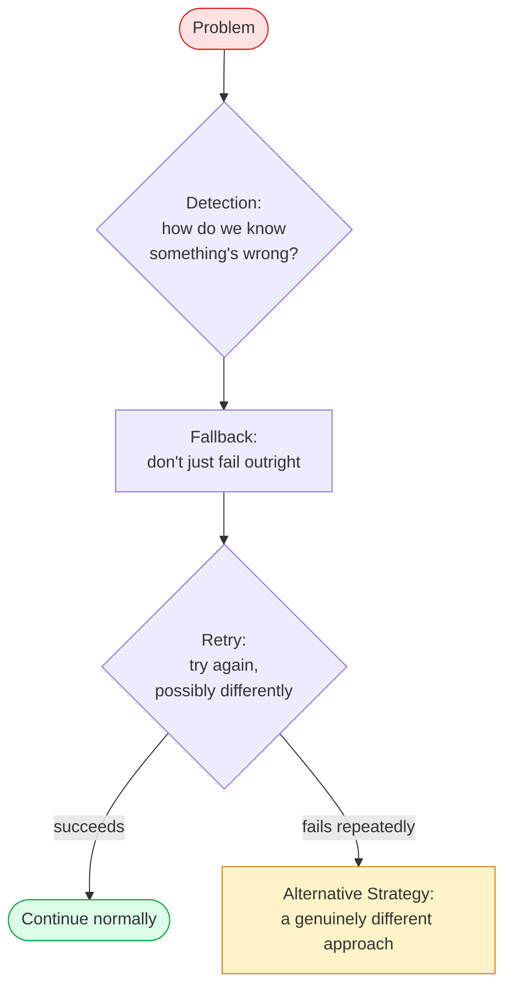

# Module 17 — Agent Reliability

### Difficulty
Advanced

### Learning Objectives
- Understand common agent failure modes: hallucination, tool failures, infinite loops, bad planning, wrong tool selection, context overload.
- Learn concrete mitigations: retries, timeouts, guardrails, validation, fallback models, human approval.

### Prerequisites
Modules 1–16.

---

## Lesson 17.1 — Common Failure Modes

| Failure Mode | What It Looks Like | Root Cause |
|---|---|---|
| **Hallucination** | Agent states false information confidently | LLMs generate plausible-sounding text, not verified fact; worse without grounding (RAG) |
| **Tool failures** | API timeout, malformed response, rate limit hit | External systems are unreliable; network issues, quota limits |
| **Infinite loops** | Agent keeps calling the same tool or repeating steps without progress | No termination condition, or model gets "stuck" reasoning in circles |
| **Bad planning** | Agent's plan misses key steps or pursues an ineffective strategy | Vague goal, insufficient context provided to the planner, or planning model limitations |
| **Incorrect tool selection** | Agent calls the wrong tool for the situation | Ambiguous/overlapping tool descriptions, insufficient examples in the prompt |
| **Context overload** | Agent's response degrades as conversation/context grows very long | Context window filled with noise, causing "context rot" — the model loses track of what matters |

---

## Lesson 17.2 — The General Solution Loop



**How to read this graph:** this is a decision funnel, not a straight pipeline — notice "Retry" has two exits. Most failures should resolve at the cheap "Retry" step (a network blip fixed by trying again); only failures that survive repeated retries should escalate all the way to "Alternative Strategy," which is the most expensive, most disruptive branch. A common mistake this graph makes visible: if your code jumps straight from "Problem" to "Alternative Strategy" without ever trying the cheaper Detection → Fallback → Retry path first, you're over-reacting to what might have been a one-off blip.

---

## Lesson 17.3 — Concrete Mitigations

### Retries
```python
def call_tool_with_retry(tool_fn, tool_input, max_retries=3):
    for attempt in range(max_retries):
        try:
            return tool_fn(**tool_input)
        except TransientError as e:
            if attempt == max_retries - 1:
                return {"error": f"Failed after {max_retries} attempts: {e}"}
            time.sleep(2 ** attempt)  # exponential backoff
```
*Explanation:* transient failures (network blips, rate limits) often succeed on retry; exponential backoff avoids hammering a struggling service. Non-transient errors (bad input) should NOT be blindly retried — they'll fail identically every time.

### Timeouts
```python
result = call_tool_with_timeout(tool_fn, tool_input, timeout_seconds=10)
```
*Why it matters:* without a timeout, one hung tool call can stall the entire agent run indefinitely.

### Guardrails
Pre- and post-execution checks that constrain agent behavior:
```text
Input Guardrail:  Reject tool calls with obviously malformed/dangerous input
                  (e.g., a "delete_file" call targeting a system directory)
Output Guardrail: Reject/flag responses containing disallowed content
                  (e.g., PII leakage, policy violations)
```

### Validation
```python
def validate_tool_output(output: dict, expected_schema: dict) -> bool:
    # Check output actually matches the expected structure before trusting it
    ...
```
Never assume a tool (especially an LLM-generated structured output) returns exactly the expected shape — validate before using it downstream, since malformed output propagating silently causes hard-to-trace bugs later.

### Fallback Models
```text
Primary model unavailable / rate-limited / fails repeatedly
   ↓
Fallback: retry the same request against a secondary model provider or a
smaller/cheaper model, possibly with a degraded-but-functional response
```

### Human Approval (see Module 18 for full treatment)
For high-risk actions (sending money, deleting data, sending external emails), insert a mandatory human approval gate rather than letting the agent act autonomously.

---

## Lesson 17.4 — Specific Fixes Per Failure Mode

| Failure Mode | Mitigation |
|---|---|
| Hallucination | Ground answers in retrieval (RAG, Module 10); instruct the model to say "I don't know" when uncertain; add a fact-checking/critic step (Module 12, 15) |
| Tool failures | Retries with backoff, timeouts, structured error observations fed back to the agent (Module 7) |
| Infinite loops | Hard max-step limits (Module 6); detect repeated identical actions and force a different strategy or stop |
| Bad planning | Clarify/decompose the goal further (Module 11); add a plan-review step before execution begins |
| Incorrect tool selection | Sharpen tool descriptions; reduce overlapping tools; add few-shot examples of correct tool choice (Module 3, 7) |
| Context overload | Summarize/compress older history; use RAG instead of dumping full documents; trim irrelevant tool results before re-injecting (Module 2, 10) |

### Practical Example — Loop Detection

```python
def detect_stuck_loop(history: list[dict], window=3) -> bool:
    if len(history) < window:
        return False
    recent = history[-window:]
    return all(
        step["tool"] == recent[0]["tool"] and step["input"] == recent[0]["input"]
        for step in recent
    )

# In the agent loop:
if detect_stuck_loop(state["history"]):
    # Force a different approach instead of repeating the same failing action
    inject_message(state, "You've repeated the same action. Try a different approach or ask for help.")
```

*Explanation:* this checks whether the last N actions were identical — a strong signal the agent is stuck. Instead of letting it loop forever (burning cost with no progress), it's nudged toward a different strategy or an explicit stop.

### Key Takeaways
- Reliability problems are not edge cases — they are the default state of any nontrivial agent system and must be designed for from the start.
- Each failure mode has a distinct root cause and requires a distinct mitigation — there's no single fix-all.
- Detection before mitigation: you can't fix what you don't notice (logging, monitoring, and loop detection are prerequisites to any fix).

### Common Mistakes
- Adding retries for errors that will deterministically fail again (e.g., malformed input) — wastes calls without fixing anything.
- Treating hallucination as unfixable — grounding, uncertainty instructions, and verification steps meaningfully reduce (though don't eliminate) it.
- Setting max-step limits so low that legitimate complex tasks get cut off, or so high that runaway loops become expensive before being caught.

### Exercise
For an agent that books restaurant reservations via an API, list 3 specific failure scenarios and the mitigation you'd apply to each.

### Challenge
Design a monitoring dashboard (on paper — list the metrics) that would let an on-call engineer quickly spot each of the 6 failure modes covered in this module in a production agent system.

### Knowledge Check
1. Why shouldn't every tool failure be retried the same way?
2. What's the difference between a guardrail and validation?
3. Give one concrete technique to reduce hallucination beyond "hope the model doesn't."
