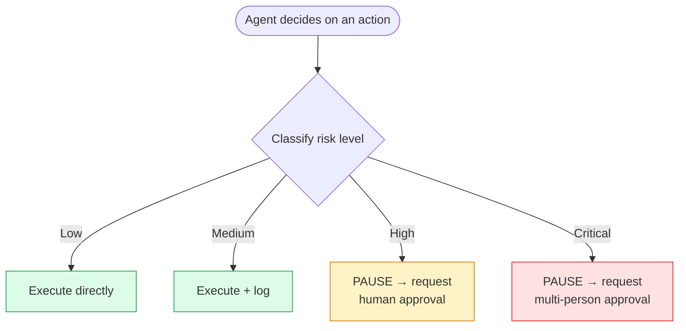

# Module 18 — Human-in-the-Loop Systems

### Difficulty
Advanced

### Learning Objectives
- Understand when agents should require human approval before acting.
- Understand approval gates, risk levels, escalation, and review systems.

### Prerequisites
Modules 1–17.

---

## Lesson 18.1 — Why Human-in-the-Loop (HITL) Matters

### Concept Explanation

Not every agent action should happen fully autonomously. Some actions are risky, irreversible, expensive, or sensitive enough that a human should confirm them before they take effect. **Human-in-the-loop** design inserts explicit checkpoints where the agent pauses and waits for human approval, rejection, or edits.

### Simple Analogy

> A junior employee can draft an email on their own, but a good process has their manager glance at it before it goes out to an important client. The employee (agent) still does the work — the human just gates the risky final action.

### Visual Diagram

```text
AI drafts email
       ↓
Human approves (or edits/rejects)
       ↓
Email is sent
```

---

## Lesson 18.2 — Approval Gates and Risk Levels

### Concept Explanation

Not all actions carry equal risk. A practical approach is to classify actions into risk tiers and only gate the higher-risk ones — gating everything defeats the purpose of automation, while gating nothing defeats the purpose of safety.

| Risk Level | Example Actions | Approval Needed? |
|---|---|---|
| **Low** | Reading data, searching, drafting (not sending) content | No — fully autonomous |
| **Medium** | Sending internal messages, updating non-critical records | Optional — log and allow undo, or lightweight notification |
| **High** | Sending external communications, spending money, deleting data, modifying production systems | Yes — mandatory human approval before execution |
| **Critical** | Irreversible financial transactions, legal commitments, actions affecting many users at once | Yes — mandatory approval + possibly multi-person sign-off |

### Visual Diagram — Risk-Based Gating



**How to read this graph:** the color coding tracks risk directly — green means "just let it run," amber means "pause and wait for one person," red means "pause and wait for more than one person." Notice only two of the four branches (Low, Medium) let the agent act immediately; the other two both hit a hard "PAUSE" before anything actually executes. This is the mechanism that makes Module 18.2's risk table concrete: an agent using this flowchart never has to guess whether to ask a human — the risk classification decides it automatically.

---

## Lesson 18.3 — Escalation and Review Systems

### Concept Explanation

- **Escalation**: when an agent is uncertain, stuck, or facing an ambiguous/high-stakes decision, it should hand off to a human rather than guessing.
- **Review systems**: a structured way for humans to see pending approvals, the agent's reasoning/plan behind the proposed action, and approve/reject/edit with minimal friction.

### Practical Example (Conceptual)

```python
RISK_LEVELS = {"send_email": "high", "search": "low", "delete_record": "critical"}

def execute_action(action: dict, approval_queue) -> dict:
    risk = RISK_LEVELS.get(action["tool"], "medium")

    if risk in ("high", "critical"):
        approval_queue.submit(action)     # pause and wait for a human decision
        return {"status": "pending_approval", "action": action}

    return run_tool(action)  # low/medium risk: execute immediately (with logging)
```

```text
Human Review UI (conceptual):
┌─────────────────────────────────────────────────────────┐
│ Pending Approval #482                                    │
│ Action: send_email                                       │
│ To: client@example.com                                   │
│ Subject: "Project Update"                                │
│ Reasoning: "User requested a status update be sent after │
│ the weekly report was generated."                        │
│                                                            │
│ [ Approve ]   [ Edit ]   [ Reject ]                       │
└─────────────────────────────────────────────────────────┘
```

*Explanation:* showing the agent's concise reasoning alongside the proposed action lets the human reviewer make an informed, fast decision instead of blindly trusting or re-doing the whole analysis themselves.

### Key Takeaways
- HITL isn't "give up on automation" — it's targeted risk management, gating only the actions where a mistake is costly or hard to reverse.
- Risk-based tiering avoids the two failure extremes: gating everything (kills the value of automation) or gating nothing (unsafe for high-stakes actions).
- Escalation should be a first-class agent behavior, not an afterthought — a well-designed agent knows when to say "I'm not confident enough to proceed without a human."

### Common Mistakes
- Applying the same approval gate to every action regardless of risk, causing approval fatigue — humans start rubber-stamping without really reviewing, defeating the safety purpose.
- Not showing the human reviewer enough context (just "approve this email?" with no visible content/reasoning) — makes the review meaningless.
- Building HITL as a manual code review afterthought rather than a designed part of the agent's control flow (Module 16's state management makes "pause and resume" for approval tractable).

### Exercise
Classify the following actions into the four risk tiers: reading a customer's order history; issuing a $500 refund; searching product documentation; permanently deleting a user account.

### Challenge
Design an escalation policy for an autonomous research agent: under what specific conditions should it stop and ask a human for guidance rather than continuing on its own (e.g., conflicting sources, budget/tool-call limits approaching, ambiguous instructions)?

### Knowledge Check
1. Why is gating every single action a bad HITL design, not a safe one?
2. What information should a human approval review interface show, at minimum?
3. Give one condition under which an agent should proactively escalate rather than wait to be asked.
