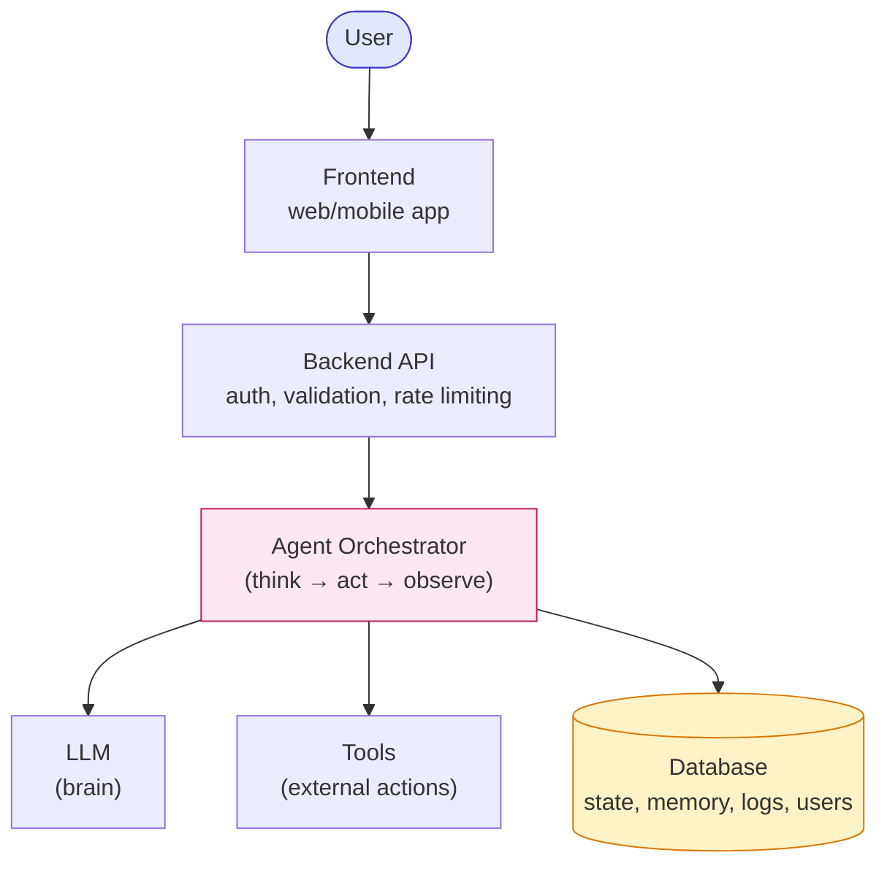
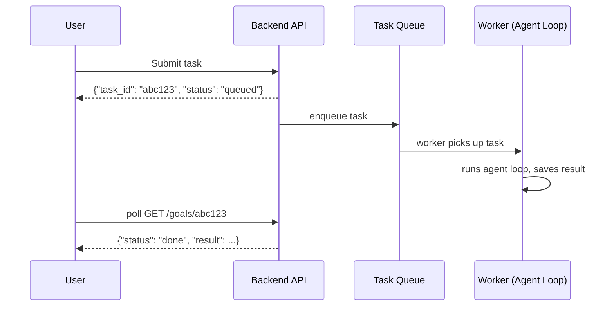

# Module 20 — Deploying Agent Systems

### Difficulty
Advanced

### Learning Objectives
- Understand the backend architecture needed to serve agents as a real product.
- Understand authentication, databases, logging, monitoring, and scaling.
- Understand deployment options: local, cloud, containers, serverless.

### Prerequisites
Modules 1–19.

---

## Lesson 20.1 — Production Architecture

### Concept Explanation

Everything covered so far runs conceptually as a script. To become a real product, an agent system needs a full application architecture wrapping it: a frontend for users, a backend API to handle requests, an orchestrator running the actual agent loop, and supporting infrastructure (LLM access, tools, databases).

### Visual Diagram



**How to read this graph:** everything above the pink "Agent Orchestrator" box is ordinary web-application plumbing you'd build for *any* product — the orchestrator is the only box that's specific to agentic AI, and it's the one that fans out to the three supporting systems below it (the LLM for reasoning, Tools for taking action, and the Database for remembering). If you've built a normal web app before, the top half of this diagram should look completely familiar; everything genuinely new that this course teaches lives in the bottom half.

### Component Responsibilities

| Component | Responsibility |
|---|---|
| Frontend | User interaction, displaying agent progress/results |
| Backend API | Authentication, request validation, rate limiting, routing to the orchestrator |
| Agent Orchestrator | Runs the actual agent loop (Module 6), manages state (Module 16) |
| LLM | The reasoning "brain" (Module 2) |
| Tools | External actions (Module 7) |
| Database | Persisted state, memory (Module 8–9), logs, user data |

---

## Lesson 20.2 — Authentication

### Concept Explanation

Every production agent system needs to know *who* is making a request, both to personalize behavior (memory scoped per user) and to prevent abuse (rate limits, access control). Common approaches: API keys for service-to-service access, OAuth/session tokens for end-user-facing apps.

### Key Consideration
Memory and tool permissions (Module 8, 18) must be scoped per authenticated user — an agent must never retrieve or act on another user's data due to a missing authorization check.

---

## Lesson 20.3 — Logging and Monitoring

### Concept Explanation

- **Logging**: recording each agent step (plan, tool call, observation, final answer) for later debugging and auditing.
- **Monitoring**: real-time or near-real-time tracking of system health — error rates, latency, cost, and the reliability metrics from Module 19 — with alerting when something goes wrong.

### Visual Diagram

```text
Agent Run
   ↓
Structured Logs: {step, plan, tool, input, output, latency, cost, timestamp}
   ↓
Log Storage (e.g., a logging/observability platform)
   ↓
Dashboards: success rate, cost trends, latency percentiles, error rates
   ↓
Alerts: notify on-call when error rate or cost spikes beyond thresholds
```

### Key Takeaway
Without structured, per-step logging, debugging a failed agent run in production is close to impossible — you need the full plan/action/observation trace, not just the final output.

---

## Lesson 20.4 — Scaling

### Concept Explanation

Agent systems can be resource-intensive: many LLM calls per task, potentially long-running (minutes, not milliseconds). Scaling considerations:

- **Concurrency**: handling many simultaneous agent runs without one slow run blocking others (favor async/non-blocking architectures).
- **Queueing**: for long-running tasks, use a task queue (submit → process asynchronously → notify when done) rather than holding an HTTP connection open for minutes.
- **Rate limiting**: both protecting your own system from overload and respecting LLM provider/tool API rate limits.

### Visual Diagram



**How to read this graph:** the crucial detail is that the API's reply to the user arrives almost instantly ("queued"), *before* the actual agent work has even started — the User's HTTP connection is never held open for the minutes an agent loop might take. The real work happens later, off to the side, in the Worker lane, and the User finds out it's done through a separate follow-up request. This is the asynchronous pattern referenced throughout Module 20.4 — contrast it with a naive design where the User's request would just hang until the whole agent loop finished.

---

## Lesson 20.5 — Deployment Options

| Option | Description | Best For |
|---|---|---|
| **Local development** | Running the agent on your own machine | Development, testing, personal tools |
| **Cloud deployment (VMs)** | Running on a cloud provider's virtual machines | Full control over the environment, predictable/steady load |
| **Containers (Docker)** | Packaging the agent + dependencies into a portable, reproducible unit | Consistent environments across dev/staging/production |
| **Serverless deployment** | Functions that run on-demand, scaling automatically, billed per invocation | Spiky/unpredictable load, minimizing idle infrastructure cost |

### Simple Analogy

> Local development is like cooking in your own kitchen. Cloud VMs are like renting a fully equipped commercial kitchen you manage yourself. Containers are like a portable food truck kitchen — the same setup works wherever you park it. Serverless is like a shared commercial kitchen you only pay for by the minute you're actually using it.

### Key Takeaways
- A production agent system is a full application: frontend, backend API, orchestrator, LLM, tools, and database working together — not just "the agent loop."
- Authentication must scope memory and permissions per user to prevent data leakage or abuse.
- Structured, per-step logging is non-negotiable for debugging production agent failures.
- Long-running agent tasks should be queued asynchronously, not handled as a blocking HTTP request.
- Deployment choice (local/VM/container/serverless) depends on load pattern, control needs, and operational maturity.

### Common Mistakes
- Serving long-running agent tasks synchronously over HTTP, causing timeouts and poor user experience.
- Skipping structured logging until after a production incident, when it's too late to have captured the failure.
- Not testing under realistic concurrency — an agent that works fine for one user may behave very differently under load (rate limits, shared resource contention).

### Exercise
Sketch the request flow (as a diagram) for a research agent that takes 3–5 minutes to complete, from user submission to final result delivery, including how the user finds out it's done.

### Challenge
Design the logging schema (list of fields) you'd want captured for every single agent step in production, sufficient to fully reconstruct and debug a failed run after the fact.

### Knowledge Check
1. Why shouldn't a long-running agent task be handled as a single blocking HTTP request?
2. What's the difference between logging and monitoring?
3. Name one deployment option best suited for unpredictable, spiky traffic.
