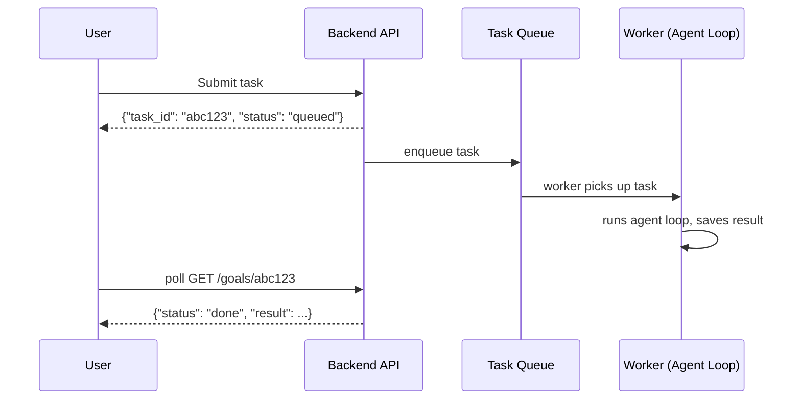

# Module 20 — Deploying Agent Systems

### Difficulty
Advanced

### Learning Objectives
- Understand the backend architecture needed to serve agents as a real product.
- Understand authentication, databases, logging, monitoring, and scaling.
- Understand deployment options: local, cloud, containers, serverless.

### Prerequisites
Modules 1–19.

---

## Lesson 20.1 — Production Architecture

### Concept Explanation

Every code example in Modules 6 through 19 has, implicitly, assumed you already have a running Python process, with your API keys loaded, your database connected, and someone (you, running a script) triggering the agent by hand. That's exactly right for learning and prototyping — but it is not a product. A product means: a stranger, anywhere on the internet, can make a request without knowing anything about your code, get a response, and trust that their data is kept separate from every other stranger's data, at any hour, without you personally being at a keyboard to keep it running. Closing that gap between "a script I run" and "a product other people rely on" is what this entire module is about, and it requires wrapping the agent loop in a full application architecture: a frontend for users, a backend API to handle requests, an orchestrator running the actual agent loop, and supporting infrastructure (LLM access, tools, databases).

It's worth being explicit about *why* each layer is necessary rather than optional, because a beginner's first instinct is often "can't I just expose my agent function directly over the internet?" You technically could, but you'd immediately run into every problem this module exists to solve: anyone could call your (expensive) LLM-backed function without identifying themselves, there'd be no way to tell one user's conversation history apart from another's, a slow or hung agent run would block your entire server from handling anyone else, and you'd have zero visibility into what went wrong when (not if) something failed at 3 AM. Each component in the architecture below exists specifically to close one of these gaps.

### A Common Question

**"Do I really need all of these pieces even for a small side project?"** Not necessarily at the same level of sophistication — a hobby project with one user (you) can reasonably skip authentication, run everything as one process without a task queue, and use simple file-based logging instead of a full observability platform. But the *shape* of the architecture (something receiving requests, something orchestrating the agent, something persisting state) doesn't go away just because you simplify each piece — you're always making a deliberate trade-off between engineering effort and the number of the production concerns above that you're willing to leave unhandled. The moment you have more than one user, or the agent takes long enough that you can't just wait synchronously, the "quick and simple" version starts actively causing the exact problems this module describes.

### Visual Diagram


**How to read this graph:** everything above the pink "Agent Orchestrator" box is ordinary web-application plumbing you'd build for *any* product — the orchestrator is the only box that's specific to agentic AI, and it's the one that fans out to the three supporting systems below it (the LLM for reasoning, Tools for taking action, and the Database for remembering). If you've built a normal web app before, the top half of this diagram should look completely familiar; everything genuinely new that this course teaches lives in the bottom half.

### Component Responsibilities

| Component | Responsibility |
|---|---|
| Frontend | User interaction, displaying agent progress/results |
| Backend API | Authentication, request validation, rate limiting, routing to the orchestrator |
| Agent Orchestrator | Runs the actual agent loop (Module 6), manages state (Module 16) |
| LLM | The reasoning "brain" (Module 2) |
| Tools | External actions (Module 7) |
| Database | Persisted state, memory (Module 8–9), logs, user data |

---

## Lesson 20.2 — Authentication

### Concept Explanation

Authentication answers one specific question, and it's worth stating it precisely because it's easy to conflate with a related but different question: authentication asks "who is making this request?" — not "what is this person allowed to do?" (that second question is **authorization**, and the two are frequently confused but genuinely distinct). A request that successfully authenticates as "user 4521" hasn't yet been granted any particular permission; authentication just establishes identity, and every subsequent authorization check (can this user see this memory, can this user trigger this high-risk tool) depends on that identity already being known and trustworthy.

Every production agent system needs to solve authentication for two entirely separate reasons, and it's worth keeping them separate in your head because they call for different techniques. The first reason is **personalization**: an agent's memory (Module 8) is only useful if it's *this specific user's* memory being retrieved, not a random mix of every user's data. Without authentication, there's no way to know whose memory to load. The second reason is **abuse prevention**: an unauthenticated endpoint is an open invitation for anyone to spam your (expensive, rate-limited) LLM calls, potentially running up a large bill or exhausting your provider's quota before a real user gets a turn.

There are two common technical approaches, and which one you reach for depends on who's calling the API. **API keys** are a good fit for service-to-service access — one backend system calling another, where there's no human sitting at a login screen; the calling system simply attaches a long, secret string to every request, and your server checks that string against a known list of valid keys. **OAuth/session tokens** are the right fit for end-user-facing apps — a human logs in once (often via a login form or a third-party provider like Google), and the server issues a short-lived token that the frontend then attaches to every subsequent request, so the user doesn't have to re-enter their password on every single API call.

### A Common Question

**"Once I know who the user is, doesn't the rest just follow automatically?"** No — and this is exactly where a huge, easy-to-miss class of security bugs lives. Knowing *that* a request comes from user 4521 does nothing on its own unless every single piece of code that touches memory, tools, or data *explicitly* filters by that identity. It is entirely possible to write a working authentication system, correctly identify every user, and *still* leak data between users, simply because one query somewhere in the codebase forgot to add a `WHERE user_id = ?` clause. Authentication is necessary but not sufficient — it's the input to every authorization check that follows, not a replacement for those checks.

### Key Consideration
Memory and tool permissions (Module 8, 18) must be scoped per authenticated user — an agent must never retrieve or act on another user's data due to a missing authorization check. In practice, this means the safest pattern is to make the user's identity a *mandatory* parameter threaded through every memory-read and memory-write function in your codebase (so it's structurally impossible to call them without specifying whose data you mean), rather than an optional filter that a developer might simply forget to apply on some code path.

---

## Lesson 20.3 — Logging and Monitoring

### Concept Explanation

**Logging** and **monitoring** are two halves of the same overall goal — understanding what your system actually did — but they answer different questions on different timescales, and conflating them is a common source of production blind spots. **Logging** is recording each agent step (plan, tool call, observation, final answer) for later debugging and auditing — it answers "what exactly happened during *this specific* run, in detail, after the fact?" **Monitoring** is real-time or near-real-time tracking of system health — error rates, latency, cost, and the reliability metrics from Module 19 — with alerting when something goes wrong; it answers "is the system, in aggregate, behaving normally *right now*?" You need both because they catch different failure modes: monitoring is what tells you *that* something is wrong (a spike in errors, a latency regression) often before a human notices anything, while logging is what tells you *why* it went wrong once you know where to look.

It's worth being concrete about why "structured" logging specifically matters, rather than just logging free-text messages the way you might in a simple script. A structured log entry — a well-defined object with named fields like `step`, `tool`, `input`, `output`, `latency`, `cost`, and `timestamp` — can be queried, filtered, and aggregated by a machine: "show me every run where `tool == 'send_email'` and `status == 'error'` in the last hour" is a trivial query against structured logs, but nearly impossible to answer reliably by grepping through free-text log lines that were each phrased slightly differently. Given that a single agent task can trigger dozens of LLM calls and tool invocations (Module 6, 7), and a production system might run thousands of tasks a day, the difference between structured and unstructured logging is the difference between debugging in minutes and debugging in hours, or not at all.

Concretely, one structured log entry for a single agent step might look like this as JSON (Module 0.6):

```json
{
  "run_id": "run_9f21ab",
  "step_number": 3,
  "plan_summary": "Check current price and availability of shortlisted laptops",
  "tool_called": "price_check_tool",
  "tool_input": {"items": ["Laptop A", "Laptop B", "Laptop C"]},
  "tool_output": {"Laptop A": 78500, "Laptop B": 76900, "Laptop C": null},
  "status": "partial_success",
  "error_detail": "Laptop C: 404 - product no longer listed",
  "latency_ms": 640,
  "cost_tokens": {"input": 210, "output": 45},
  "timestamp": "2026-08-31T09:14:02Z"
}
```

Notice that this single entry already tells a debugging story on its own, without needing to look at anything else: step 3 of run `run_9f21ab` tried to check prices for three laptops, two succeeded, one failed with a specific reason (`404`, the product listing disappeared), and it cost 255 tokens and took 640ms. If a user later reports "the agent recommended a laptop that turned out to be unavailable," this is exactly the log entry that would explain why — Laptop C returned `null` because it was already gone by the time the agent checked, and a well-designed agent should have handled that `null` gracefully (Module 17) rather than including Laptop C in its final recommendation anyway.

### A Common Question

**"Isn't logging the same thing as the `history` list from the agent-loop code in Module 6 and 7?"** They're closely related but serve different purposes and typically have different lifetimes. The in-memory `history`/`state` your agent loop builds during a run exists to let the *agent itself* make its next decision — it's functional, working data the LLM reads back in. A production log is a separate, durable *copy* of similar information, written specifically for humans (or monitoring systems) to inspect later, often long after the agent run itself has finished and its in-memory state has been discarded. In practice, many systems populate their logs directly from the same state object the agent loop already maintains — you're not duplicating effort, just also writing that same information somewhere durable and queryable, in addition to using it live during execution.

**"Do I need an expensive third-party logging platform from day one?"** No — the *concept* of structured logging matters far more than the specific tool. A personal project can write structured JSON lines to a local file and grep/query it with a small script. A real production system with meaningful traffic benefits from a dedicated log storage and dashboard platform (Module 20's diagram below refers to this generically) because manually searching flat files stops scaling once you have more than a handful of runs per day — but the underlying discipline (one structured entry per step, with consistent field names) is exactly the same regardless of scale, and it's far easier to add a fancy platform on top of good structured logs later than to retrofit structure onto years of unstructured free-text logs.

### Visual Diagram

```text
Agent Run
   ↓
Structured Logs: {step, plan, tool, input, output, latency, cost, timestamp}
   ↓
Log Storage (e.g., a logging/observability platform)
   ↓
Dashboards: success rate, cost trends, latency percentiles, error rates
   ↓
Alerts: notify on-call when error rate or cost spikes beyond thresholds
```

**How to read this diagram:** follow it top to bottom as a pipeline where each stage exists for a different audience. "Structured Logs" and "Log Storage" exist for a human debugging one specific incident later — they're the raw material. "Dashboards" exist for a human (or a team) wanting a quick health check across *many* runs at a glance, which is only possible because the underlying logs were structured and aggregable in the first place. "Alerts" exist so that no human has to be staring at the dashboard for a problem to be noticed — the system proactively surfaces the small subset of dashboard changes that actually warrant a human's attention, which is what turns "monitoring" from a passive activity into an active safety net.

### Key Takeaway
Without structured, per-step logging, debugging a failed agent run in production is close to impossible — you need the full plan/action/observation trace, not just the final output. And without monitoring built on top of that same structured data, you're relying on users to tell you something's broken instead of finding out yourself, often minutes or hours before a user would ever notice or bother reporting it.

---

## Lesson 20.4 — Scaling

### Concept Explanation

"Scaling" in a typical web application usually means handling more simultaneous users hitting endpoints that each respond in milliseconds. Agent systems break that assumption in a way that changes the whole problem: a single agent task might take *minutes*, not milliseconds, because it involves multiple sequential LLM calls (each with its own latency) interleaved with tool calls (each of which might itself be a slow network request). If you naively build an agent system the way you'd build a typical CRUD API — one HTTP request comes in, your server handles it synchronously, and only then sends back a response — you'll discover a serious problem the moment more than a handful of users try to use it at once: web servers have a limited number of workers/threads available to handle requests, and if each agent request occupies one of those workers for several minutes, your server's total capacity to handle *simultaneous* users collapses to a tiny number, no matter how much other headroom you have.

This is why agent-system scaling revolves around three specific considerations, each addressing a different part of that problem:

**Concurrency** is about handling many simultaneous agent runs without one slow run blocking others. The key architectural choice here is favoring async/non-blocking code: instead of a worker thread sitting idle while it waits for an LLM API to respond (which can take several seconds per call), an async architecture lets that same worker pick up and start progress on a *different* request during the wait, then come back to the first request once its LLM call actually returns. This dramatically increases how many concurrent agent runs a single server can juggle, because most of an agent's wall-clock time is actually spent *waiting* on external calls (the LLM, tools), not doing local computation — exactly the kind of waiting that async code is designed to exploit.

**Queueing** solves a related but distinct problem: what should happen to the *user's* HTTP connection while a multi-minute agent task runs? Holding an HTTP connection open for minutes is fragile (mobile networks drop, browsers time out, load balancers often have their own maximum-connection-duration limits that will kill the connection out from under you) and wasteful (that connection is tying up resources the whole time even though nothing is happening on it). The fix is to decouple "accepting the request" from "actually doing the work": the API immediately writes the task into a queue and responds right away with a task ID, a completely separate worker process picks the task up from the queue whenever it's free, and the user finds out the result later through a follow-up request (or a webhook/notification) — this is exactly the sequence diagram shown later in this lesson.

**Rate limiting** exists in two directions simultaneously, and it's easy to only think about one of them. In one direction, you're protecting *your own* system from being overwhelmed by too many requests at once (whether from legitimate heavy usage or abuse). In the other direction, you're respecting *someone else's* limits — LLM providers and most third-party APIs cap how many requests you can send per minute, and exceeding that cap gets your requests rejected (or your access temporarily suspended), which is a failure mode Module 17's retry-with-backoff guidance is specifically designed to handle gracefully rather than letting it cascade into a broader outage.

### A Common Question

**"If queueing adds this much complexity, can't I just make my agent's individual steps faster instead, so synchronous requests become viable again?"** Making individual steps faster (smaller/cheaper models where appropriate, per Module 22, fewer redundant tool calls, parallelizing independent sub-tasks) is genuinely worth doing and reduces cost regardless of architecture — but it doesn't eliminate the fundamental issue, because even a "fast" multi-step agent task realistically takes seconds, and holding open even a handful of seconds' worth of synchronous connections at real production traffic volumes still creates the exact scaling ceiling described above. Speed optimizations and async/queued architecture are complementary, not substitutes for each other — you generally want both once you have real traffic.

**"Doesn't a task queue introduce its own failure point — what if the queue or the worker crashes?"** Yes, and this is exactly why Module 16's checkpointing guidance matters so much in a queued architecture: a well-designed worker persists progress after each step (not just at the very end), so that if a worker crashes mid-task, a replacement worker can pick the same task back up from its last checkpoint instead of losing all progress and starting over. A queue by itself doesn't guarantee reliability — it has to be paired with the state-persistence discipline from Module 16 to actually deliver on the promise of "the task will eventually complete even if something goes wrong along the way."

### Visual Diagram



**How to read this graph:** the crucial detail is that the API's reply to the user arrives almost instantly ("queued"), *before* the actual agent work has even started — the User's HTTP connection is never held open for the minutes an agent loop might take. The real work happens later, off to the side, in the Worker lane, and the User finds out it's done through a separate follow-up request. This is the asynchronous pattern referenced throughout Module 20.4 — contrast it with a naive design where the User's request would just hang until the whole agent loop finished.

---

## Lesson 20.5 — Deployment Options

| Option | Description | Best For |
|---|---|---|
| **Local development** | Running the agent on your own machine | Development, testing, personal tools |
| **Cloud deployment (VMs)** | Running on a cloud provider's virtual machines | Full control over the environment, predictable/steady load |
| **Containers (Docker)** | Packaging the agent + dependencies into a portable, reproducible unit | Consistent environments across dev/staging/production |
| **Serverless deployment** | Functions that run on-demand, scaling automatically, billed per invocation | Spiky/unpredictable load, minimizing idle infrastructure cost |

### Simple Analogy

> Local development is like cooking in your own kitchen. Cloud VMs are like renting a fully equipped commercial kitchen you manage yourself. Containers are like a portable food truck kitchen — the same setup works wherever you park it. Serverless is like a shared commercial kitchen you only pay for by the minute you're actually using it.

### A Common Question

**"Why bother with containers at all if I already have a cloud VM working fine?"** The problem containers solve isn't really about *running* your code — a VM can run your code just fine. It's about *reproducibility*: "works on my machine" is a genuinely common and painful failure mode, where an agent system behaves correctly in development but breaks in production because of a subtly different Python version, a missing system library, or a different installed package version. A container packages your exact code, exact dependencies, and exact runtime environment into one portable unit that behaves identically wherever it runs — your laptop, a teammate's laptop, a staging server, and production all execute the literal same environment, which eliminates an entire category of "it worked before I deployed it" bugs. This matters more for agent systems than you might expect, because agent behavior can be subtly sensitive to exact library versions (an LLM SDK, a vector database client) in ways a simpler application might not be.

**"When does serverless stop making sense for agent workloads?"** Serverless functions typically have a maximum execution time limit (often measured in seconds to a few minutes, depending on the provider) — if your agent tasks can legitimately run longer than that limit, serverless functions alone can't host the actual long-running work, though they can still be a good fit for the lightweight parts of your architecture (the API layer that enqueues tasks, per Lesson 20.4) even when the actual agent worker needs to run on a longer-lived container or VM instead. This is a common hybrid pattern: serverless for bursty, short-lived request handling, containers or VMs for the sustained agent execution itself.

### Key Takeaways
- A production agent system is a full application: frontend, backend API, orchestrator, LLM, tools, and database working together — not just "the agent loop."
- Authentication must scope memory and permissions per user to prevent data leakage or abuse.
- Structured, per-step logging is non-negotiable for debugging production agent failures.
- Long-running agent tasks should be queued asynchronously, not handled as a blocking HTTP request.
- Deployment choice (local/VM/container/serverless) depends on load pattern, control needs, and operational maturity.

### Common Mistakes
- **Serving long-running agent tasks synchronously over HTTP.** The root mechanism, as explained in Lesson 20.4, is that this ties up a limited server worker for the entire duration of the agent's execution, collapsing your effective concurrent-user capacity and risking timeouts from browsers, mobile networks, and load balancers that were never designed to hold a connection open for minutes.
- **Skipping structured logging until after a production incident.** This is a mistake of timing, not of understanding — everyone agrees logging is valuable in the abstract, but it's easy to defer "I'll add proper logging later" until the exact moment you desperately need it and discover the failure already happened with no trace captured. Structured logging has to be built in from the start of a production system, not retrofitted after the first outage.
- **Not testing under realistic concurrency.** An agent that works flawlessly for one user in a demo can behave very differently once ten users hit it simultaneously — shared resource contention (a database connection pool running out), provider rate limits (Lesson 20.4) kicking in for the first time, or race conditions in shared state (Module 16) that never surface with a single sequential user. Load testing before launch, not after, is what catches these — they are almost never visible in single-user manual testing.
- **Conflating authentication with authorization**, as discussed in Lesson 20.2 — correctly identifying a user is not the same as correctly restricting what that user's requests can see or do, and treating them as one solved problem often leaves a data-leakage gap that only surfaces once two real users' data happens to collide in the same query.

### Exercise
Sketch the request flow (as a diagram) for a research agent that takes 3–5 minutes to complete, from user submission to final result delivery, including how the user finds out it's done.

### Challenge
Design the logging schema (list of fields) you'd want captured for every single agent step in production, sufficient to fully reconstruct and debug a failed run after the fact.

### Knowledge Check
1. Why shouldn't a long-running agent task be handled as a single blocking HTTP request?
2. What's the difference between logging and monitoring?
3. Name one deployment option best suited for unpredictable, spiky traffic.
