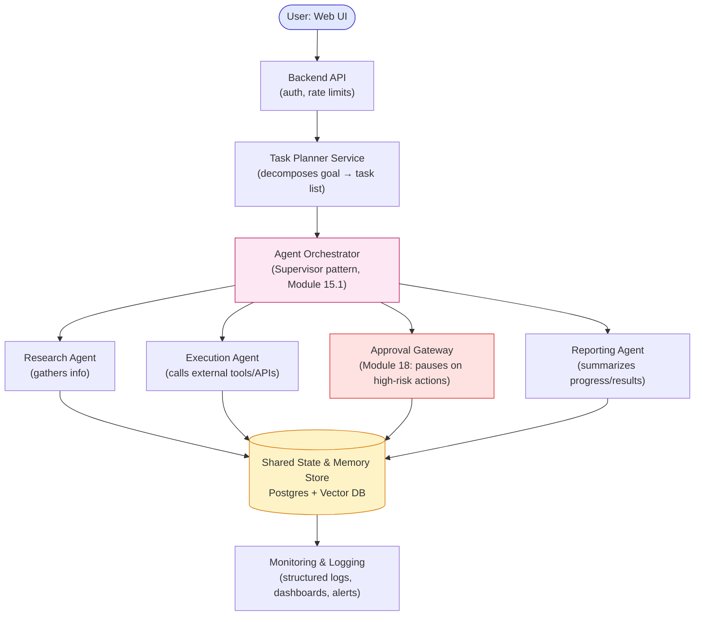

# Part 14 — Capstone Project

# AI Business Automation Agent Platform

This capstone synthesizes every module into one production-style system. It should:

1. Receive business goals from a user (natural language).
2. Break goals into tasks (planning, Module 11).
3. Select appropriate tools for each task (Module 7).
4. Execute tasks (agent loop, Module 6).
5. Store memory across sessions (Module 8–9).
6. Monitor progress (Module 20).
7. Request human approval when necessary (Module 18).
8. Generate reports (Module 19 informs what "success" means to measure).

---

## System Architecture



**How to read this graph:** trace a goal from top to bottom — it's decomposed into tasks *before* it ever reaches the multi-agent layer, which is why the Task Planner sits above the Orchestrator rather than being one of the four specialist agents. Notice the red "Approval Gateway" box is a peer of the other three agents, not a filter every agent must pass through individually — this matches Module 18's design: only actions the Execution Agent classifies as medium-risk-or-higher get routed through it, everything else flows straight to the shared store. Every agent — including the gateway — writes to the same yellow Shared State & Memory Store, which is what lets the Reporting Agent produce a coherent final report without needing to talk to the other three agents directly.

---

## Database Design (Core Tables)

```text
users(id, email, role, created_at)

goals(id, user_id, description, status, created_at)

tasks(id, goal_id, description, status, priority, assigned_agent, created_at, completed_at)

task_steps(id, task_id, step_number, plan_summary, tool_used, tool_input,
           tool_output, status, checkpoint_data, created_at)

approvals(id, task_step_id, risk_level, proposed_action, status
          ["pending","approved","rejected"], reviewer_id, reviewed_at)

memory_facts(id, user_id, fact_text, embedding_vector, source, created_at)

agent_logs(id, task_step_id, level, message, cost_tokens, latency_ms, created_at)
```

*Design notes:* `task_steps.checkpoint_data` supports recovery (Module 16.3). `approvals` implements the risk-tiered human-in-the-loop gate (Module 18.2). `memory_facts` with an `embedding_vector` column implements long-term semantic memory (Module 8–9). `agent_logs` captures per-step cost/latency for evaluation and cost tracking (Module 19, 22).

---

## Agent Architecture

| Agent | Role | Tools | Risk Tier of Its Actions |
|---|---|---|---|
| Task Planner | Decomposes a goal into an ordered task list | None (pure LLM reasoning) | Low |
| Research Agent | Gathers information needed for a task | Search, document retrieval | Low |
| Execution Agent | Performs the actual business action | Email, CRM update, payment API, file operations | Medium–Critical (varies per tool) |
| Approval Gateway | Enforces human-in-the-loop policy | None (pure control logic) | N/A (a control component, not a reasoning agent) |
| Reporting Agent | Summarizes progress and results for the user | None (pure LLM reasoning over logged data) | Low |

---

## Tool Architecture

```text
Tool Registry
├── low_risk/
│   ├── search(query)
│   ├── read_file(path)
│   └── query_db(sql)      [read-only credentials]
├── medium_risk/
│   ├── send_internal_message(channel, text)
│   └── update_crm_record(id, fields)
├── high_risk/
│   ├── send_external_email(to, subject, body)
│   └── update_production_config(key, value)
└── critical_risk/
    ├── issue_payment(amount, recipient)
    └── delete_customer_data(user_id)
```

Each tool is tagged with a risk tier (Module 18.2) enforced centrally by the Approval Gateway — individual agents cannot bypass this classification.

---

## API Design (Core Endpoints)

```text
POST   /goals                 → submit a new business goal
GET    /goals/{id}            → check status and progress
GET    /goals/{id}/tasks      → list decomposed tasks and their status
GET    /approvals/pending     → list actions awaiting human approval
POST   /approvals/{id}/decide → approve/reject/edit a pending action
GET    /goals/{id}/report     → get the final generated report
GET    /metrics               → task success rate, cost, latency (Module 19)
```

Long-running goals use the async pattern from Module 20.4: `POST /goals` returns immediately with a `goal_id` and `status: "processing"`; the client polls `GET /goals/{id}` or receives a webhook when complete.

---

## Folder Structure

```text
agentic-platform/
├── backend/
│   ├── api/                 # FastAPI routes (auth, goals, approvals, metrics)
│   ├── orchestrator/        # supervisor logic, agent loop, replanning
│   ├── agents/
│   │   ├── planner.py
│   │   ├── researcher.py
│   │   ├── executor.py
│   │   └── reporter.py
│   ├── tools/
│   │   ├── registry.py      # risk-tier tagging + dispatch
│   │   └── implementations/
│   ├── memory/
│   │   ├── vector_store.py
│   │   └── fact_store.py
│   ├── approval/
│   │   └── gateway.py
│   ├── db/
│   │   └── models.py
│   └── monitoring/
│       └── logging.py
├── frontend/                 # goal submission UI, approval review UI, dashboards
├── tests/
│   ├── unit/
│   ├── eval/                 # agent evaluation test datasets (Module 19)
│   └── security/             # prompt injection / permission tests (Module 21)
└── infra/
    ├── docker/
    └── deployment configs
```

---

## Development Roadmap

```text
Phase 1: Core agent loop + single Execution Agent with 2-3 low-risk tools
Phase 2: Add Task Planner + multi-step task decomposition
Phase 3: Add Approval Gateway with risk tiering (Module 18)
Phase 4: Add memory (short-term + long-term via vector store, Module 8-9)
Phase 5: Add Reporting Agent + metrics dashboard (Module 19-20)
Phase 6: Add security hardening (prompt injection tests, least-privilege tools,
         Module 21) + cost optimization pass (Module 22)
Phase 7: Load testing, monitoring/alerting, production deployment (Module 20)
```

---

## Testing Strategy

| Test Type | What It Covers | Module Reference |
|---|---|---|
| Unit tests | Individual tool functions, planner output schema validation | 7, 17 |
| Agent evaluation suite | Task success rate, tool accuracy across representative + edge cases | 19 |
| Security tests | Prompt injection attempts, permission boundary checks | 21 |
| Reliability tests | Simulated tool failures, timeout handling, loop detection | 17 |
| Load tests | Concurrent goal submissions, queue behavior under load | 20 |
| Human-in-the-loop tests | Verify high/critical-risk actions are always gated, never bypassed | 18 |

---

## Deployment Strategy

- **Local**: Docker Compose running API, orchestrator, Postgres, and vector DB together for development.
- **Staging**: Containerized deployment on a cloud provider, using queued/async task processing (Module 20.4), with monitoring dashboards active.
- **Production**: Scaled containers behind the backend API, autoscaling workers processing the task queue, secrets managed via a secrets manager (never in code or logs, Module 21.4), full logging/monitoring/alerting active before go-live.

---

This capstone is intentionally large — treat it as a multi-week project, building phase by phase per the roadmap above, applying the reliability, security, evaluation, and cost lessons from Modules 17, 19, 21, and 22 at every phase rather than bolting them on at the end.

Continue to **[25-Learning-Roadmap.md](25-Learning-Roadmap.md)**.
