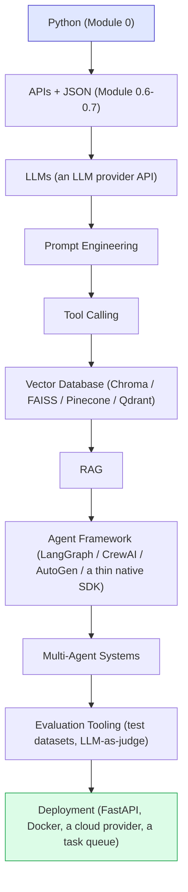

# Part 15 — Complete Learning Roadmap

This roadmap groups the course's 26 modules into 9 phases, each roughly 1-3 weeks, and each ending in something concrete you can point to — a working script, a finished project, or a hardened system — rather than just "having read some material." The grouping isn't arbitrary: every phase bundles together the modules that depend most tightly on each other and that, together, unlock exactly one new *capability* you didn't have before (the ability to call an LLM at all; the ability to build an agent that acts; the ability to ground answers in real documents; and so on). Treat each phase's Deliverable as a gate — if you can't actually produce it, that's a sign to revisit the phase's modules rather than pushing ahead into a phase that assumes you can.

## Phase 1 — Foundations (Week 1–2)

Learn:
- Python basics (Module 0): variables, functions, loops, dictionaries, JSON handling, classes.
- APIs and JSON (Module 0.6–0.7): making HTTP requests, parsing responses.
- LLM basics (Modules 1–2): tokens, context windows, training vs. inference.

These three topics are grouped together because none of the later phases are reachable without all three simultaneously: you need Python to write any code at all, you need to understand APIs/JSON because that's literally the wire format every LLM call and every tool call in this course uses, and you need the LLM fundamentals (Module 1-2) so that when Phase 2 asks you to write a prompt, you understand *why* the wording matters (tokens, context windows) rather than treating prompting as trial-and-error guesswork. This phase's capability gate is narrow but load-bearing: by the end of it you should be able to make one successful LLM API call and do something with the result in code — nothing agentic yet, just the plumbing every later phase assumes already works.

Deliverable: comfortably make an API call to an LLM and parse a structured JSON response.

---

## Phase 2 — AI Applications (Week 3–4)

Learn:
- Prompt engineering (Module 3): system/user prompts, few-shot, templates, injection basics.
- Structured outputs and function calling foundations (Module 2.5, Module 7).

This phase is where "I can call an LLM" (Phase 1) turns into "I can reliably get the LLM to do a specific, useful thing." The two topics are grouped because they're really the same skill applied at two levels: prompt engineering (Module 3) is about controlling what the model says in free text, and structured outputs (Module 2.5, 7) is about controlling the *shape* that text comes back in, so your code can act on it programmatically instead of a human reading it. The capability this phase unlocks is the one every later agent depends on completely: an LLM call whose output your code can trust and parse, not just read.

Deliverable: a working single-purpose LLM feature (e.g., a classifier or extractor) with a production-quality prompt.

---

## Phase 3 — AI Agents (Week 5–6)

Learn:
- Agent loops (Module 4, 6).
- Tools (Module 7).
- Memory basics (Module 8).
- Planning basics (Module 11).

This is the phase where the course's actual subject matter — agentic AI, not just "using an LLM" — begins, and it's grouped this way because these four topics are the minimum ingredients for anything that deserves to be called an agent at all (Module 4's own definition): a loop that decides its own steps, tools to act with, some form of memory across those steps, and at least a basic sense of planning rather than pure one-step-at-a-time reaction. Skipping any one of the four leaves you with something agent-*shaped* but not actually agentic — tools without a loop is just a function library; a loop without memory forgets its own progress mid-task.

Deliverable: **Project 1 (Personal Task Assistant)** and **Project 2 (Research Agent)**.

---

## Phase 4 — Knowledge Systems (Week 7–8)

Learn:
- Embeddings and vector databases (Module 9).
- RAG, beginner through production techniques (Module 10).

This phase is deliberately narrow and self-contained compared to its neighbors, because embeddings/vector search and RAG are conceptually a self-sufficient unit: you can learn and practice grounding an LLM's answers in real documents without needing the agent loop from Phase 3 at all (a RAG system doesn't strictly require an agent — a single retrieve-then-generate call already demonstrates the whole idea). It's placed *after* Phase 3 rather than before it mainly for course-sequencing reasons — Phase 3 already established the idea of "give the model information it doesn't already have" via tool results, and RAG is a natural, more powerful generalization of that same idea using retrieval instead of a live tool call.

Deliverable: **Project 3 (RAG Knowledge Assistant)**.

---

## Phase 5 — Advanced Reasoning (Week 9–10)

Learn:
- Reasoning patterns: ReAct, plan-and-execute, reflection, critique-and-revise, tree-based exploration, iterative improvement (Module 12).
- Dynamic planning and replanning (Module 11.2).
- State management and checkpointing (Module 16).

These three topics are grouped because they all answer the same underlying question from different angles: "what happens when a task is too long, too uncertain, or too error-prone for the simple loop from Phase 3 to handle gracefully?" Reasoning patterns (Module 12) give you named, tested recipes for structuring multi-step reasoning; dynamic replanning (Module 11.2) handles the case where the world doesn't match what was planned; and state management (Module 16) makes it possible for a task spanning many minutes and many steps to survive a crash partway through. Together they unlock the capability gate this phase is named for: agents that can tackle genuinely open-ended, long-running tasks reliably, not just short, predictable ones.

Deliverable: **Project 4 (Autonomous Research System)**.

---

## Phase 6 — Frameworks and Multi-Agent Systems (Week 11–13)

Learn:
- Agent frameworks: LangChain, LangGraph, CrewAI, AutoGen, Semantic Kernel, modern Agent SDKs (Module 13).
- Multi-agent architecture and communication (Module 14).
- Multi-agent design patterns: supervisor, hierarchical, peer-to-peer, pipeline, debate, critic, router (Module 15).

Frameworks are placed in the same phase as multi-agent systems, rather than earlier, quite deliberately: everything in Phases 1-5 was intentionally built by hand, from the raw LLM API up, so that you'd understand the underlying mechanics before ever reaching for a framework's abstraction over them (Module 13's own "when to build without a framework" argument depends on you having that hand-built baseline to compare against). Multi-agent coordination is the point where hand-rolling every piece genuinely starts to cost more than it teaches, which is why this phase introduces frameworks right alongside the multi-agent patterns they're often used to implement. The capability gate here is coordinating *several* agents toward one goal, not just running one agent well.

Deliverable: **Project 5 (Multi-Agent Content Company)**.

---

## Phase 7 — Reliability and Safety (Week 14–15)

Learn:
- Reliability: hallucination, tool failures, infinite loops, bad planning (Module 17).
- Human-in-the-loop systems and approval gates (Module 18).
- Security: prompt injection, data leakage, tool abuse, API key protection (Module 21).

Notice this phase is entirely about things that can go *wrong* with a system that, by Phase 6, is already working — that ordering is intentional. Reliability, human oversight, and security are grouped together because they're really three faces of the same underlying discipline: bounding what an agent can do when its reasoning is imperfect (which it always, eventually, will be). This phase is placed after multi-agent systems specifically because a multi-agent system has more failure surface than a single agent — more places for a loop to get stuck, more actions that might need approval, more entry points for injected content — so practicing these techniques on the Project 4/5 systems you already built gives you a realistically complex target to harden, rather than a toy.

Deliverable: add reliability guardrails, loop detection, and approval gates to your Project 4 or 5 system.

---

## Phase 8 — Evaluation, Deployment, and Cost (Week 16–18)

Learn:
- Agent evaluation metrics and test dataset design (Module 19).
- Deployment architecture, authentication, logging, monitoring, scaling (Module 20).
- Cost optimization: model tiering, caching, batching (Module 22).

These three are the last pieces standing between "a system that works when I run it" and "a system other people can actually rely on." They're grouped together because each one answers a question you can only meaningfully ask of a system that's already reliable and safe (Phase 7): is it actually good (evaluation), can strangers use it without me babysitting it (deployment), and can I afford to run it at real volume (cost)? This is also why evaluation is taught before deployment within this phase — you want a way to *measure* success before you put a system in front of real users, not after.

Deliverable: deploy one of your projects as a real API with logging, monitoring, and a basic evaluation suite.

---

## Phase 9 — Capstone (Week 19–22+)

Build the **AI Business Automation Agent Platform** (Module 24), phase by phase per its own development roadmap, applying everything from Phases 1–8.

This phase has no new modules of its own for a reason: everything you need has already been taught, and the actual skill being exercised here is *integration* — making planning, tools, memory, multi-agent coordination, reliability, human approval, evaluation, and deployment all work together in one coherent system, under the kind of competing constraints (cost vs. safety, speed vs. thoroughness) that never show up when each concept is practiced in isolation. If Phase 9 feels harder than any single prior phase despite "not teaching anything new," that's expected — it's the same jump in difficulty a musician feels moving from practicing individual scales to playing a full piece.

---

# Final Roadmap (Visual)

**How to read this graph:** this is the same single-trail shape as the roadmap in `00-Course-Overview.md`, just spelled out module by module instead of by course part — use it as the detailed map once you're ready to start, and the overview version when you just want the big picture. Starting at the blue "Python Basics" box is not optional scaffolding — every downstream box's code examples assume you can read the Python patterns from Module 0 (dictionaries, `while` loops, JSON, API calls).

---

# Technology Roadmap

**How to read this graph:** unlike the "Final Roadmap" above (which lists *concepts*, one per module), this chart lists *concrete technology choices* you'll actually install and configure — Python is still the very first box for the same reason: it's the language every other box's tooling (an LLM SDK, a vector database client, a web framework) is written for and installed into via `pip` (Module 0.8).

---

# Final Checklist

After completing this course, you should be able to:

- [ ] Read and write the core Python patterns used throughout this course: dictionaries/JSON, functions, `while`/`for` loops, simple classes, and HTTP API calls.
- [ ] Explain what an LLM is, how tokens/context windows work, and why hallucination happens.
- [ ] Write production-quality prompts with clear roles, scope, format, and refusal behavior.
- [ ] Clearly distinguish a chatbot, a workflow, and an agent, and choose the right one for a given problem.
- [ ] Build an agent with a working think → act → observe loop and a maximum step limit.
- [ ] Design and implement tool schemas with proper error handling.
- [ ] Implement short-term and long-term memory, including vector-based semantic memory.
- [ ] Build a RAG pipeline from ingestion through production-grade retrieval (hybrid search, reranking, metadata filtering).
- [ ] Decompose goals into plans and implement dynamic replanning.
- [ ] Apply the appropriate reasoning pattern (ReAct, plan-and-execute, reflection, critique-and-revise, tree search, iterative improvement) to a given task.
- [ ] Evaluate agent frameworks and decide when to use one, and which, vs. building without one.
- [ ] Design a multi-agent system using the appropriate coordination pattern (supervisor, hierarchical, pipeline, debate, critic, router).
- [ ] Implement state management with checkpointing and recovery for long-running tasks.
- [ ] Identify and mitigate the six core agent reliability failure modes.
- [ ] Design risk-tiered human-in-the-loop approval gates.
- [ ] Build an evaluation suite with meaningful metrics and a real test dataset.
- [ ] Design and deploy a production agent architecture with authentication, logging, monitoring, and scaling.
- [ ] Identify and mitigate prompt injection, data leakage, tool abuse, and API key exposure risks.
- [ ] Optimize agent system cost through model tiering, caching, context management, and batching.
- [ ] Design and (at least partially) build a full production-style multi-agent business automation platform.

Continue to **[26-Glossary.md](26-Glossary.md)** for quick term reference.
