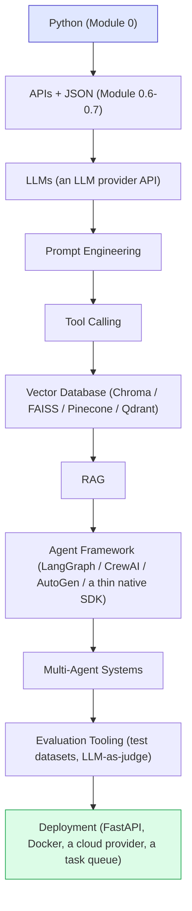

# Part 15 — Complete Learning Roadmap

## Phase 1 — Foundations (Week 1–2)

Learn:
- Python basics (Module 0): variables, functions, loops, dictionaries, JSON handling, classes.
- APIs and JSON (Module 0.6–0.7): making HTTP requests, parsing responses.
- LLM basics (Modules 1–2): tokens, context windows, training vs. inference.

Deliverable: comfortably make an API call to an LLM and parse a structured JSON response.

---

## Phase 2 — AI Applications (Week 3–4)

Learn:
- Prompt engineering (Module 3): system/user prompts, few-shot, templates, injection basics.
- Structured outputs and function calling foundations (Module 2.5, Module 7).

Deliverable: a working single-purpose LLM feature (e.g., a classifier or extractor) with a production-quality prompt.

---

## Phase 3 — AI Agents (Week 5–6)

Learn:
- Agent loops (Module 4, 6).
- Tools (Module 7).
- Memory basics (Module 8).
- Planning basics (Module 11).

Deliverable: **Project 1 (Personal Task Assistant)** and **Project 2 (Research Agent)**.

---

## Phase 4 — Knowledge Systems (Week 7–8)

Learn:
- Embeddings and vector databases (Module 9).
- RAG, beginner through production techniques (Module 10).

Deliverable: **Project 3 (RAG Knowledge Assistant)**.

---

## Phase 5 — Advanced Reasoning (Week 9–10)

Learn:
- Reasoning patterns: ReAct, plan-and-execute, reflection, critique-and-revise, tree-based exploration, iterative improvement (Module 12).
- Dynamic planning and replanning (Module 11.2).
- State management and checkpointing (Module 16).

Deliverable: **Project 4 (Autonomous Research System)**.

---

## Phase 6 — Frameworks and Multi-Agent Systems (Week 11–13)

Learn:
- Agent frameworks: LangChain, LangGraph, CrewAI, AutoGen, Semantic Kernel, modern Agent SDKs (Module 13).
- Multi-agent architecture and communication (Module 14).
- Multi-agent design patterns: supervisor, hierarchical, peer-to-peer, pipeline, debate, critic, router (Module 15).

Deliverable: **Project 5 (Multi-Agent Content Company)**.

---

## Phase 7 — Reliability and Safety (Week 14–15)

Learn:
- Reliability: hallucination, tool failures, infinite loops, bad planning (Module 17).
- Human-in-the-loop systems and approval gates (Module 18).
- Security: prompt injection, data leakage, tool abuse, API key protection (Module 21).

Deliverable: add reliability guardrails, loop detection, and approval gates to your Project 4 or 5 system.

---

## Phase 8 — Evaluation, Deployment, and Cost (Week 16–18)

Learn:
- Agent evaluation metrics and test dataset design (Module 19).
- Deployment architecture, authentication, logging, monitoring, scaling (Module 20).
- Cost optimization: model tiering, caching, batching (Module 22).

Deliverable: deploy one of your projects as a real API with logging, monitoring, and a basic evaluation suite.

---

## Phase 9 — Capstone (Week 19–22+)

Build the **AI Business Automation Agent Platform** (Module 24), phase by phase per its own development roadmap, applying everything from Phases 1–8.

---

# Final Roadmap (Visual)

```mermaid
flowchart TD
    P0["Python Basics (Module 0)"] --> M2["LLM Fundamentals (Module 1-2)"]
    M2 --> M3["Prompt Engineering (Module 3)"]
    M3 --> M4["What Is an Agent? (Module 4-5)"]
    M4 --> M6["Basic Agent Architecture (Module 6)"]
    M6 --> M7["Tool Calling (Module 7)"]
    M7 --> M8["Memory (Module 8)"]
    M8 --> M9["Vector Databases & Embeddings (Module 9)"]
    M9 --> M10["Retrieval-Augmented Generation (Module 10)"]
    M10 --> M11["Planning (Module 11)"]
    M11 --> M12["Reasoning Patterns (Module 12)"]
    M12 --> M13["Agent Frameworks (Module 13)"]
    M13 --> M14["Multi-Agent Systems (Module 14)"]
    M14 --> M15["Multi-Agent Design Patterns (Module 15)"]
    M15 --> M16["State Management (Module 16)"]
    M16 --> M17["Reliability (Module 17)"]
    M17 --> M18["Human-in-the-Loop (Module 18)"]
    M18 --> M19["Evaluation (Module 19)"]
    M19 --> M20["Deployment (Module 20)"]
    M20 --> M21["Security (Module 21)"]
    M21 --> M22["Cost Optimization (Module 22)"]
    M22 --> CAP(["PRODUCTION AGENT SYSTEMS (Capstone)"])

    style P0 fill:#e0e7ff,stroke:#4338ca
    style CAP fill:#dcfce7,stroke:#16a34a
```

**How to read this graph:** this is the same single-trail shape as the roadmap in `00-Course-Overview.md`, just spelled out module by module instead of by course part — use it as the detailed map once you're ready to start, and the overview version when you just want the big picture. Starting at the blue "Python Basics" box is not optional scaffolding — every downstream box's code examples assume you can read the Python patterns from Module 0 (dictionaries, `while` loops, JSON, API calls).

---

# Technology Roadmap

**How to read this graph:** unlike the "Final Roadmap" above (which lists *concepts*, one per module), this chart lists *concrete technology choices* you'll actually install and configure — Python is still the very first box for the same reason: it's the language every other box's tooling (an LLM SDK, a vector database client, a web framework) is written for and installed into via `pip` (Module 0.8).

---

# Final Checklist

After completing this course, you should be able to:

- [ ] Read and write the core Python patterns used throughout this course: dictionaries/JSON, functions, `while`/`for` loops, simple classes, and HTTP API calls.
- [ ] Explain what an LLM is, how tokens/context windows work, and why hallucination happens.
- [ ] Write production-quality prompts with clear roles, scope, format, and refusal behavior.
- [ ] Clearly distinguish a chatbot, a workflow, and an agent, and choose the right one for a given problem.
- [ ] Build an agent with a working think → act → observe loop and a maximum step limit.
- [ ] Design and implement tool schemas with proper error handling.
- [ ] Implement short-term and long-term memory, including vector-based semantic memory.
- [ ] Build a RAG pipeline from ingestion through production-grade retrieval (hybrid search, reranking, metadata filtering).
- [ ] Decompose goals into plans and implement dynamic replanning.
- [ ] Apply the appropriate reasoning pattern (ReAct, plan-and-execute, reflection, critique-and-revise, tree search, iterative improvement) to a given task.
- [ ] Evaluate agent frameworks and decide when to use one, and which, vs. building without one.
- [ ] Design a multi-agent system using the appropriate coordination pattern (supervisor, hierarchical, pipeline, debate, critic, router).
- [ ] Implement state management with checkpointing and recovery for long-running tasks.
- [ ] Identify and mitigate the six core agent reliability failure modes.
- [ ] Design risk-tiered human-in-the-loop approval gates.
- [ ] Build an evaluation suite with meaningful metrics and a real test dataset.
- [ ] Design and deploy a production agent architecture with authentication, logging, monitoring, and scaling.
- [ ] Identify and mitigate prompt injection, data leakage, tool abuse, and API key exposure risks.
- [ ] Optimize agent system cost through model tiering, caching, context management, and batching.
- [ ] Design and (at least partially) build a full production-style multi-agent business automation platform.

Continue to **[26-Glossary.md](26-Glossary.md)** for quick term reference.
